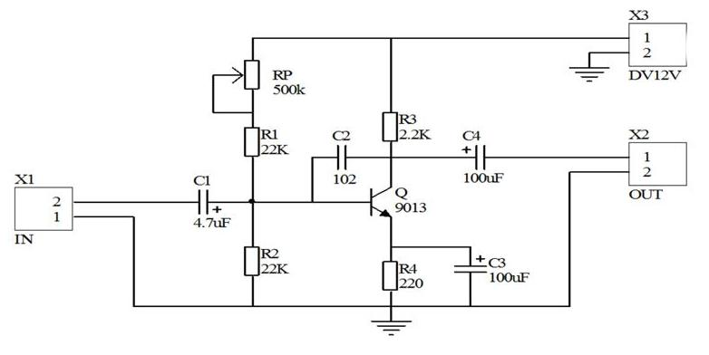
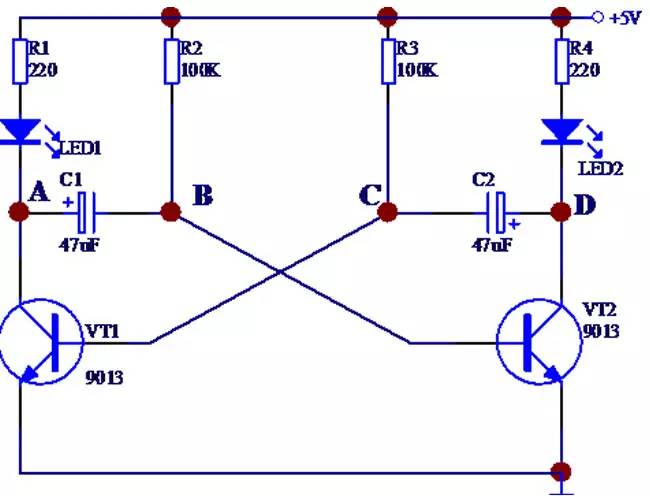
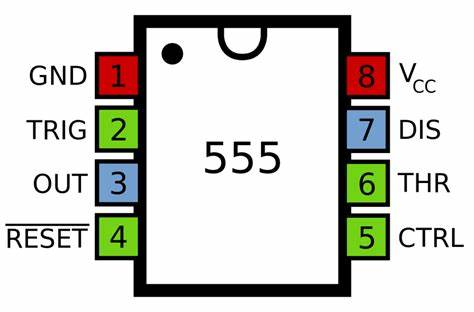
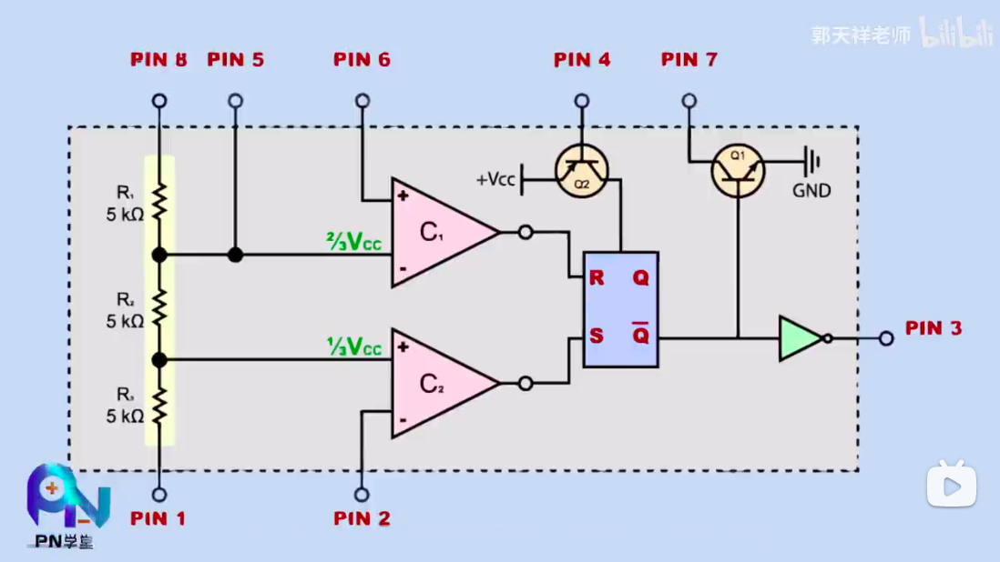
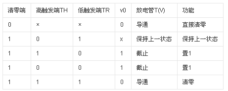

.. _circuits_summary_index:

======================
经典芯片及电路赏析
======================

1 经典放大电路
=================================

2 多谐振荡电路
=================================

RC振荡电路
----------------------

`电路详解 <http://b23.tv/V6tnaKC>`_

关键信息点：虽然两边电路完全对称，但是在A和D两个三极管的集电极电压还是会有细微差别。
就会导致C1和C2充电会有细微差别。（另一种解释是一个三极管的基极先通，如VT1先通，通了后会导致其
A集电极电位降为0，因为C1电压不能突变，因此会将B点电位下拉到0，因此VT2截止）。
假设VT1先导通，那么就会C2比C1充电更快，因为D的电位会比A的电位更高。直到C2充电饱和，C2的电压基本等于VCC电压。

C2饱和后C2充电电流开始降低，VT1电流开始减少，那么A点电位开始上升，那就C1就加速充电。
C1加速充电，即充电电流增加，VT2就会导通。VT2导通后进一步降低D点电位，C2开始放电，
VT1截止。

C1充电到截止后，C1充电电流开始减少，进一步导致VT2导通电流降低，那么D点电位上升，
直到VT1导通。以此循环往复。

LC振荡电路
--------------------------

3 NE555芯片
=================================
介绍
------------
555定时器是美国Signetics公司1972年研制的用于取代机械式定时器的中规模集成电路，因输入端设计有三个5kΩ的电阻而得名。此电路后来竟风靡世界。目前，流行的产品主要有4个：BJT两个：555，556（含有两个555）；CMOS两个：7555，7556（含有两个7555）。

引脚功能：

* 1脚：外接电源负端VSS或接地，一般情况下接地。
* 2脚：低触发端TR。
* 3脚：输出端Vo
* 4脚：是直接清零端。当此端接低电平，则时基电路不工作，此时不论TR、TH处于何电平，时基电路输出为“0”，该端不用时应接高电平。
* 5脚：VC为控制电压端。若此端外接电压，则可改变内部两个比较器的基准电压，当该端不用时，应将该端串入一只0.01μF电容接地，以防引入干扰。
* 6脚：高触发端TH。
* 7脚：放电端。该端与放电管集电极相连，用做定时器时电容的放电。
* 8脚：外接电源VCC，双极型时基电路VCC的范围是4.5 ~ 16V，CMOS型时基电路VCC的范围为3 ~ 18V。一般用5V。在1脚接地，5脚未外接电压，两个比较器A1、A2基准电压分别为低电平的情况下，555时基电路的功能表如表1示。

内部电路：

真值表：

我们知道，数字电路的信号只有两种状态：逻辑低或逻辑高，即通常所说的0状态或1状态、0电平或1电平。
单稳电路指的是该电路的输出信号只能在一种状态（逻辑高或低）下是稳定的，而当电路的输出处在另一种状态下时不能稳定的保持住，会自动的回到稳定的状态。
当然，双稳电路就是说电路的输出信号在两种状态下（0或1）都可以稳定的存在。
单稳电路的应用是十分广泛的，一般用来产生一定时间宽度的（正或负）脉冲信号。
单稳（电路）触发器同“RS触发器”、“JK触发器”、“D触发器”等（后几种为双稳态的触发器）构成数字电路中基本的触发器类型，单稳电路也是数字电路中的基本电路。
注：在看数字电路的资料时，有时看到“三态”的字样，三态指的是除了前面说的逻辑状态0、逻辑状态1以外，还有称为“高阻态”的第三种的状态。“高阻态”指（信号）线呈高阻抗状态，就象信号线“断开”一样。“高阻态”应理解为“电路”的一种状态而不是“信号”的一种状态（数字信号只有0或1）。
举两个比较直观的例子吧，便与你理解：

* 1.双稳态：你见过自行车吧，后轮轴上有一个撑子，停车时，把撑子撑在地上，自行车就不会倒了。这个撑子有两个稳定的状态，撑在地上是一个稳定状态，行走时，用脚把它拨到上边，他就会稳定在上边（另一个稳定状态）不掉下来。只有给它一个外力的时候，他才会改变状态。我们对这种有两个稳定状态的称为双稳态。
* 2.单稳态：有些大型商场有一种带有弹簧的门，平时它是关着的，当你走过来，用手推它时，他就被你推开了，你走过去后，他又自动弹回去，关上了。这个门，就只有一个稳定状态，就是关门，但你施加外力时，它可以改变状态，但是当外力撤销时，改变的状态不能够保持住，所以这个状态是不稳定的，他又自动回到了那个稳定的状态。对于这种只有一个稳定状态的，我们称它为单稳态。
* 3.双稳态电路：电路可以保持在两个稳态上，当施加触发脉冲时，电路翻转，变为另一个稳态。触发脉冲撤销后，能够保持在这个稳定状态上，直到下一个触发脉冲的到来，才再次改变状态。
* 4.单稳态电路：电路只能保持在一个稳定状态上，当施加触发脉冲时，电路翻转，变为另一个状态，但这个状态无法稳定。不管触发脉冲撤销与否，电路都要自动回到原来的稳定状态。下一个触发脉冲的到来，再次重复一下这个翻转又返回的动作。
* 5.典型应用：单稳态电路典型应用实例就是楼道里的电灯，夜晚来临，楼道里漆黑一片，当你拍一下手，声音的触发信号，就会使灯泡点亮，但是这种状态保持不住，两分钟后，电灯自动恢复到熄灭状态（稳态）。这个灯就只有一个稳定状态，就是熄灭。所以是个单稳态电路。

所谓单稳态电路就是具有两种状态的电路,其中一种是稳定的状态(稳态),另一种是暂时稳定的状态(暂稳态).就像弹簧门一样.
弹簧门的关门是它的稳定状态,开门是它的暂时稳定状态,外力一撤,门就会自动恢复稳定状态.如果用单稳态电路控制门,那就不需要弹簧了,开门后,过几秒钟(时间由你定)门会自动关上,如果在单稳态电路的输入端加上红外传感器,那门就是全自动的了.

`555定时器及50个经典设计电路 <https://zhuanlan.zhihu.com/p/67923210>`_

单稳态应用电路
----------------------

双稳态应用电路
----------------------

无稳态应用电路
----------------------
