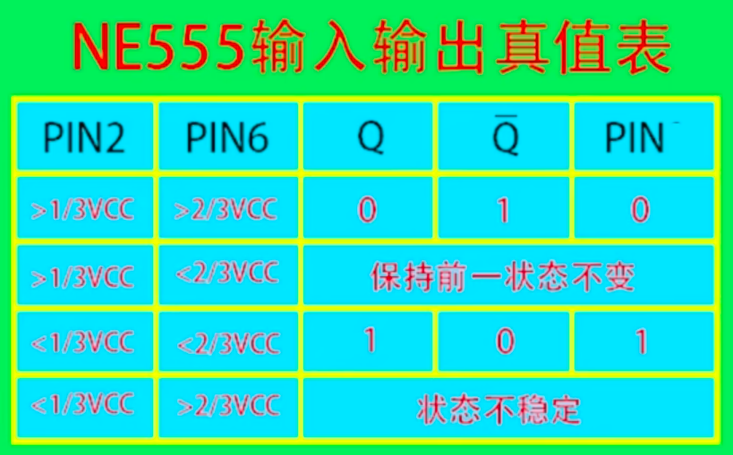

.. _circuits_summary_index:

======================
经典芯片及电路赏析
======================

1 经典放大电路
==============

2 NE555芯片
==================
介绍
------------
555定时器是美国Signetics公司1972年研制的用于取代机械式定时器的中规模集成电路，因输入端设计有三个5kΩ的电阻而得名。此电路后来竟风靡世界。目前，流行的产品主要有4个：BJT两个：555，556（含有两个555）；CMOS两个：7555，7556（含有两个7555）。

引脚功能：

* 1脚：外接电源负端VSS或接地，一般情况下接地。
* 2脚：低触发端TR。
* 3脚：输出端Vo
* 4脚：是直接清零端。当此端接低电平，则时基电路不工作，此时不论TR、TH处于何电平，时基电路输出为“0”，该端不用时应接高电平。
* 5脚：VC为控制电压端。若此端外接电压，则可改变内部两个比较器的基准电压，当该端不用时，应将该端串入一只0.01μF电容接地，以防引入干扰。
* 6脚：高触发端TH。
* 7脚：放电端。该端与放电管集电极相连，用做定时器时电容的放电。
* 8脚：外接电源VCC，双极型时基电路VCC的范围是4.5 ~ 16V，CMOS型时基电路VCC的范围为3 ~ 18V。一般用5V。在1脚接地，5脚未外接电压，两个比较器A1、A2基准电压分别为低电平的情况下，555时基电路的功能表如表1示。

内部电路：

.. image:: images/NE555-INER.png

真值表：

单稳态应用电路
----------------------

双稳态应用电路
----------------------

无稳态应用电路
----------------------
