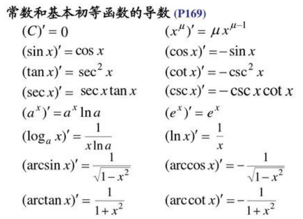
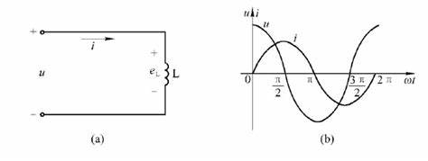

.. _electrician_summary_index:

============
1 微积分常识
============
- 导数： 反应函数相对于自变量的变化而变化的快慢程度。几何学上就是函数的斜率。
- 微分： 是指当自变量存在微小变化时函数大体上变化多少。
- 积分： 直观地说，对于一个给定的正实值函数，在一个实数区间上的定积分可以理解为在坐标平面上，由曲线、直线以及轴围成的曲边梯形的面积值（一种确定的实数值）。

基本函数导函数：

==============
2 电工电子常识
==============

2.1 电荷
========

电荷，是物体或构成物体的质点所带的正电或负电。电荷是物体的一种状态属性，宏观物体或微观粒子处于带电状态就说它们带有电荷。电荷的基本单元符号为e，其大小等于电子或质子所带电量的绝对值，
任何带电体所带的电量只能是这个基本单元的整数倍。
物体或微观粒子所带的电荷有两种，称为正电荷和负电荷，带同种电荷的物体互相排斥，带异种电荷的物体互相吸引。静止电荷之间的相互作用力称为静电力。
实验证明，电荷的电量与其运动状态无关，即在不同的参考系内观察，带电粒子的电量保持不变，这就是电荷的相对论不变性。

电荷的量称为“电荷量”。在国际单位制里，电荷量的符号以q为表示，单位是C（库仑，简称“库”）。研究带电物质相互作用的学科称为“电动力学”，可分为经典电动力学与量子电动力学。假若量子效应可以被忽略，
则经典电动力学能够很正确地描述出带电物质在电磁方面的物理行为。

质子带正电荷，电子带负电荷。

电子所带电荷为e=-1.6×10 ^-19 C（库仑），质量为9.11×10 -31 kg（0.51MeV/c ^2 ），能量为5.11×10 5 eV，通常被表示为e⁻。

2.2 电势/电位
=============

静电场的标势称为电势，或称为静电势。在电场中，某点电荷的电势能跟它所带的电荷量（与正负有关，计算时将电势能和电荷的正负都带入即可判断该点电势大小及正负）之比，叫做这点的电势（也可称电位），通常用φ来表示。
电势是从能量角度上描述电场的物理量，电场强度则是从力的角度描述电场。电势差能在闭合电路中产生电流（当电势差相当大时，空气等绝缘体也会变为导体）。电势也被称为电位。

电场中A、B两点间的电势差等于单位正电荷从A点移动到B点电场力所做的功 （U = W（ab）/q）；

> 电势差
>
> 电场中A、B两点间的电势差 ⑴等于单位正电荷从A点移动到B点，电场力所做的功；等于单位负电荷从A点移动到B点，电场力所做的功的相反数。⑵等于单位正电荷从A点移动到B点电势能的减少量；
> 等于单位负电荷从A点移动到B点，电势能的减少量的相反数。

> 电势
>
>电场中某点的电势 ⑴等于单位正电荷由该点移动到参考点，电场力所做的功；等于单位负电荷由该点移动到参考点，电场力所做的功的相反数。⑵等于单位正电荷相对参考点的电势能；等于单位负电荷相对参考点的电势能的相反数。

2.3 电压
========
电压（voltage），也被称作电势差或电位差，是衡量单位电荷在静电场中由于电势不同所产生的能量差的物理量。

电压用U表示，电压的国际单位制为伏特（V，简称伏）。

2.4 电流
========
电磁学上把单位时间里通过导体任一横截面的电量叫做电流强度，简称电流(Electric current)，电流符号为 I，单位是安培（A），简称“安”。

电流是电子的定向移动形成，电流方向与电子移动方向相反。

自然界中静电电压少则千伏，高则十万伏，人接触后会很疼，却没事，主要是电流太少。

DC: 直流； AC：交流

把交流变成直流叫整流器，把直流变成交流叫逆变器。

2.5 电阻
========
导体对电流的阻碍作用就叫该导体的电阻。电阻（Resistance，通常用“R”表示）是一个物理量，在物理学中表示导体对电流阻碍作用的大小。导体的电阻越大，表示导体对电流的阻碍作用越大。
不同的导体，电阻一般不同，电阻是导体本身的一种性质。导体的电阻通常用字母R表示，电阻的单位是欧姆，简称欧，符号为Ω。

人体是导电的，电阻值1000-2000Ω。人体安全电压36V，电流10mA。

2.6 电能/电功率
===============
电功率 P = UI  单位瓦特(w)

电能(Electric energy)，是指使用电以各种形式做功的能力。电能既是一种经济、 实用、清洁且容易控制和转换的能源形态，又是电力部门向电力用户提供由发、供、用三方共同保证质量的一种特殊产品( 它同样具有产品的若干特征，
如可被测 量、预估、保证或改善。

电能的单位是“度”，它的学名叫做千瓦时，符号是kW·h。在物理学中，更常用的能量单位（也就是主单位，有时也叫国际单位）是焦耳，简称焦，符号是J。

它们的关系是：1kW·h=3.6×10^6J

电能公式：W=UIt=Pt

根据欧姆定律（I=U/R）可以进一步推出：W = I^2Rt = U^2t/R

==========
3 关键定律
==========
- 欧姆定律： U = R * I
- 基尔霍夫电流定律： 一个节点上流出电流之和等于注入电流之和
- 基尔霍夫电压定律： 一个环路内，电压之和等于0
- 叠加定理：对于线性电路，任何一条支路中的电流，都可以看成是由电路中各个电源（电压源/电流源）分别作用时，在此电路产生的电流的代数和。

=================
4 R/C/L元件及电路
=================

4.1 R/C/L元件
=============

----
电阻
----

∫uidt = ∫Ri^2dt，电能全部消耗在了电阻元件上，转换为热能。电阻元件是耗能元件。

----
电感
----
电感元件是线圈，其上电压为u，当流过电流i时，将产生磁盘通Φ(单位韦伯，Wb)。设磁通通过每匝线圈，如果线圈有N匝，则电感元件参数：
L = NΦ/i

称为电感或自感，单位是亨[利]（H）。

当电感元件中的磁通或电流发生改变时，则在电感元件中产生的感应电动势为：

e(l) = -N(dΦ/dt) = -L(di/dt)

u = -e(l) = L(di/dt)

∫uidt = ∫L(di/dt)idt = ∫Lidi = 1/2Li^2

上式表明，当电感元件中的电流增大时，磁场能量增大，在此过程中电能转换为磁盘，即电感元件从电源取用能量。1/2Li^2就是电感元件中的磁场能量。
当电流减少时，磁场能量减小，磁通转换为电能，即电感元件向电源放还能量。可见电感元件不消耗能量，是储能元件。

当线圈中通过恒定电流时，其上电压u为零，故电感元件可视为短路。

当 电感器 两端接通电源后，通过电感器的电流从无到有从小到大逐渐变化。 由于电流的作用，在电感器内产生从小到大的磁场，电感器线圈在自身磁场的作用下感应出 电动势 ，
这个自感电动势的方向与电源电压方向相反，具有阻碍电流增大的作用。

----
电容
----
C = q/u

称为电容元件，它的单位是法[拉]（F）。法拉太大，一般用uF, pF. 1F = 10^6 uF = 10^12 pF

当电容元件上的电荷量q或电压u发生变化时，则在电路中引起电流：

i = dq/dt = C(du/dt)

当电容元件两端加恒定电压时，其中电流i为零，故电容元件可视为开路。

上式两边分别乘以电压，将对时间积分，得到：

∫uidt = ∫uC(du/dt)dt = ∫Cudu = 1/2(Cu^2)

上式表明当电容元件上的电压增高昌，电场能量增大，在此过程中电容元件从电源取用能量（充电）。1/2(Cu^2)就是电容元件中的电场能量。当电压降低时，电场能量减小，即电容元件向电源放还能量（放电）。
可见电容元件也是储能元件。

电阻不在乎电压的变化，但电容在乎！ 电压的这种快速改变可以看成是高频分量，电容对高频信号具有低阻抗。 电容会阻碍电压的变化，阶跃输入是这样的，开始时电压发生一个快速的变化，然后就保持5V不再变化了。
因此电容最终将充电到5V并保持5V不动，这就是RC电路的瞬态响应。 电容阻碍着电压的变化，电流的变化根本不会受到电容的阻碍。

[电容器是什么？它是如何工作的？通交，隔直，你真的懂吗？（上）](https://m.toutiao.com/is/i8FKBw7e/)

[电容器是什么？它是如何工作的？通交，隔直，你真的懂吗？（下）](https://m.toutiao.com/is/i8FKyoNr/)

4.2 RC电路
==========

--------
微分电路
--------
输出尖脉冲反映了输入矩形脉冲的跃变部分，是对矩形脉冲的微分的结果，因此叫微分电路。

在脉冲电路中，常用微分电路把矩形脉冲变换为尖脉冲，作为触发信号。

t = RC（单位秒），表示1/5充放电时间，电压充到63%。

从频域上讲，微分电路是低通滤波电路。

--------
积分电路
--------
从积分电路的波形上看，u2是对u1积分的结果，因此这种电路称之为积分电路。

在脉冲电路中，可应用积分电路把矩形波脉冲变换为锯齿波电压，作扫描等用。

从频域上讲，积分电路是高通滤波电路。

4.3 RL电路
==========
RL 电路经常用于直流电源等射频放大器，电感器 (L) 用于提供直流偏置电流并阻止射频返回电源。

============
5 变压器原理
============
输电传输功率P = UIcosΦ,在功率一定，因数cosΦ一定情况下，电压越高电流越小。这样就可以减小输电线面积，节省材料，同时还可减小功率损耗。

因此要先升高压传输，然后再降低压使用。

下图是变压器的结构示意图，图中，左侧是一次绕组，右侧是二次绕组，一次和二次绕组均绕在铁芯上。

变压器只能输入交流电压。从变压器一次绕组两端输入交流电压，从二次绕组输出交流电压。

给一次绕组输入交流电压后，一次绕组中有交流电通过，一次绕组产生交变磁场，磁场的磁力线绝大多数由铁芯构成回路。

因为二次绕组也绕在铁芯或磁芯上，变化的磁力线穿过二次绕组，在二次绕组两端产生感应电动势。二次绕组所产生的电压大小与输入电压大小不同（如果是1:1的变压器，则电压相同），其频率和变化规律与输入的交流电压一样。

这就是变压器的基本工作原理：根据电磁感应原理，当一个导电的物体处于变化的磁场中，在导电体中就能够感应出电流来。

变压器改变电压有一个专门的参数：变压比。

变压器的变压比表示了变压器一次绕组匝数与二次绕组匝数之间的关系。从变压比可以看出一个变压器是升压变压器还是降压变压器，也或者是1:1的变压器。

变压比=一次绕组匝数/二次绕组匝数。

变压比小于1，是升压变压器，表明一次绕组匝数小于二次绕组匝数。

变压比大于1是降压变压器，表明一次绕组匝数大于二次绕组匝数。

.. image:: images/vo_change_2.webp

从变压器的工作原理可知，电流从一次绕组进去，从二次绕组流出。由于输入的交流电的电流方向不断改变，就会产生一个和电流同步变化的磁场。由于磁场的大小与方向不断改变，从而在次级线圈内感应出电流来。
因为在每一圈线圈上的电压都相等，所以，次级线圈圈数越多，从次级线圈输出的电压就越高。

如果初级线圈的圈数比次级线圈多，次级线圈上的电压就会降低，这就是降压变压器；反之，如果初级线圈的圈数比次级线圈少，次级线圈上的电压就会升高，这就是升压变压器。

========
6 电动机
========
- 电动机：电能转换为机械能的装置的统称。

- 步进电机： 一种特殊的精细化控制的电机，无反馈。步进电机接收的是电脉冲信号，根据信号数量转过相应的步距角。通俗来讲就是你推一下，我动一下。动的角度就是步距角，是步进电机的固有属性。假如步距角是15°，
  表示每接收一个脉冲电机就转过15°。所谓开环，就是只管控制，不管反馈。步进电机接收脉冲后转动，但不保证一定能转到。比如脉冲频率过高或者负载较大，就会造成失步，也就是没转到位。所以说使用步进电机的场合，
  要么不需要位置反馈，要么在其他设备上进行位置反馈。比如模型小车的车轮、光驱的光头、摄像机云台，以及各种行业机械设备等。

- 伺服电机： 伺服电机则是闭环控制，即通过传感器实时反馈电机的运行状态，由控制芯片进行实时调节。一般工业用的伺服电机都是三环控制，即电流环、速度环、位置环，分别能反馈电机运行的角加速度、角速度和旋转位置。

- 舵机： 特殊的用于航模等玩具上的小型伺服电机。舵机一般有180度，360度等。舵机典型的有SG90, MG996R并行控制的，以及串行总结控制的。

- PWM： PWM（Pulse Width Modulation）控制技术就是对脉冲的宽度进行调制的技术，即通过对一系列脉冲的宽度进行调制，来等效的获得所需要的波形（含形状和幅值）。

========
7 继电器
========
继电器（英文名称：relay）是一种电控制器件，是当输入量（激励量）的变化达到规定要求时，在电气输出电路中使被控量发生预定的阶跃变化的一种电器。
它具有控制系统（又称输入回路）和被控制系统（又称输出回路）之间的互动关系。通常应用于自动化的控制电路中，它实际上是用小电流去控制大电流运作的一种“自动开关”。

继电器是具有隔离功能的自动开关元件，广泛应用于遥控、遥测、通讯、自动控制、机电一体化及电力电子设备中，是最重要的控制元件之一。

继电器一般都有能反映一定输入变量（如电流、电压、功率、阻抗、频率、温度、压力、速度、光等）的感应机构（输入部分）；有能对被控电路实现“通”、“断”控制的执行机构（输出部分）；
在继电器的输入部分和输出部分之间，还有对输入量进行耦合隔离，功能处理和对输出部分进行驱动的中间机构（驱动部分）。

典型继电器原理如下图：

