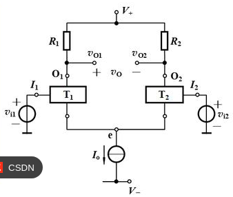
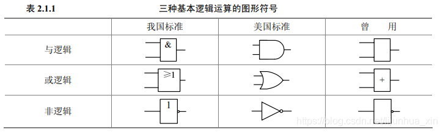
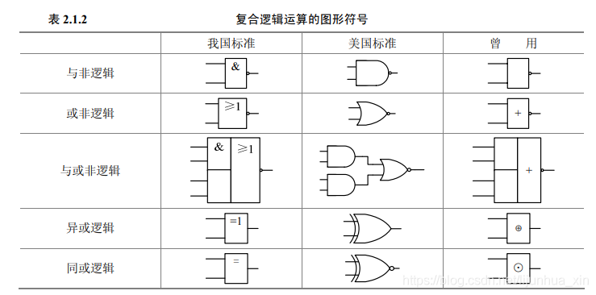
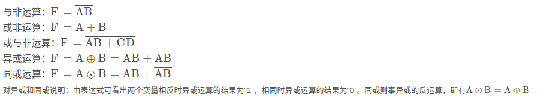

.. _electron_summary_index:

============
1 电子元器件
============
这是我见过讲的比较透彻的一个视频了：

[三极管是如何实现放大的（上）赵全老师纯干货讲解！](https://m.toutiao.com/is/i8FKY8Y3/)

[三极管是如何实现放大的（下）赵全老师纯干货讲解！](https://m.toutiao.com/is/i8FKrSBh/)

PN结及三极管放大电路是人类史上的一个丰碑，他让人类实现了信息化、数字化。

==========
2 放大电路
==========
[三极管的工作原理-赵全（上）2021版](https://m.toutiao.com/is/i8FK286g/)

[三极管的工作原理-赵全（下）2021版](https://m.toutiao.com/is/i8FwoM9b/)

经典放大电路：

.. image:: images/ttl_amplifier.jpg

放大电路要工作，必须满足三极管0.6-0.7V工作区间要求。低于0.6V，三极管不导通，叫截止。
大于0.7V叫饱和，再高了也不再放大了。
因此实际的放大电路是在0.6-0.7V之间上下信号放大。
那么该电路首先是通过一个偏置电路将Q的基极电压置到0.65V，那么X1信号来的时候（在正负0.5V区间），
可以通过Q的放大作用将信号放大到X2输出端。其中C1电容起到防止静态直流工作电压通过X1短路的作用。
该电路中，关键术语解释:

* 1 偏置电路，提供整体放大电路的静态工作电压的电路。核心关键是X3电源，R1,R2,R3，R4电阻以及Q三极管。
* 2 偏置电阻，R1,R2,RP分压，让Q的基极获得0.65V的静态工作电压，管这几个电阻叫偏置电阻。
* 3 输出电阻，R3电阻固定，那么在Q放大不同信号即不同电流时，Ic电流随之变化，那么R3两端电压也随之变化。
  进而Q的集电极电位也随之动态变化。因此管R3叫输出电阻。

有了放大电路，配合上光敏、压敏、红外、温度、湿度等等传感器，我们实现了自动化。

================
3 集成运算放大器
================
放大电路中的零点飘移问题（晶体管导电性因温度变化而变化），另外因为像炉温变化等场景，不宜电容耦合放大电路，需要直接耦合。

为解决零点飘移问题，有人发明了差分放大电路，即两个完全对称的放大电路，这样就在飘移大家一起飘移，然后相互一减，就抵消了突变情况，让电路保持稳定。

视频教程: https://m.toutiao.com/is/i8a239Tb

直接的差分放大电路：

这里的差分电路必须双端输入，双端输出。

在上面差分电路接地端加上一个恒流源，可以做到单输入单输出。

详细计算推导过程见视频。

集成运算放大器内部实现如下：

==================
4 逻辑数学与门电路
==================
数字电路本质上是高电平为1，低电平为0的逻辑运算。

【 1. 基本逻辑运算 】
① 与
Y=A · B =AB

② 或
Y=A+B

③ 非
Y=A‘

与运算：有0出0，全1出1.
或运算：有1出1，全0出0.

【 2.复合逻辑运算】
① 与非
Y=(A·B)’

② 或非
Y=(A+B)‘

③ 与或非
Y=(A·B+C·D)‘

.. image:: images/logic_compute_3_1.png

④ 异或
Y=A⊕B= A · B’ + A’ · B

⑤ 同或
Y=A⊙B= A · B +A’ · B’

.. image:: images/logic_compute_5.png

PS：异或逻辑与同或逻辑互为反函数、对偶函数。

【 3. 基本公式 】

.. image:: images/logic_compute_6.png

【 4. 常用公式 】

.. image:: images/logic_compute_7.png

消因子公式证明：
A + A’B =( AA + AB + AA’ ) + A’B = ( A+A’ ) ( A+B ) = A + B

消项公式证明：
AB+A’C+BC=AB+A’C+BC(A+A’)=AB+A’C+ABC+A’BC=AB+A’C

AB+A’C+BCD = AB+A’C+BCD(A+A’) = ( AB + ABCD ) + ( A’C + A’CBD) = AB+A’C

【 5. 定理 】
1. 代入定理
在任何一个包含A的逻辑等式中，若以另外一个逻辑式带入式中A的位置，则等式依然成立。

2. 反演定理
对于任意一个逻辑式Y，若将其中所有的‘ · ’换成‘ + ’，‘ + ’换成‘ · ’，1换成0，0换成1，原变量换成反变量，反变量换成原变量，则得到的结果就是Y’，即其反函数。

遵循规则：

3. 对偶定理
两逻辑式相等，则它们的对偶式也相等。

======================
5 触发器及时序逻辑电路
======================

