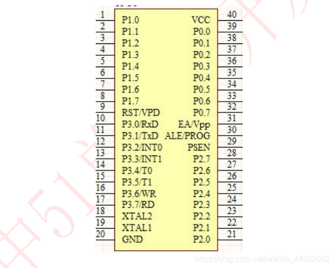

.. _021_mcu_common_summary_index:

======================================
单片机知识总结
======================================

1 单片机简介
===================================

单片机也称为微控制器(MCU)等，它并不是一个拥有逻辑功能的芯片，而是把一个计算机系统集成到芯片之上。就相当于一个微型的计算机，和一般的计算机相比，单片机就只是缺少了I/O设备。

单片机的应用领域十分广泛，比如实时工控、通讯设备、智能仪表、家用电器、导航系统等。各种电子产品一旦用上了单片机，就能够给产品增加一些特定功能，实现更新换代。普通的电器增加了特定单片机模块后，就能称之为：”智能电子“。

现在主流单片机包括CPU、2KB容量的RAM、 2个16位定时/计数器、128 KB容量的ROM、4个8位并行口、ADC/DAC、全双工串口行口、EEPROM、SPI、I2C、ISP、IAP等。

单片机本质上也是冯诺依曼架构的计算机，包括运算器、控制器、寄存器。

1.1 单片机的周期
--------------------------------------
时钟周期：也称为震荡周期，定义为时钟频率的倒数（可以这样来理解，时钟周期就是单片机外接晶振的倒数，如12Mhz的晶振，它的时钟周期就是1/12us）,
它是单片机中最基本的、最小的时间单位。在一个时钟周期内，CPU仅完成这一个最基本的动作

状态周期：它是时钟周期的两倍

机器周期：单片机的基本操作周期，在一个操作周期内，单片机完成一项基本操作，如取指令、存储器读写等。它由12个时钟周期（6个状态周期）组成。

指令周期：他是指CPU执行一条指令所需要的时间。一般一个指令周期含有1~4个机器周期。

1.2 波特率/定时器初值
------------------------------------------
(1)波特率：单片机或计算机在串口通信时的速率用波特率表示，它定义为每秒传输二进制代码的位数，即1波特 = 1位/秒，单位是bps。

(2)波特率的计算：在串行通信中，收、发双方对发送或接受数据的速率有约定。通过编程可对单片机串行口设定四种工作方式，其中方式0和方式2的波特率是固定的，而方式1和方式3的波特率是可变的，由定时器T1的溢出率来决定。

(3)为什么51系列单片机常用11.0592MHz的晶振设计？常用波特率通常按规范取1200,2400,4800,9600···，若采用晶振12Mhz或6Mhz，计算得出的T1定时初值将不是一个整数，这样通信时便会产生积累误差。

2 常见单片机
===============================
 * 51单片机，最适合入门的单片机。会C语言的话，1小时即可上手玩转。
 * STM32，STM32是意法半导体（ST）推出一款32位的单片机。STM32具有超低的价格、超多的外设、丰富的型号、优异的实时性、极低的开发成本等优势。STM32凭借其产品线的多样化、极高的性价比、简单易用的库开发方式，迅速在众多32位单片机中脱颖而出。
 * ASR-PRO，语音识别单片机。是国产杭州天问五幺科技公司出口，使用体验非常好。
 * ESP8266, ESP8266可以作为辅助的模块进行数据的传输：可以在Arduino IDE的主程序内创建函数进行编写，将Arduino开发板连接的检测模块的数据通过ESP8266传输到服务器等。
 * Arduino，Arduino是一个开放源码电子原型平台，拥有灵活、易用的硬件和软件。
 * 树莓派 香橙派， 更像是带GPIO功能的通用计算机。

3 GPIO
======================
GPIO是通用输入输出。主要三种使用方式： 连接其它器件进行通信； 输出高低电平直接控制器件； 连接传感器或开关作为输入判断。
如下图是51单片机的GPIO引脚。

4 中断/TIMER
==============================

5 单片机通信总线
======================================

5.1 UART串口
----------------------------

5.2 IIC
----------------------------

5.3 SPI
----------------------------

5.4 CAN
----------------------------

6 EEPROM
======================

7 ADC/DAC
======================

8 Flash
======================

9 IAP
======================

10 看门狗
======================
