# STM32 学习笔记-中级篇 #

* * *

### 第40讲 USMART调试组件实验-M3 ###

**什么是USMART?**  
USMART是正点原子团队为其STM32开发平台开发的一种类似linux的shell的调试工具。具体工作过程是通过串口发送命令给单片机，然后单片机收到命令之后调用单片机里面对应的相关函数，并执行，同时支持返回结果。  
USMART调试过程：  
　串口调试助手发送函数命令：Led_Set(0);  
　单片机接受到命令之后，解析命令，调用对应的函数：Led_set(）;  
　Led_set函数  
**USMART应用场景**  
开发过程中，经常需要修改函数入口参数，查看运行效果的情况下应用非常方便。不用多次下载代码，或者多次用JLINK调试。  
**USMART特点**  
- 可以调用绝大部分用户直接编写的函数。  
- 资源占用极少（最少情况：FLASH:4K；SRAM:72B）。  
- 支持参数类型多（数字（包含10/16进制）、字符串、函数指针等）。  
- 支持函数返回值显示。  
- 支持参数及返回值格式设置。  
- 支持函数执行时间计算（V3.1版本新特性）。  
- 使用方便。  

**USMART文件组**  
- usmart.c负责与外部互交等。  
- usmat_str.c主要负责命令和参数解析。  
- usmart_config.c主要由用户添加需要由usmart管理的函数。  
- usmart.h和usmart_str.h是两个头文件，其中usmart.h里面含有几个用户配置宏定义，可以用来配置usmart的功能及总参数长度(直接和SRAM占用挂钩)、是否使能定时器扫描、是否使用读写函数等。  

**USMART配置步骤：**  
1. 将USMART包添加到工程中，头文件要包含到path。  
1. 添加需要调用的函数到usmart_config.c文件中。  
1. 主函数中调用usmart_dev.init函数初始化usmart。  
1. 即可通过助手发送命令，调用在usmart注册过的函数。  

**USMART系统命令：**   USMART有7个系统命令:  
- ?:      获取帮助信息  
- help:   获取帮助信息  
- list:   可用的函数列表  
- id:     可用函数的ID列表  
- hex:    参数16进制显示,后跟空格+数字即执行进制转换  
- dec:    参数10进制显示,后跟空格+数字即执行进制转换  
- runtime 1,开启函数运行计时;0,关闭函数运行计时;  
请按照程序编写格式输入函数名及参数并以回车键结束.  
_ _ _

### 第41讲 RTC实时时钟_备份区域BKP 原理讲解-M3 ###

**RTC (Real Time Clock)：实时时钟**  
RTC是个独立的定时器。RTC模块拥有一个连续计数的计数器，在相应的软件配置下，可以提供时钟日历的功能。修改计数器的值可以重新设置当前时间和日期。  
RTC模块和时钟配置系统(RCC_BDCR寄存器)是在后备区域，即在系统复位或从待机模式唤醒后RTC的设置和时间维持不变。但是在系统复位后，会自动禁止访问后备寄存器和RTC，以防止对后备区域(BKP)的意外写操作。所以在要设置时间之前， 先要取消备份区域（BKP）写保护。  
**RTC特征**  
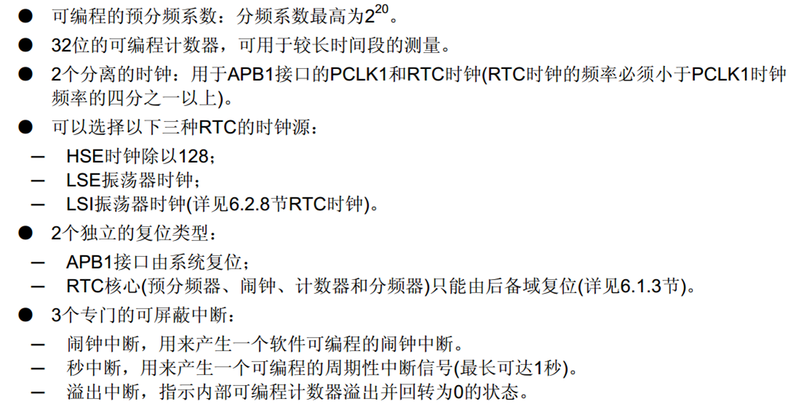  
**RTC工作原理框图**  
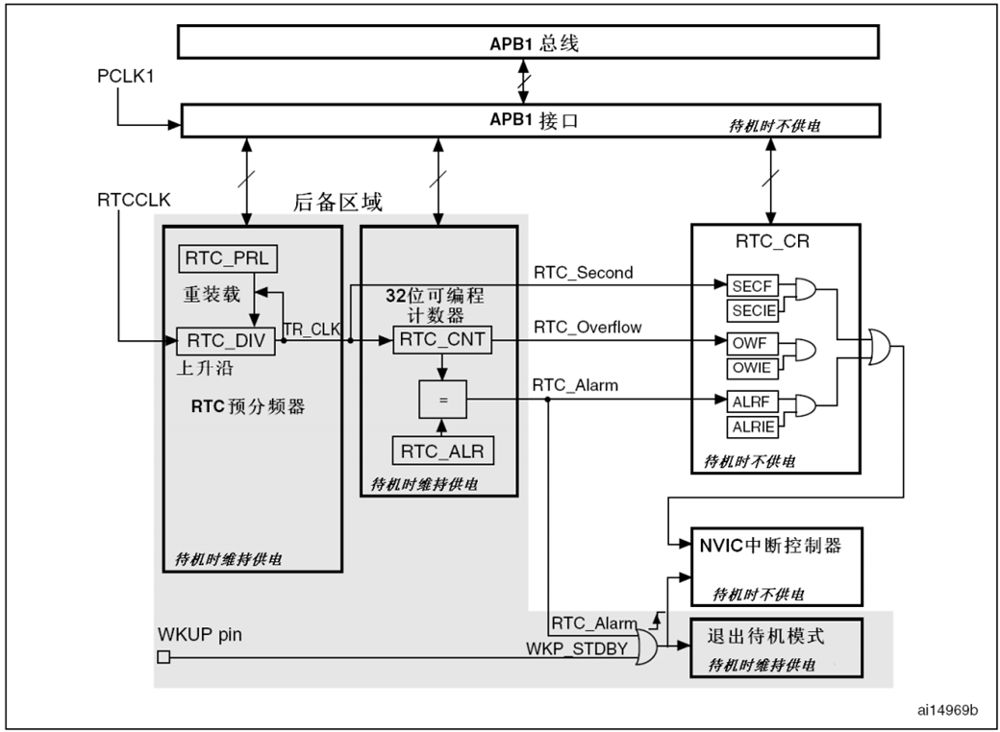  
**RTC由两部分组成:**  
- APB1接口：用来和APB1总线相连。通过APB1接口可以访问RTC的相关寄存器（预分频值，计数器值，闹钟值）。  
- RTC核心：由一组可编程计数器组成。分两个主要模块。  
　　第一个是RTC预分频模块，它可以编程产生最长1秒的RTC时间基TR_CLK。如果设置了秒中断允许位，可以产生秒中断。  
　　第二个是32位的可编程计数器，可被初始化为当前时间。系统时间按TR_CLK周期累加并与存储在RTC_ALR寄存器中的可编程时间相比，当匹配时候如果设置了闹钟中断允许位，可以产生闹钟中断。  

　　RTC内核完全独立于APB1接口，软件通过APB1接口对RTC相关寄存器访问。但是相关寄存器只在RTC APB1时钟进行重新同步的RTC时钟的上升沿被更新。所以软件必须先等待寄存器同步标志位（RTC_CRL的RSF位）被硬件置1才读。  

**RTC时钟源**  
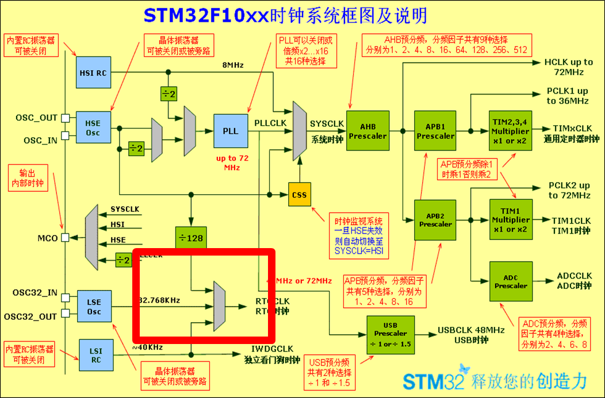  
**BKP备份寄存器**  
1. 备份寄存器是42个16位的寄存器。可用来存储84个字节数据。  
1. 它们处在备份区域，当VDD电源切断，仍然由VBAT维持供电。  
1. 当系统在待机模式下被唤醒，或者系统复位或者电源复位，它们也不会复位。  
1. 执行以下操作将使能对后备寄存器和RTC访问：  
设置寄存器RCC_APB1ENR的PWREN和BKPEN位，使能电源和后备时钟。  
设置寄存器PWR_CR的DBP位，使能对RTC和后备寄存器的访问。  

提醒：一共有42个16位备份寄存器。常用来保存一些系统配置信息和相关标志位。  
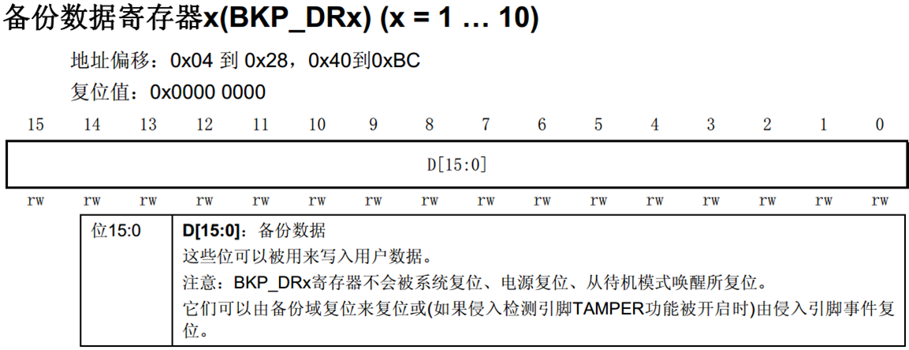  
**RTC相关寄存器**  
1. RTC控制寄存器             (RTC_CRH，   RTC_CRL)  
1. RTC预分频装载寄存器  (RTC_PRLH， RTC_PRLL)  
1. RTC预分频余数寄存器  (RTC_DIVH，  RTC_DIVL)  
1. RTC计数器寄存器         (RTC_CNTH， RTC_CNTL)  
1. RTC闹钟寄存器             (RTC_ALRH ，RTC_ALRL)  

**RTC控制寄存器高位（RTC_CRH)**  
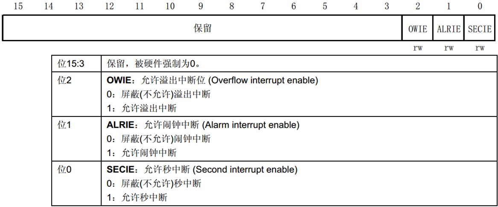  
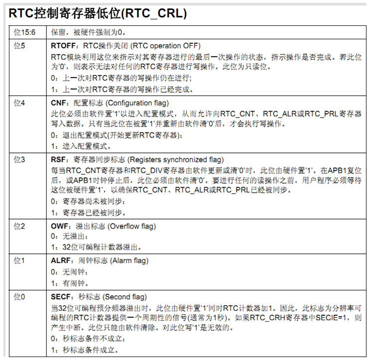  
①修改CRH/CRL寄存器，必须先判断RSF位，确定已经同步。  
②修改CNT,ALR,PRL的时候，必须先配置CNF位进入配置模式，修改完之后，设置CNF位为0退出配置模式  
③同时在对RTC相关寄存器写操作之前，必须判断上一次写操作已经结束，也就是判断RTOFF位是否置位。  
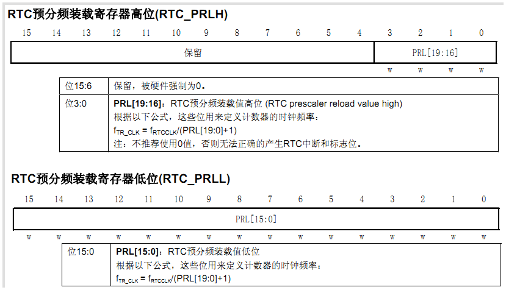  
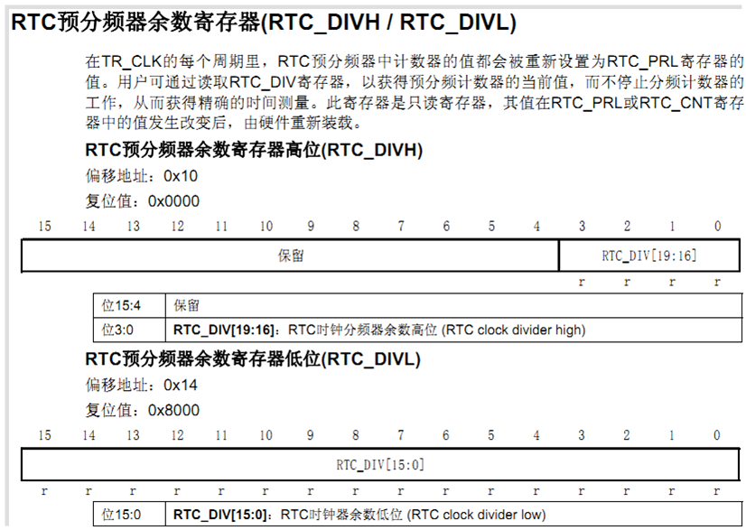  
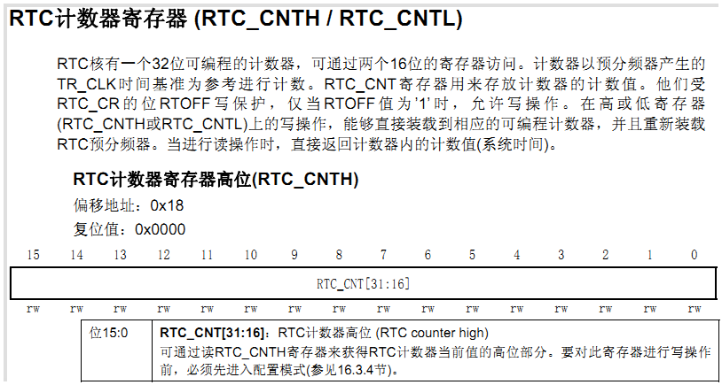  
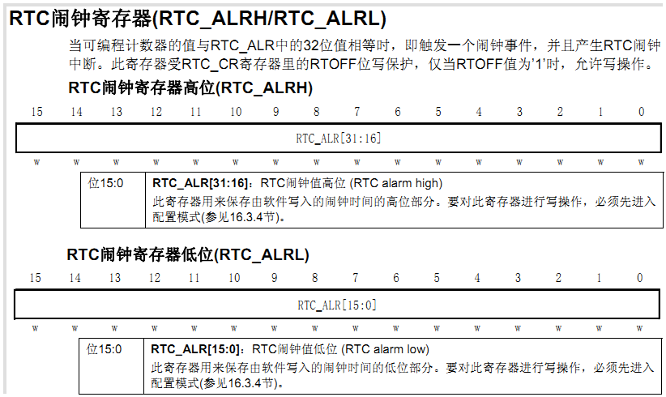  
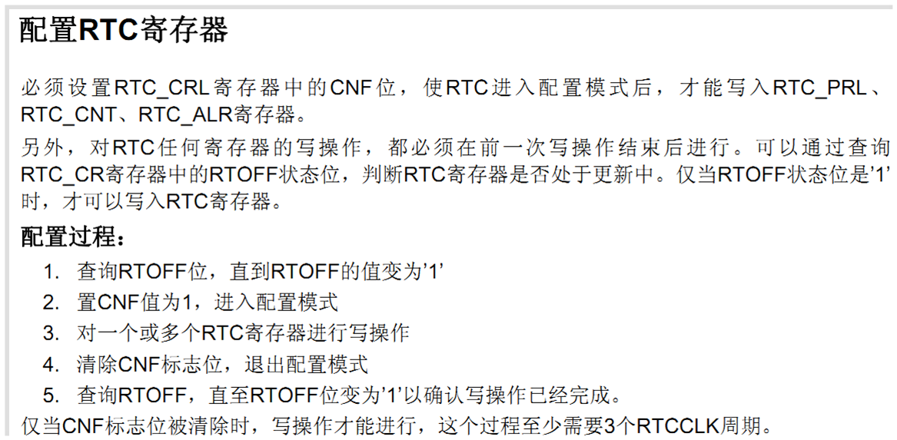  
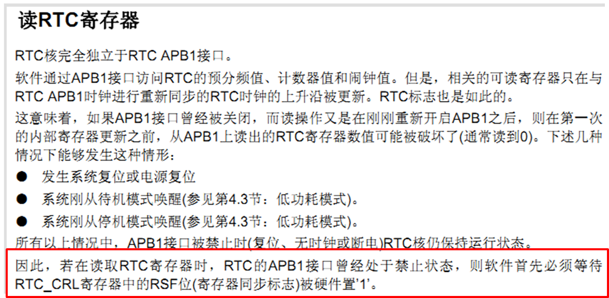  

**RTC相关库函数讲解**  
库函数所在文件： stm32f10x_rtc.c / stm32f10x_rtc.h  
1. RTC时钟源和时钟操作函数：  
 void RCC_RTCCLKConfig(uint32_t  CLKSource)；//时钟源选择  
 void RCC_RTCCLKCmd(FunctionalState NewState)//时钟使能   
1. RTC配置函数（预分频，计数值：  
void RTC_SetPrescaler(uint32_t PrescalerValue);//预分频配置：PRLH/PRLL  
void RTC_SetCounter(uint32_t CounterValue)；//设置计数器值：CNTH/CNTL  
void RTC_SetAlarm(uint32_t AlarmValue)；//闹钟设置：ALRH/ALRL  
1. RTC中断设置函数：  
void RTC_ITConfig(uint16_t RTC_IT, FunctionalState NewState);//CRH  
1. RTC允许配置和退出配置函数：  
void RTC_EnterConfigMode(void);//允许RTC配置 :CRL位 CNF  
void RTC_ExitConfigMode(void);//退出配置模式:CRL位 CNF  
1. 同步函数：  
void RTC_WaitForLastTask(void)；//等待上次操作完成：CRL位RTOFF  
void RTC_WaitForSynchro(void)；//等待时钟同步：CRL位RSF  
1. 相关状态位获取清除函数：  
FlagStatus RTC_GetFlagStatus(uint16_t RTC_FLAG);  
void RTC_ClearFlag(uint16_t RTC_FLAG);  
ITStatus RTC_GetITStatus(uint16_t RTC_IT);  
void RTC_ClearITPendingBit(uint16_t RTC_IT);  
1. 其他相关函数（BKP等）  
PWR_BackupAccessCmd();//BKP后备区域访问使能  
RCC_APB1PeriphClockCmd();//使能PWR和BKP时钟  
RCC_LSEConfig();//开启LSE，RTC选择LSE作为时钟源  
uint16_t BKP_ReadBackupRegister(uint16_t BKP_DR);//读BKP寄存器  
void BKP_WriteBackupRegister(uint16_t BKP_DR, uint16_t Data);//写BKP  

**RTC配置一般步骤**  
① 使能PWR和BKP时钟：RCC_APB1PeriphClockCmd();  
②  使能后备寄存器访问:   PWR_BackupAccessCmd();  
③  配置RTC时钟源，使能RTC时钟：  
      RCC_RTCCLKConfig();  
      RCC_RTCCLKCmd();  
      如果使用LSE，要打开LSE：RCC_LSEConfig(RCC_LSE_ON);  
④ 设置RTC预分频系数：RTC_SetPrescaler();  
⑤ 设置时间：RTC_SetCounter();  
⑥ 开启相关中断（如果需要）:RTC_ITConfig()；  
⑦ 编写中断服务函数：RTC_IRQHandler();  
⑧ 部分操作要等待写操作完成和同步。  
   RTC_WaitForLastTask();//等待最近一次对RTC寄存器的写操作完成  
   RTC_WaitForSynchro();	//等待RTC寄存器同步  
_ _ _

### 第42讲 RTC实时时钟程序讲解-M3 ###

### 第43讲 待机唤醒实验-低功耗-M3 ###

### 第44讲 ADC基本原理-M3 ###
### 第45讲 ADC模数转换实验-M3 ###
### 第46讲 内部温度传感器实验-M3 ###
### 第47讲 光敏传感器实验-M3 ###
### 第48讲 DAC数模转换实验-M3 ###
### 第49讲 PWM DAC实验-M3 ###
### 第50讲 DMA基本原理-M3 ###
### 第51讲 DMA实验实验程序讲解-M3 ###
### 第52讲 I2C通信实验-M3 ###
### 第53讲 SPI接口原理与配置-M3 ###
### 第54讲 SPI通信实验-M3 ###
### 第55讲 485通信实验-M3 ###
### 第56讲 CAN通信基础知识介绍-M3 ###
### 第57讲 STM32 CAN控制器原理与配置-M3 ###
### 第58讲 CAN通信实验讲解-M3 ###
### 第59讲 触摸屏实验-电容型触摸屏-M3 ###
### 第60讲 触摸屏实验-电阻型触摸屏-M3 ###
### 第61讲 红外遥控器实验-M3 ###
### 第62讲 游戏手柄实验-M3 ###
### 第63讲 DS18B20温度传感器实验-M3 ###
### 第64讲 DHT11温湿度传感器实验-M3 ###
### 第65讲 MPU6050六轴传感器实验-M3 ###
### 第66讲 2.4G无线通信实验-M3 ###
### 第67讲 FLASH闪存编程原理与步骤-M3 ###
### 第68讲 FLASH模拟EEPROM实验-M3 ###
### 第69讲 OV7670摄像头实验-M3 ###
### 第70讲 外部SRAM实验 ###
### 第71讲 内存管理实验 ###

