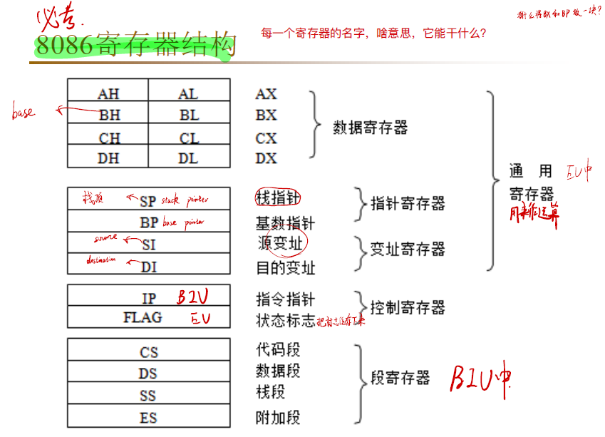

.. _02-microcomputersummary_index:

================================
微机原理学习总结
================================

1 冯诺依曼架构
================================
1.1 概述
-------------------------
1946年，第一台计算机ENIAC诞生，人类进入计算机时代，后来，美籍匈牙利数学家：冯.诺依曼提出了计算机“存储程序”的计算机设计理念，即将计算机指令进行编码后存储在计算机的存储器中，需要的时候可以顺序地执行程序代码，从而控制计算机运行，这就是冯.诺依曼计算机体系的开端。

.. image:: images/nuoyiman.jpg

早期的计算机设计中，程序和数据是俩个截然不同的概念，数据放在存储器中，而程序作为控制器的一部分，这样的计算机计算效率低，灵活性较差。冯.诺依曼结构中，将程序和数据一样看待，将程序编码为数据，然后与数据一同存放在存储器中，这样计算机就可以调用存储器中的程序来处理数据了。意味着，无论什么程序，最终都是会转换为数据的形式存储在存储器中，要执行相应的程序只需要从存储器中依次取出指令、执行，冯.诺依曼结构的灵魂所在正是这里：减少了硬件的连接，这种设计思想导致了硬件和软件的分离，即硬件设计和程序设计可以分开执行！！！这就催生了程序员这个职业的诞生！！！

概括的来讲，冯.诺依曼结构消除了原始计算机体系中，只能依靠硬件控制程序的状况（程序作为控制器的一部分，作为硬件存在），将程序编码存储在存储器中，实现了可编程的计算机功能，实现了硬件设计和程序设计的分离，大大促进了计算机的发展。

灵魂就是将程序从硬件实现转换为软件实现（存储程序控制原理）！！！

核心设计思想主要体现在如下三个方面：

 * 程序、数据的最终形态都是二进制编码，程序和数据都是以二进制方式存储在存储器中的，二进制编码也是计算机能够所识别和执行的编码。（可执行二进制文件：.bin文件）
 * 程序、数据和指令序列，都是事先存在主（内）存储器中，以便于计算机在工作时能够高速地从存储器中提取指令并加以分析和执行。
 * 确定了计算机的五个基本组成部分：运算器、控制器、存储器、输入设备、输出设备

1.2 运算器
-------------------------
首先计算机要有运算处理数据的能力，所以需要一个处理单元来完成各种算数运算和逻辑运算，这就是算术逻辑单元（Arithmetic Logic Unit，ALU）。ALU的主要功能就是在控制信号的作用下，完成加、减、乘、除等算术运算以及与、或、非、异或等逻辑运算以及移位、补位等运算。

运算器的主要部件就是ALU，运算器的处理对象是数据，所以数据的长度以及数据的表示方法，对运算器的影响很大。大多数通用计算机是以16、32、64位数据作为运算器一次处理数据的长度。能够对一个数据的所有位同时处理运算器称为并行运算器，一次只能对数据的一个位处理的运算器称为串行运算器。

运算器与其他部分的关系：

计算机运算时，运算器的操作对象和操作种类由控制器决定。运算器操作的数据从内存中读取，处理的结果再写入内存（或者暂时存放在内部寄存器中），而且运算器对内存数据的读写是由控制器来进行的。

1.3 控制器
--------------------------
控制器又称为控制单元（Control Unit），是计算机的神经中枢和指挥中心，只有在控制器的控制下，整个计算机才能够有条不紊地工作、自动执行程序。

控制器是整个CPU的指挥控制中心，由指令寄存器IR（InstructionRegister）、程序计数器PC（ProgramCounter）和操作控制器OC（OperationController）三个部件组成。

控制器的工作流程为：从内存中取指令、翻译指令、分析指令，然后根据指令的内存向有关部件发送控制命令，控制相关部件执行指令所包含的操作。

控制器和运算器共同组成中央处理器（Central Processing Unit），CPU是一块超大规模集成电路，是计算机运算核心和控制核心，CPU的主要功能是解释计算机指令以及处理数据。

1.4 存储器
-----------------------------
内部存储器称为内存或者主存，是用来存放欲执行的程序和数据。

在计算机内部，程序和数据都是以二进制代码的形式存储的，它们均以字节为单位（8位）存储在存储器中，一个字节占用一个存储单元，并且每个存储单元都有唯一的地址号。

这里以字节（8位）为存储单元，就与上面运算器的操作数据的大小联系起来了，16、32、64都是8的倍数

CPU可以直接使用指令对内部存储器按照地址进行读写俩种操作，读：将内存中某个存储单元的内容读出，送入CPU的某个寄存器中；写：在控制器的控制下，将CPU中某寄存器内容传到某个存储单元中。

要注意，内存中的数据和地址码都是二进制数，但是俩者是不同的，一个地址可以指向一个存储单元，地址是存储单元的位置，数据是存储单元的内容，数据可以是操作码、可以是CPU要处理阿数据、也可以是数据的地址，地址码的长度由内存单元的个数确定。

内存的存取速度会直接影响计算机的运算速度，由于CPU是高速器件，但是CPU的速度是受制于内存的存取速度的，所以为了解决CPU和内存速度不匹配的问题，在CPU和内存直接设置了一种高速缓冲存储器Cache。 Cache是计算机中的一个高速小容量存储器，其中存放的是CPU近期要执行的指令和数据，其存取速度可以和CPU的速度匹配，一般采用静态RAM充当Cache

内存按工作方式的不同又可以分为俩部分：

RAM：随机存储器，可以被CPU随机读取，一般存放CPU将要执行的程序、数据，断电丢失数据

ROM：只读存储器，只能被CPU读，不能轻易被CPU写，用来存放永久性的程序和数据，比如：系统引导程序、监控程序等。具有掉电非易失性。

1.5 程序在CPU中执行过程
-----------------------------------
程序在CPU中执行的过程可以分为以下几个步骤：
 * 取指：CPU从内存中取出下一条需要执行的指令，并将其存储在指令寄存器中。
 * 译码：CPU对指令进行解码，以确定需要执行的操作类型。
 * 执行：根据译码结果，CPU执行相应的操作，如进行算术逻辑运算、数据传输等。
 * 访存：如果需要从内存中读取或写入数据，CPU将执行访存操作。
 * 回写：如果寄存器中的结果需要写回内存，CPU将执行回写操作。
 * 更新PC：CPU更新程序计数器（PC），以指向下一条需要执行的指令。
 * 这个过程会不断重复，直到程序执行完毕。

相关术语：
 * 1. Ad(Address) 形式地址
 * 2. AC(Accumulation register)累加寄存器
 * 3. ALU(Arithmetic logic unit)算术逻辑单元
 * 4. MQ(Multiplier-Quotient Register)乘商寄存器
 * 5. DR(Data Register) 数据寄存器
 * 6. AR(Address Register) 地址寄存器(MAR)
 * 7. IR(Instruction Register) 指令寄存器
 * 8. BR(Buffer Register) 缓冲寄存器(MBR)
 * 9. ID(Instruction Decoder) 指令译码器
 * 10. PC(ProgramCounter) 程序计数器

2 微处理器
================================
2.1 8086处理器
-----------------------------
参照： https://developer.aliyun.com/article/985092

EU与BIU的结构和功能
总线接口部件BIU

BIU是CPU与外部存储器及输入输出的接口，负责数据交换。
BIU由下列各部分组成：

4个16位段地址寄存器，即代码段寄存器CS，数据段寄存器DS，附加段寄存器ES和堆栈段寄存器SS，它们分别用于存放当前代码段、数据段、附加段和堆栈段的段基址。
段基址表示20位段起始地址的高16位，段起始地址的低4位固定是0。

16位指令指针IP：IP用于存放下一条要执行指令的有效地址EA(即偏移地址)，IP的内容由BIU自动修改，通常是进行加1修改。当执行转移指令、调用指令时，BIU装入IP中的是转移目的地址。
偏移地址表示离段起始地址之间的距离，用字节数表示。如偏移地址=0064H,表示该地址距离段起始地址有100个字节，偏移地址为0就表示该地址为段起始地址。
由段基址（段寄存器的内容）和偏移地址两部分构成了存储器的逻辑地址，如CS:IP=3000:2000H，CS:IP=0200:1020H等，都是逻辑地址。

地址加法器：加法器用于将逻辑地址变换成读／写存储器所需的20位物理地址，即完成地址加法操作。方法是将某一段寄存器的内容（代表段基址）左移4位（相当乘16）再加上16位偏移地址以形成20位物理地址。
6字节的指令队列：当执行单元EU正在执行指令中，且不需要占用总线时，BIU会自动进行预取下一条或几条指令的操作，并按先后次序存入指令队列中排队，由EU按顺序取来执行。
总线控制逻辑：总线控制逻辑用于产生并发出总线控制信号，以实现对存储器和输入输出端口的读／写控制。
执行部件EU：负责指令的执行

算术逻辑单元ALU: ALU完成16位或8位的二进制数的算术逻辑运算，绝大部分指令的执行都由ALU完成。在运算时数据先传送至16位的暂存寄存器中，经ALU处理后，运算结果可通过内部总线送入通用寄存器或由BIU存入存储器。
标志寄存器FR：它用来反映CPU最近一次运算结果的状态特征或存放控制标志。FR为16位，其中7位未用。
通用寄存器组：它包括4个数据寄存器AX、BX、CX、DX，其中AX又称累加器，4个专用寄存器，即基址指示器BP、堆栈指示器SP、源变址寄存器SI和目的变址寄存器DI。
EU控制器：它接收从BIU中指令队列取来的指令，经过指令译码形成各种定时控制信号，向EU内各功能部件发送相应的控制命令，以完成每条指令所规定的操作。
BIU和EU的动作管理

取指令
BIU从内存取指令，并送到指令队列。取指令时的地址由代码段寄存器CS中的16位段基址的最低位后补4个0，再与指令指针IP中的16位偏移地址在地址加法器中相加得到20位物理地址。然后通过总线控制逻辑发出存储器读命令，从而启动存储器，从存储器中取出指令并送入指令队列供EU执行。
取操作数或存结果
在EU执行指令过程中需要取操作数或存结果时，先向BIU发出请求，并提供操作数的有效地址，BIU将根据EU的请求和提供的有效地址，形成20位的物理地址并执行一个总线周期去访问存储器或I/O端口，从指定存储单元或I/O端口取出操作数送交EU使用或将结果存入指定的存储单元或I/O端口。如果BIU已准备好取指令同时又收到EU的申请，BIU先完成取指令的操作，然后进行操作数的读写。
当EU执行转移、调用和返回指令时，BIU先自动清除指令队列，再按EU提供的新地址取指令。BIU新取得的第一条指令将直接送到EU中去执行。然后，BIU将随后取得的指令重新填入指令队列。

8086寄存器结构：

EAX 是"累加器"(accumulator), 它是很多加法乘法指令的缺省寄存器。

EBX 是"基地址"(base)寄存器, 在内存寻址时存放基地址。

ECX 是计数器(counter), 是重复(REP)前缀指令和LOOP指令的内定计数器。

EDX 则总是被用来放整数除法产生的余数。

ESI/EDI分别叫做"源/目标索引寄存器"(source/destination index),因为在很多字符串操作指令中, DS:ESI指向源串,而ES:EDI指向目标串.

EBP是"基址指针"(BASE POINTER), 它最经常被用作高级语言函数调用的"框架指针"(frame pointer). 在破解的时候,经常可以看见一个标准的函数起始代码:
　　
 * push ebp ;保存当前ebp
 * mov ebp,esp ;EBP设为当前堆栈指针
 * sub esp, xxx ;预留xxx字节给函数临时变量.
 * ...

　　这样一来,EBP 构成了该函数的一个框架, 在EBP上方分别是原来的EBP, 返回地址和参数. EBP下方则是临时变量. 函数返回时作 mov esp,ebp/pop ebp/ret 即可.

ESP 专门用作堆栈指针，被形象地称为栈顶指针，堆栈的顶部是地址小的区域，压入堆栈的数据越多，ESP也就越来越小。在32位平台上，ESP每次减少4字节。

2.2 ARM处理器
-----------------------------
详见MCU STM32

3 总线
===================
总线（Bus）是计算机各种功能部件之间传送信息的公共通信干线。总线是一种内部结构，它是 cpu、内存、输入、输出设备传递信息的公用通道，主机的各个部件通过总线相连接，外部设备通过相应的接口电路再与总线相连接，从而形成了计算机硬件系统。

总线分类
----------------

1、总线按功能和规范可分为五大类型：数据总线、地址总线、控制总线、扩展总线及局部总线。

数据总线、地址总线和控制总线也统称为系统总线，即通常意义上所说的总线。常见的数据总线为ISA、EISA、VESA、PCI等。

地址总线：是专门用来传送地址的，由于地址只能从CPU传向外部存储器或I/O端口，所以地址总线总是单向三态的，这与数据总线不同，地址总线的位数决定了CPU可直接寻址的内存空间大小。

控制总线：用来传送控制信号和时序信号。控制信号中，有的是微处理器送往存储器和I/O接口电路的；也有是其它部件反馈给CPU的，比如：中断申请信号、复位信号、总线请求信号、设备就绪信号等。

2、按照传输数据的方式划分，可以分为串行总线和并行总线。串行总线中，二进制数据逐位通过一根数据线发送到目的器件；并行总线的数据线通常超过2根。常见的串行总线有SPI、I2C、USB及RS232等。

3、按照时钟信号是否独立，可以分为同步总线和异步总线。同步总线的时钟信号独立于数据，而异步总线的时钟信号是从数据中提取出来的。SPI、I2C是同步串行总线，RS232采用异步串行总线。

4、微机中总线一般有内部总线、系统总线和外部总线。内部总线是微机内部各外围芯片与处理器之间的总线，用于芯片一级的互连；而系统总线是微机中各插件板与系统板之间的总线，用于插件板一级的互连；外部总线则是微机和外部设备之间的总线，微机作为一种设备，通过该总线和其他设备进行信息与数据交换，它用于设备一级的互连。

那么多分类，笔者也只能选择一种介绍了，就选择内部总线、系统总线和外部总线咯。

内部总线
----------------

I2C总线：I2C（Inter-IC）总线10多年前由Philips公司推出，是近年来在微电子通信控制领域广泛采用的一种新型总线标准。它是同步通信的一种特殊形式，具有接口线少，控制方式简化，器件封装形式小，通信速率较高等优点。在主从通信中，可以有多个I2C总线器件同时接到I2C总线上，通过地址来识别通信对象。

SCI总线：串行通信接口SCI也是由Motorola公司推出的。它是一种通用异步通信接口UART，与MCS-51的异步通信功能基本相同。

IIS：I2S（Inter-IC Sound Bus）是飞利浦公司为数字音频设备之间的音频数据传输而制定的一种总线标准。I2S有3个主要信号：1.串行时钟SCLK，也叫位时钟，即对应数字音频的每一位数据，SCLK有1个脉冲。2.帧时钟LRCK，用于切换左右声道的数据。LRCK为“1”表示正在传输的是左声道的数据，为“0”则表示正在传输的是右声道的数据。3.串行数据SDATA，就是用二进制补码表示的音频数据。有时为了使系统间能够更好地同步，还需要另外传输一个信号MCLK，称为主时钟，也叫系统时钟（Sys Clock）。

SPI：SPI（Serial Peripheral Interface：串行外设接口）;SPI是Motorola首先在其MC68HCXX系列处理器上定义的。SPI接口主要应用在EEPROM，FLASH，实时时钟，AD转换器，还有数字信号处理器和数字信号解码器之间。SPI接口是以主从方式工作的，这种模式通常有一个主器件和一个或多个从器件，其接口包括以下四种信号：（1）MOSI – 主器件数据输出，从器件数据输入 （2）MISO – 主器件数据输入，从器件数据输出 （3）SCLK – 时钟信号，由主器件产生（4）/SS – 从器件使能信号，由主器件控制。

UART：UART（Universal Asynchronous Receiver Transmitter：通用异步收发器）。将由计算机内部传送过来的并行数据转换为输出的串行数据流。将计算机外部来的串行数据转换为字节，供计算机内部使用并行数据的器件使用。在输出的串行数据流中加入奇偶校验位，并对从外部接收的数据流进行奇偶校验。在输出数据流中加入启停标记，并从接收数据流中删除启停标记。处理由键盘或鼠标发出的中断信号（键盘和鼠票也是串行设备）。可以处理计算机与外部串行设备的同步管理问题。有一些比较高档的UART还提供输入输出数据的缓冲区。常用TXD，RXD，/RTS，/CTS。

JTAG：JTAG （Joint Test Action Group 联合测试行动小组）是一种国际标准测试协议（IEEE1149.1兼容），主要用于芯片内部测试。标准的JTAG接口是4线：TMS、TCK、TDI、TDO，分别为模式选择、时钟、数据输入和数据输出线。测试复位信号（TRST，一般以低电平有效）一般作为可选的第五个端口信号。一个含有JTAGDebug接口模块的CPU，只要时钟正常，就可以通过JTAG接口访问CPU的内部寄存器和挂在CPU总线上的设备，如FLASH，RAM，内置模块的寄存器，象UART，Timers，GPIO等等的寄存器。

CAN：CAN全称为“Controller Area Network”，即控制器局域网，是国际上应用最广泛的现场总线之一。最初，CAN被设计作为汽车环境中的微控制器通讯，在车载各电子控制装置ECU之 间交换信息，形成汽车电子控制网络。比如：发动机管理系统、变速箱控制器、仪表装备、电子主干系统中，均嵌入CAN控制装置。一个由CAN总线构成的单一网络中，理论上可以挂接无数个节点。实际应用中，节点数目受网络硬件的电气特性所限制。例如，当使用Philips P82C250作为CAN收发器时，同一网络中允许挂接110个节点。CAN 可提供高达1Mbit/s的数据传输速率，这使实时控制变得非常容易。另外，硬件的错误检定特性也增强了CAN的抗电磁干扰能力。

SDIO：SDIO是SD型的扩展接口，除了可以接SD卡外，还可以接支持SDIO接口的设备，插口的用途不止是插存储卡。支持 SDIO接口的PDA，笔记本电脑等都可以连接象GPS接收器，Wi-Fi或蓝牙适配器，调制解调器，局域网适配器，条型码读取器，FM无线电，电视接收 器，射频身份认证读取器，或者数码相机等等采用SD标准接口的设备。

GPIO：GPIO （General Purpose Input Output 通用输入/输出）或总线扩展器利用工业标准I²C、SMBus™或SPI™接口简化了I/O口的扩展。当微控制器或芯片组没有足够的I/O端口，或当系统 需要采用远端串行通信或控制时，GPIO产品能够提供额外的控制和监视功能。

系统总线
----------------

ISA总线：ISA（industrialstandardarchitecture）总线标准是IBM公司1984年为推出PC/AT机而建立的系统总线标准，所以也叫AT总线。它是对XT总线的扩展，以适应8/16位数据总线要求。它在80286至80486时代应用非常广泛，以至于现在奔腾机中还保留有ISA总线插槽。ISA总线有98只引脚。

EISA总线：EISA总线是1988年由Compaq等9家公司联合推出的总线标准。它是在ISA总线的基础上使用双层插座，在原来ISA总线的98条信号线上又增加了98条信号线，也就是在两条ISA信号线之间添加一条EISA信号线。在实用中，EISA总线完全兼容ISA总线信号。

VESA总线：VESA（videoelectronicsstandardassociation）总线是1992年由60家附件卡制造商联合推出的一种局部总线，简称为VL（VESAlocalbus）总线。它的推出为微机系统总线体系结构的革新奠定了基础。该总线系统考虑到CPU与主存和Cache的直接相连，通常把这部分总线称为CPU总线或主总线，其他设备通过VL总线与CPU总线相连，所以VL总线被称为局部总线。它定义了32位数据线，且可通过扩展槽扩展到64位，使用33MHz时钟频率，最大传输率达132MB/s，可与CPU同步工作。是一种高速、高效的局部总线，可支持386SX、386DX、486SX、486DX及奔腾微处理器。

PCI总线：PCI（peripheralcomponentinterconnect）总线是当前最流行的总线之一，它是由Intel公司推出的一种局部总线。它定义了32位数据总线，且可扩展为64位。PCI总线主板插槽的体积比原ISA总线插槽还小，其功能比VESA、ISA有极大的改善，支持突发读写操作，最大传输速率可达132MB/s，可同时支持多组外围设备。PCI局部总线不能兼容现有的ISA、EISA、MCA（microchannelarchitecture）总线，但它不受制于处理器，是基于奔腾等新一代微处理器而发展的总线。

外部总线
----------------

RS-232-C总线：RS-232-C是美国电子工业协会EIA制定的一种串行物理接口标准。RS是英文“推荐标准”的缩写，232为标识号，C表示修改次数。RS-232-C总线标准设有25条信号线，包括一个主通道和一个辅助通道，在多数情况下主要使用主通道，对于一般双工通信，仅需几条信号线就可实现，如一条发送线、一条接收线及一条地线。RS-232-C标准规定的数据传输速率为每秒50、75、100、150、300、600、1200、2400、4800、9600、19200波特。RS-232-C标准规定，驱动器允许有2500pF的电容负载，通信距离将受此电容限制，例如，采用150pF/m的通信电缆时，最大通信距离为15m；若每米电缆的电容量减小，通信距离可以增加。传输距离短的另一原因是RS-232属单端信号传送，存在共地噪声和不能抑制共模干扰等问题，因此一般用于20m以内的通信。

RS-485总线：在要求通信距离为几十米到上千米时，广泛采用RS-485串行总线标准。RS-485采用平衡发送和差分接收，因此具有抑制共模干扰的能力。加上总线收发器具有高灵敏度，能检测低至200mV的电压，故传输信号能在千米以外得到恢复。RS-485采用半双工工作方式，任何时候只能有一点处于发送状态，因此，发送电路须由使能信号加以控制。RS-485用于多点互连时非常方便，可以省掉许多信号线。应用RS-485可以联网构成分布式系统，其允许最多并联32台驱动器和32台接收器。

IEEE-488总线：IEEE-488总线用来连接系统，如微计算机、数字电压表、数码显示器等设备及其他仪器仪表均可用IEEE-488总线装配起来。它按照位并行、字节串行双向异步方式传输信号，连接方式为总线方式，仪器设备直接并联于总线上而不需中介单元，但总线上最多可连接15台设备。最大传输距离为20米，信号传输速度一般为500KB/s，最大传输速度为1MB/s。

USB总线：通用串行总线USB是由Intel、Compaq、Digital、IBM、Microsoft、NEC、NorthernTelecom等7家世界著名的计算机和通信公司共同推出的一种新型接口标准。它基于通用连接技术，实现外设的简单快速连接，达到方便用户、降低成本、扩展PC连接外设范围的目的。它可以为外设提供电源，而不像普通的使用串、并口的设备需要单独的供电系统。

计算机总线通信时，地址的确定主要依赖于地址总线。地址总线是计算机内部各部件间通信的重要部分，它负责传递存储单元或I/O端口的地址信息。地址总线的宽度决定了计算机可以直接寻址的内存空间大小。

计算机内部通信
-------------------------------------
在计算机内部通信过程中，地址的确定分为以下几个步骤：

1 CPU通过地址总线发送地址信号：当CPU需要访问内存或I/O端口时，它会通过地址总线发送地址信号。地址信号包含了目标存储单元或I/O端口的地址信息。

2 地址译码器译码：地址信号首先会经过地址译码器，译码器将地址信号转换为实际的物理地址。物理地址是内存或I/O端口在电路板上的实际位置。

3 选中目标设备：译码后的物理地址通过总线传送到目标设备，如内存或I/O端口。目标设备根据地址信号选中相应的存储单元或I/O端口。

4 数据传输：选中目标设备后，CPU可以通过数据总线与目标设备进行数据传输。

总之，计算机总线通信时，地址的确定依赖于地址总线、地址译码器和目标设备之间的协作。CPU通过地址总线发送地址信号，地址译码器将地址信号转换为物理地址，并传送到目标设备，从而实现数据传输。

计算机IO设备地址管理
-----------------------------------------------

计算机中的IO设备地址管理主要通过设备控制器、端口地址和内存地址映射等方式实现。

1 设备控制器：IO设备一般由执行IO操作的机械部分和执行控制IO的电子部件组成。执行控制IO的电子部件称为设备控制器或适配器。设备控制器的主要功能是控制一个或多个IO设备，实现IO设备和计算机之间的数据交换。设备控制器是CPU和IO设备之间的接口，接收从CPU发来的命令，去控制IO设备工作，使处理机能够从繁杂的设备控制事务中解脱出来。

2 端口地址：除了内存地址外，计算机系统还提供了一组特殊的I/O地址，称为端口地址。端口地址空间是用于访问硬件设备的寄存器，通常与内存地址空间分开。CPU通过端口地址空间访问设备控制器，实现对IO设备的控制。端口地址由操作系统和硬件设备驱动程序共同管理，以确保设备之间的地址不冲突。

3 内存地址映射：内存地址映射是一种将IO设备地址映射到内存地址空间的技术。这样，CPU可以像访问内存一样访问IO设备，简化了程序员的编程工作。内存地址映射由操作系统和硬件设备驱动程序共同完成，需要确保设备之间的地址不冲突。

4 DMA（直接内存访问）：DMA是一种完全由硬件执行IO交换的工作方式。通过DMA，IO设备可以直接访问内存，而无需CPU干预。这样，DMA可以减轻CPU的负担，提高IO操作的性能。

总之，计算机中IO设备的地址管理主要通过设备控制器、端口地址和内存地址映射等方式实现。这些技术共同确保了IO设备地址的有效管理，提高了计算机系统的性能。

4 8086指令
====================
指令说明
---------------

00000000 00000000 00000000 00000000 00000000 00000000 00000000 00000000|        |        |        |        |        |        |        |        |+--------+--------+--------+--------+--------+--------+--------+--------+| Opcode | R | R | R | R | R | R | R | R | R | R | R | R | R | R | R | R |+--------+--------+--------+--------+--------+--------+--------+--------+

指令列表
----------------
X86和X87汇编指令大全（有注释）

(1) 数据传输指令
^^^^^^^^^^^^^^^^^^^^^^^^^^

它们在存贮器和寄存器、寄存器和输入输出端口之间传送数据.

1. 通用数据传送指令.

 * MOV     传送字或字节.
 * MOVSX   先符号扩展,再传送.
 * MOVZX   先零扩展,再传送.
 * PUSH    把字压入堆栈.
 * POP     把字弹出堆栈.
 * PUSHA   把AX,CX,DX,BX,SP,BP,SI,DI依次压入堆栈.
 * POPA    把DI,SI,BP,SP,BX,DX,CX,AX依次弹出堆栈.
 * PUSHAD  把EAX,ECX,EDX,EBX,ESP,EBP,ESI,EDI依次压入堆栈.
 * POPAD   把EDI,ESI,EBP,ESP,EBX,EDX,ECX,EAX依次弹出堆栈.
 * BSWAP   交换32位寄存器里字节的顺序
 * XCHG    交换字或字节.(至少有一个操作数为寄存器,段寄存器不可作为操作数)
 * CMPXCHG 比较并交换操作数.(第二个操作数必须为累加器AL/AX/EAX)
 * XADD    先交换再累加.(结果在第一个操作数里)
 * XLAT    字节查表转换.----BX指向一张256字节的表的起点,AL为表的索引值(0-255,即0-FFH);返回AL为查表结果.([BX+AL]->AL)

2. 输入输出端口传送指令.

 * IN      I/O端口输入. ( 语法: IN   累加器,    {端口号│DX} )
 * OUT     I/O端口输出. ( 语法: OUT {端口号│DX},累加器 )输入输出端口由立即方式指定时,    其范围是 0-255; 由寄存器 DX 指定时,其范围是    0-65535.

3. 目的地址传送指令.
 * LEA     装入有效地址.例: LEA DX,string ;把偏移地址存到DX.
 * LDS     传送目标指针,把指针内容装入DS.例: LDS SI,string   ;把段地址:偏移地址存到 DS:SI.
 * LES     传送目标指针,把指针内容装入ES.例: LES DI,string   ;把段地址:偏移地址存到 ES:DI.
 * LFS     传送目标指针,把指针内容装入FS.例: LFS DI,string   ;把段地址:偏移地址存到 FS:DI.
 * LGS     传送目标指针,把指针内容装入GS.例: LGS DI,string   ;把段地址:偏移地址存到 GS:DI.
 * LSS     传送目标指针,把指针内容装入SS.例: LSS DI,string   ;把段地址:偏移地址存到SS:DI.

4. 标志传送指令.

 * LAHF    标志寄存器传送,把标志装入AH.
 * SAHF    标志寄存器传送,把AH内容装入标志寄存器.
 * PUSHF   标志入栈.
 * POPF    标志出栈.
 * PUSHD   32位标志入栈.
 * POPD    32位标志出栈.

(2) 算术运算指令
^^^^^^^^^^^^^^^^^^^^^^^^^^^^^^^^^^

 * ADD     加法.
 * ADC     带进位加法.
 * INC     加 1.
 * AAA     加法的ASCII码调整.
 * DAA     加法的十进制调整.
 * SUB     减法.
 * SBB     带借位减法.
 * DEC     减 1.
 * NEG     求反(以    0 减之).
 * CMP     比较.(两操作数作减法,仅修改标志位,不回送结果).
 * AAS     减法的ASCII码调整.
 * DAS     减法的十进制调整.
 * MUL     无符号乘法.结果回送AH和AL(字节运算),或DX和AX(字运算),
 * IMUL    整数乘法.结果回送AH和AL(字节运算),或DX和AX(字运算),
 * AAM     乘法的ASCII码调整.
 * DIV     无符号除法.结果回送:商回送AL,余数回送AH, (字节运算);或 商回送AX,余数回送 DX, (字运算).
 * IDIV    整数除法.结果回送:商回送AL,余数回送AH, (字节运算);或 商回送AX,余数回送 * DX, (字运算).
 * AAD     除法的ASCII码调整.
 * CBW     字节转换为字. (把AL中字节的符号扩展到AH中去)
 * CWD     字转换为双字. (把AX中的字的符号扩展到DX中去)
 * CWDE    字转换为双字. (把AX中的字符号扩展到EAX中去)
 * CDQ     双字扩展. (把EAX中的字的符号扩展到EDX中去)

(3) 逻辑运算指令
^^^^^^^^^^^^^^^^^^^^^^^^^^^^^^^^^

 * AND     与运算.
 * OR      或运算.
 * XOR     异或运算.
 * NOT     取反.
 * TEST    测试.(两操作数作与运算,仅修改标志位,不回送结果).
 * SHL     逻辑左移.
 * SAL     算术左移.(=SHL)
 * SHR     逻辑右移.
 * SAR     算术右移.(=SHR)
 * ROL     循环左移.
 * ROR     循环右移.
 * RCL     通过进位的循环左移.
 * RCR     通过进位的循环右移.

以上八种移位指令,其移位次数可达255次.移位一次时, 可直接用操作码. 如 SHL AX,1.移位>1次, 则由寄存器CL给出移位次数.如 MOV CL,04   SHL AX,CL

(4) 串指令
^^^^^^^^^^^^^^^^^^^^^^^^^^^^^^^^

 * DS:SI 源串段寄存器 :源串变址.
 * ES:DI 目标串段寄存器:目标串变址.
 * CX 重复次数计数器.
 * AL/AX 扫描值.
 * D标志   0表示重复操作中SI和DI应自动增量; 1表示应自动减量.
 * Z标志   用来控制扫描或比较操作的结束.
 * MOVS    串传送.( MOVSB 传送字符. MOVSW 传送字. MOVSD 传送双字. )
 * CMPS    串比较.( CMPSB 比较字符. CMPSW 比较字. )
 * SCAS    串扫描.把AL或AX的内容与目标串作比较,比较结果反映在标志位.
 * LODS    装入串.把源串中的元素(字或字节)逐一装入AL或AX中.( LODSB 传送字符. LODSW  传送字.    LODSD 传送双字. )
 * STOS    保存串.是LODS的逆过程.
 * REP         当CX/ECX<>0时重复.
 * REPE/REPZ   当ZF=1或比较结果相等,且CX/ECX<>0时重复.
 * REPNE/REPNZ 当ZF=0或比较结果不相等,且CX/ECX<>0时重复.
 * REPC        当CF=1且CX/ECX<>0时重复.
 * REPNC       当CF=0且CX/ECX<>0时重复.

(5) 程序转移指令
^^^^^^^^^^^^^^^^^^^^^^^^^^^^^^^^^^^^^^^^^^^

1. 无条件转移指令 (长转移)
 * JMP         无条件转移指令
 * CALL        过程调用
 * RET/RETF    过程返回.
2. 条件转移指令   (短转移,-128到+127的距离内)( 当且仅当(SF XOR OF)=1时,OP1<OP2 )
 * JA/JNBE     不小于或不等于时转移.
 * JAE/JNB     大于或等于转移.
 * JB/JNAE     小于转移.
 * JBE/JNA     小于或等于转移.

以上四条,测试无符号整数运算的结果(标志C和Z).

 * JG/JNLE     大于转移.
 * JGE/JNL     大于或等于转移.
 * JL/JNGE     小于转移.
 * JLE/JNG     小于或等于转移.

以上四条,测试带符号整数运算的结果(标志S,O和Z).

 * JE/JZ       等于转移.
 * JNE/JNZ     不等于时转移.
 * JC          有进位时转移.
 * JNC         无进位时转移.
 * JNO         不溢出时转移.
 * JNP/JPO     奇偶性为奇数时转移.
 * JNS         符号位为 "0" 时转移.
 * JO          溢出转移.
 * JP/JPE      奇偶性为偶数时转移.
 * JS          符号位为 "1" 时转移.

3. 循环控制指令(短转移)

 * LOOP            CX不为零时循环.
 * LOOPE/LOOPZ     CX不为零且标志Z=1时循环.
 * LOOPNE/LOOPNZ   CX不为零且标志Z=0时循环.
 * JCXZ            CX为零时转移.
 * JECXZ           ECX为零时转移.

4. 中断指令

 * INT         中断指令
 * INTO        溢出中断
 * IRET        中断返回

5. 处理器控制指令

 * HLT         处理器暂停,  直到出现中断或复位信号才继续.
 * WAIT        当芯片引线TEST为高电平时使CPU进入等待状态.
 * ESC         转换到外处理器.
 * LOCK        封锁总线.
 * NOP         空操作.
 * STC         置进位标志位.
 * CLC         清进位标志位.
 * CMC         进位标志取反.
 * STD         置方向标志位.
 * CLD         清方向标志位.
 * STI         置中断允许位.
 * CLI         清中断允许位.

(6) 伪指令
^^^^^^^^^^^^^^^^^^^^^^^^^^^^^^^^^^^^

 * DW          定义字(2字节).
 * PROC        定义过程.
 * ENDP        过程结束.
 * SEGMENT     定义段.
 * ASSUME      建立段寄存器寻址.
 * ENDS        段结束.
 * END         程序结束.

(7) 处理机控制指令：标志处理指令
^^^^^^^^^^^^^^^^^^^^^^^^^^^^^^^^^^^^^^^^^^^^^^^^^^^^^^^^^^^^^^^

 * CLC     进位位置0指令
 * CMC     进位位求反指令
 * STC     进位位置为1指令
 * CLD     方向标志置1指令
 * STD     方向标志位置1指令
 * CLI     中断标志置0指令
 * STI     中断标志置1指令
 * NOP     无操作
 * HLT     停机
 * WAIT    等待
 * ESC     换码
 * LOCK    封锁

(8) 浮点运算指令集
^^^^^^^^^^^^^^^^^^^^^^^^^^^^^^^^^
详细参照：https://blog.csdn.net/bjbz_cxy/article/details/79467688

5 输入输出与中断技术
=======================================

参照：https://wenku.baidu.com/view/716df34f51ea551810a6f524ccbff121dd36c5e4.html?_wkts_=1705936969320

主机与外界交换信息称为输入/输出(I/O)
--------------------------------------------------------

作用：外部设备不能与CPU直接相连，需要通过相应的电路来完成它们之间的速度匹配、信号转换，并完成某些控制功能。

通常把介于主机和外设之间的一种缓冲电路称为I/O接口电路，简称I/O接口。接口中用来标识访问址的寄存器叫Port端口。

CPU与外设交换的信息
（1）数据信息：又分为 数字量、模拟量和开关量

（2）状态信息：作为CPU与外设之间交换数据时的联络信息，反映了当前外设所处的工作状态，是外设通过接口送往CPU的

（3）控制信息：是CPU通过接口传送给外设的，CPU通过发送控制信息设置外设(包括接口)的工作模式、控制外设的工作

在接口中，这三种信息是在不同的寄存器中分别存放的。一般称这些寄存器为I/0端ロ，每个端ロ有一个端口地址。

I/O端口的编址
--------------------------------------------------------
（1）I/O端ロ与内存单元统一编址： 即由I/O端口地址和存储单元地址共同构成一个统一的地址空间；

（2）I/O端ロ与内存单元独立编址： 即内存地址空间和I/O地址空间相对独立，80x86CPU组成的微机系统采用独立编址方式。

 * 在8086(8088)系统中，有20根地址线对内存寻址，内存的地址范围是00000～ FFFFFH；
 * 用低16位地址线对I/O端口寻址，I/O端口的地址范围是0000～FFFFH
 *
 * I/O端口地址译码的一般原则是把用于I/O端口寻址的地址线分为高位地址线和低位地址线两部分：
 *     将低位地址线直接连到I/O接口芯片的相应地址线，用于选中片内的端口
 *     将高位地址线与CPU的控制信号组合，经地址译码电路产生I/O接口芯片的片选信号

CPU与外设之间数据传送方式
--------------------------------------------------------
1、程序传送方式

2、中断传送方式

中断传送方式是指当外设需要与CPU进行信息交换时，由外设向CPU发出请求信号，使CPU暂停正在执行的程序，转去执行数据的输入/输出操作，数据传送结束后，CPU再继续执行被暂停的程序

3、直接存储器存取(DMA)传送方式

中断
--------------------------------------------------------
1、中断源：分为硬件中断源和软件中断源
 硬件中断源：外设(如键盘、打印机等)、数据通道(如磁盘机、磁带机等)、时钟电路(如定时计数器8253)和故障源(如电源掉电)等。
 软件中断源：调试程序设置的中断(如断点、单步执行等)、中断指令(如INT 21H等)以及指令执行过程出错(如除法运算时除数为零)等。

2、中断处理过程
  中断请求 ——> 中断响应 ——> 保护断点 ——> 中断处理 ——> 中断返回

保护断点: 由硬件自动完成，主要工作是关中断、将标志寄存器内容入栈保存以及将CS和IP内容入栈保存。

6 汇编语言
===================

参照 https://blog.csdn.net/qq_43701912/article/details/107518517