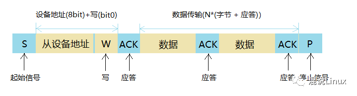

.. _021_mcu_common_summary_index:

======================================
单片机知识总结
======================================

1 单片机简介
===================================

单片机也称为微控制器(MCU)等，它并不是一个拥有逻辑功能的芯片，而是把一个计算机系统集成到芯片之上。就相当于一个微型的计算机，和一般的计算机相比，单片机就只是缺少了I/O设备。

单片机的应用领域十分广泛，比如实时工控、通讯设备、智能仪表、家用电器、导航系统等。各种电子产品一旦用上了单片机，就能够给产品增加一些特定功能，实现更新换代。普通的电器增加了特定单片机模块后，就能称之为：”智能电子“。

现在主流单片机包括CPU、2KB容量的RAM、 2个16位定时/计数器、128 KB容量的ROM、4个8位并行口、ADC/DAC、全双工串口行口、EEPROM、SPI、I2C、ISP、IAP等。

单片机本质上也是冯诺依曼架构的计算机，包括运算器、控制器、寄存器。

1.1 单片机的周期
--------------------------------------
时钟周期：也称为震荡周期，定义为时钟频率的倒数（可以这样来理解，时钟周期就是单片机外接晶振的倒数，如12Mhz的晶振，它的时钟周期就是1/12us）,
它是单片机中最基本的、最小的时间单位。在一个时钟周期内，CPU仅完成这一个最基本的动作

状态周期：它是时钟周期的两倍

机器周期：单片机的基本操作周期，在一个操作周期内，单片机完成一项基本操作，如取指令、存储器读写等。它由12个时钟周期（6个状态周期）组成。

指令周期：他是指CPU执行一条指令所需要的时间。一般一个指令周期含有1~4个机器周期。

1.2 波特率/定时器初值
------------------------------------------
(1)波特率：单片机或计算机在串口通信时的速率用波特率表示，它定义为每秒传输二进制代码的位数，即1波特 = 1位/秒，单位是bps。

(2)波特率的计算：在串行通信中，收、发双方对发送或接受数据的速率有约定。通过编程可对单片机串行口设定四种工作方式，其中方式0和方式2的波特率是固定的，而方式1和方式3的波特率是可变的，由定时器T1的溢出率来决定。

(3)为什么51系列单片机常用11.0592MHz的晶振设计？常用波特率通常按规范取1200,2400,4800,9600···，若采用晶振12Mhz或6Mhz，计算得出的T1定时初值将不是一个整数，这样通信时便会产生积累误差。

2 常见单片机
===============================
 * 51单片机，最适合入门的单片机。会C语言的话，1小时即可上手玩转。
 * STM32，STM32是意法半导体（ST）推出一款32位的单片机。STM32具有超低的价格、超多的外设、丰富的型号、优异的实时性、极低的开发成本等优势。STM32凭借其产品线的多样化、极高的性价比、简单易用的库开发方式，迅速在众多32位单片机中脱颖而出。
 * ASR-PRO，语音识别单片机。是国产杭州天问五幺科技公司出口，使用体验非常好。
 * ESP8266, ESP8266可以作为辅助的模块进行数据的传输：可以在Arduino IDE的主程序内创建函数进行编写，将Arduino开发板连接的检测模块的数据通过ESP8266传输到服务器等。
 * Arduino，Arduino是一个开放源码电子原型平台，拥有灵活、易用的硬件和软件。
 * 树莓派 香橙派， 更像是带GPIO功能的通用计算机。

3 GPIO
======================
GPIO是通用输入输出。主要三种使用方式： 连接其它器件进行通信； 输出高低电平直接控制器件； 连接传感器或开关作为输入判断。
如下图是51单片机的GPIO引脚。

4 中断/TIMER
==============================
为什么引入中断？
中断是为使单片机具有对外部或内部随机发生的事件实时处理而设置的，中断功能的存在，很大程度上提高了单片机处理外部或内部事件的能力。
中断系统特点：

①分时操作。CPU 可以分时为多个 I/O 设备服务，提高了计算机的利用率；

②实时响应。CPU 能够及时处理应用系统的随机事件，系统的实时性大大增强；

③可靠性高。CPU 具有处理设备故障及掉电等突发性事件能力，从而使系统可靠性提高

中断过程：
对于单片机来讲，中断是指CPU在处理某一时间A时，发生了另一事件B请求CPU立刻去处理（中断发生或中断请求）；
CPU暂时停止当前的工作（中断响应），转而去处理事件B（中断服务），待CPU处理事件B完成后，再回到原来事件A被中断的地方继续
处理事件A（中断返回）。这一过程称为中断，注意是整个过程，而不是单一的停止一件事的意思。
举例：你打开火，烧上一壶水。然后去洗衣服，在洗衣服的过程中，突然听到水壶发出水开的报警声，这时，你停止洗衣服动作，
立即去关掉火，然后将开水灌入暖水瓶中，灌完开水后，你又回去继续洗衣服。这个过程中实际上就发生了一次中断。

大多数单片机共提供8个中断请求源，但是一定有最基本的5个中断。

中断：
外部中断0(INTO)、外部中断 1(INT1)、外部中断 2(INT2)、外部中断 3(INT3)、定时器 0中断、定时器 1 中断、定时器 2 中断、串口(UART)中断。

基本中断：
INT0、INT1、定时器 0，定时器1，串口中断。

5 单片机通信总线
======================================
​一个完整的硬件产品是由多种模块组合实现产品功能的，微控制器 MCU 充当大脑，外围的存储单元、显示单元、发声单元、传感器单元、
运动单元等等是其躯干和四肢，而不同类型的硬件单元需要有机的结合起来，就离不开相互之间的数据通信，电子工业经过了百余年的发展，
衍生出了繁多的协议，其中既有行业公认的标准协议，也有企业自研的内部标准，这些协议通常可以分为并行通信协议和串行通信协议。

 * 并行通信，在同一时刻发送多位数据（可以是多根线）。优点是发送速度快；缺点是传输距离短 资源占用多。
 * 串行通信，用一根线 在不同的时刻发送8位数据。优点是传输距离远 占用资源少；缺点是发送速度慢。

通信的方式可以分为：全双工、半双工、单工：

 * 单工通信 只能接受或者发送 收音机 遥控器，一般只有一根线
 * 半双工通信 在同一时刻只能发送或者接收 对讲机，至少有两根线
 * 全双工通信 在同一时刻 既能接收又能发送 电话，至少有两根线

5.1 UART串口
----------------------------
通用异步收发传输器（Universal Asynchronous Receiver/Transmitter)，通常称作UART，是一种异步收发传输器，是电脑硬件的一部分。
它将要传输的资料在串行通信与并行通信之间加以转换。作为把并行输入信号转成串行输出信号的芯片，UART通常被集成于其他通讯接口的连结上。

具体实物表现为独立的模块化芯片，或作为集成于微处理器中的周边设备。一般是RS-232C规格的，与类似Maxim的MAX232之类的标准信号幅度变换芯片进行搭配，
作为连接外部设备的接口。在UART上追加同步方式的序列信号变换电路的产品，被称为USART(Universal Synchronous Asynchronous Receiver Transmitter)。

串口、UART口、COM口、USB口是指的物理接口形式(硬件)。而TTL、RS-232、RS-485是指的电平标准(电信号)。

串口：串口是一个泛称，UART，TTL，RS232，RS485都遵循类似的通信时序协议，因此都被通称为串口。

 * UART接口：通用异步收发器（Universal Asynchronous Receiver/Transmitter)，UART是串口收发的逻辑电路，这部分可以独立成芯片，也可以作为模块嵌入到其他芯片里，单片机、SOC、PC里都会有UART模块。
 * COM口：特指台式计算机或一些电子设备上的D-SUB外形(一种连接器结构，VGA接口的连接器也是D-SUB)的串行通信口，应用了串口通信时序和RS232的逻辑电平。
 * USB口：通用串行总线，和串口完全是两个概念。虽然也是串行方式通信，但由于USB的通信时序和信号电平都和串口完全不同，因此和串口没有任何关系。USB是高速的通信接口，用于PC连接各种外设，U盘、键鼠、移动硬盘、当然也包括“USB转串口”的模块。（USB转串口模块，就是USB接口的UART模块）。

TTL，RS232，RS485都是一种逻辑电平的表示方式

TTL
^^^^^^^^^^
TTL指双极型三极管逻辑电路，市面上很多“USB转TTL”模块，实际上是“USB转TTL电平的串口”模块。这种信号0对应0V，1对应3.3V或者5V。与单片机、SOC的IO电平兼容。不过实际也不一定是TTL电平，因为现在大部分数字逻辑都是CMOS工艺做的，只是沿用了TTL的说法。我们进行串口通信的时候从单片机直接出来的基本是都是 TTL 电平。

TTL电平：全双工（逻辑1: 2.4V--5V 逻辑0: 0V--0.5V）

RS232
^^^^^^^^^^
是电子工业协会(Electronic Industries Association，EIA) 制定的异步传输标准接口，同时对应着电平标准和通信协议（时序），其电平标准：+3V～+15V对应0，-3V～-15V对应1。
rs232 的逻辑电平和TTL 不一样但是协议一样。

RS-232电平：全双工（逻辑1：-15V - -5V 逻辑0：+3V - +15V)

RS485
^^^^^^^^^^^^^
RS485是一种串口接口标准，为了长距离传输采用差分方式传输，传输的是差分信号，抗干扰能力比RS232强很多。两线压差为-(2~6)V表示0，两线压差为+(2~6)V表示1

RS-485：半双工、（逻辑1：+2V--+6V 逻辑0： -6V---2V）这里的电平指AB 两线间的电压差。

通信原理
^^^^^^^^^^^^^^^^^
计算机内部采用并行数据，不能直接把数据发到Modem，必须经过UART整理才能进行异步传输，其过程为：CPU先把准备写入串行设备的数据放到UART的寄存器（临时内存块）中，再通过FIFO（First Input First Output，先入先出队列）传送到串行设备，若是没有FIFO，信息将变得杂乱无章，不可能传送到Modem。

UART作为异步串口通信协议的一种，工作原理是将传输数据的每个字符一位接一位地传输。

.. image:: images/uart_trans.webp

其中各位的意义如下：

 * 起始位：先发出一个逻辑”0”的信号，表示传输字符的开始。
 * 资料位：紧接着起始位之后。资料位的个数可以是4、5、6、7、8等，构成一个字符。通常采用ASCII码。从最低位开始传送，靠时钟定位。
 * 奇偶校验位：资料位加上这一位后，使得“1”的位数应为偶数(偶校验)或奇数(奇校验)，以此来校验资料传送的正确性。
 * 停止位：它是一个字符数据的结束标志。可以是1位、1.5位、2位的高电平。由于数据是在传输线上定时的，并且每一个设备有其自己的时钟，很可能在通信中两台设备间出现了小小的不同步。因此停止位不仅仅是表示传输的结束，并且提供计算机校正时钟同步的机会。适用于停止位的位数越多，不同时钟同步的容忍程度越大，但是数据传输率同时也越慢。
 * 空闲位：处于逻辑“1”状态，表示当前线路上没有资料传送。
 * 波特率：是衡量资料传送速率的指标。表示每秒钟传送的符号数（symbol）。一个符号代表的信息量（比特数）与符号的阶数有关。例如资料传送速率为120字符/秒，传输使用256阶符号，每个符号代表8bit，则波特率就是120baud，比特率是120*8=960BIT/S。

5.2 IIC
----------------------------
I2C总线是由Philips公司开发的一种简单、短距离、一主多从、半双工、两根线、同步通讯串行总线。
它只需要两根线即可在连接于总线上的器件之间传送信息。

主器件用于启动总线传送数据，并产生时钟以开放传送的器件，此时任何被寻址的器件均被认为是从器件．在总线上主和从、发和收的关系不是恒定的，
而取决于此时数据传送方向。如果主机要发送数据给从器件，则主机首先寻址从器件，然后主动发送数据至从器件，最后由主机终止数据传送；
如果主机要接收从器件的数据，首先由主器件寻址从器件．然后主机接收从器件发送的数据，最后由主机终止接收过程。在这种情况下
主机负责产生定时时钟和终止数据传送。

.. image:: images/iic.png

主设备给从设备发送/写入数据

 * 1. 主设备发送起始（START）信号
 * 2. 主设备发送设备地址到从设备
 * 3. 等待从设备响应(ACK)
 * 4. 主设备发送数据到从设备，一般发送的每个字节数据后会跟着等待接收来自从设备的响应(ACK)
 * 5. 数据发送完毕，主设备发送停止(STOP)信号终止传输

主设备从从设备接收/读取数据

 * 1. 设备发送起始（START）信号
 * 2. 主设备发送设备地址到从设备
 * 3. 等待从设备响应(ACK)
 * 4. 主设备接收来自从设备的数据，一般接收的每个字节数据后会跟着向从设备发送一个响应(ACK)
 * 5. 一般接收到最后一个数据后会发送一个无效响应(NACK)，然后主设备发送停止(STOP)信号终止传输

5.3 SPI
----------------------------
SPI是串行外设接口（Serial Peripheral Interface）的缩写。SPI是一种高速的、全双工、同步的通信总线，并且在芯片的管脚上只占用四根线，
节约了芯片的管脚，同时为PCB的布局上节省空间，提供方便，正是出于这种简单易用的特性，如今主流的微控制器都集成有spi接口，如 stm32 家族。

通信原理：
SPI的通信原理很简单，它以主从方式工作，这种模式通常有一个主设备和一个或多个从设备，需要至少4根线，事实上3根也可以（单向传输时）。
也是所有基于SPI的设备共有的，它们是SDI（数据输入）、SDO（数据输出）、SCLK（时钟）、CS（片选）。

 * SDI – SerialData In,串行数据输入；
 * SDO – SerialDataOut,串行数据输出；
 * SCLK – Serial Clock,时钟信号，由主设备产生；
 * CS – Chip Select,从设备使能信号，由主设备控制。

其中，CS是从芯片是否被主芯片选中的控制信号，也就是说只有片选信号为预先规定的使能信号时（高电位或低电位），主芯片对此从芯片的操作才有效。
这就使在同一条总线上连接多个SPI设备成为可能。

接下来就负责通讯的3根线了。通讯是通过数据交换完成的，这里先要知道SPI是串行通讯协议，也就是说数据是一位一位的传输的。这就是SCLK时钟线存在的原因，
由SCLK提供时钟脉冲，SDI，SDO则基于此脉冲完成数据传输。数据输出通过 SDO线，数据在时钟上升沿或下降沿时改变，在紧接着的下降沿或上升沿被读取。
完成一位数据传输，输入也使用同样原理。因此，至少需要8次时钟信号的改变（上沿和下沿为一次），才能完成8位数据的传输。

SCLK信号线只由主设备控制，从设备不能控制信号线。同样，在一个基于SPI的设备中，至少有一个主控设备。这样传输的特点：这样的传输方式有一个优点，
与普通的串行通讯不同，普通的串行通讯一次连续传送至少8位数据，而SPI允许数据一位一位的传送，甚至允许暂停，因为SCLK时钟线由主控设备控制，
当没有时钟跳变时，从设备不采集或传送数据。也就是说，主设备通过对SCLK时钟线的控制可以完成对通讯的控制。

通过逻辑分析仪采集 spi 总线数据，可以看到四个通道的波形变化，判断信号的时钟周期、时钟相位和极性，并能够解码获取实际传输的数据和指令。

最后，SPI接口的一个缺点：没有指定的流控制，没有应答机制确认是否接收到数据。

5.4 CAN
----------------------------

6 EEPROM
======================

7 ADC/DAC
======================

8 Flash
======================

9 IAP
======================

10 看门狗
======================
在由单片机构成的系统中，由于单片机的工作有可能受到外界电磁场的干扰，造成程序的跑飞，从而陷入死循环，程序的正常运行被打断，
所以出于对单片机运行状态进行实时监测的考虑，便产生了一种专门用于监测单片机程序运行状态的芯片，俗称看门狗。
其工作过程如下：看门狗芯片和单片机的一个IO引脚相连，该IO引脚通过单片机程序控制，使他定时地往看门狗的这个引脚上送入高电平（或低电平），
这一程序语句是分散的放在单片机其他控制语句中间的，一旦单片机由于干扰造成的程序跑飞而陷入某一程序段进入死循环状态时，
给看门狗引脚送电平的程序便不能被执行到，这时看门狗电路会由于得不到单片机送来的信号，便对它与单片机复位引脚相连接的引脚送一个复位信号，使单片机复位。