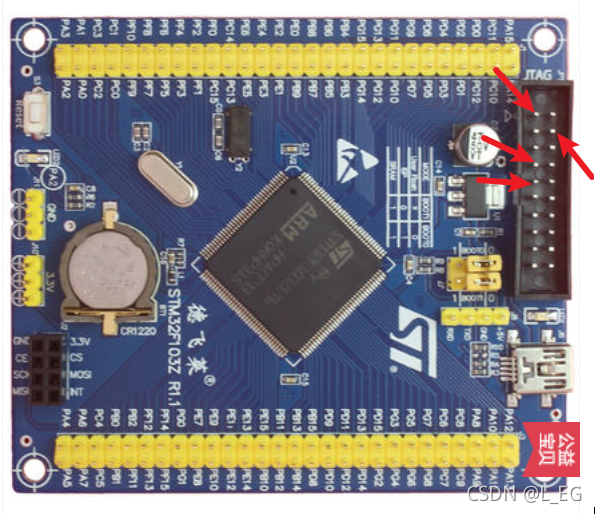
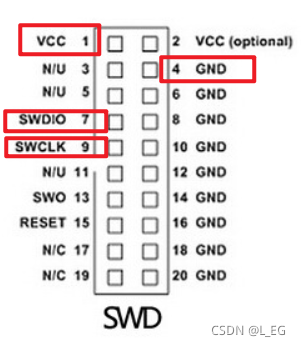
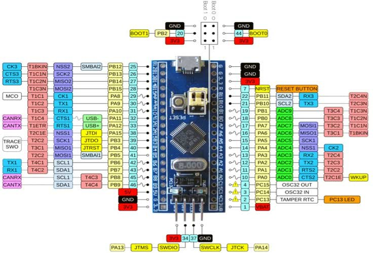
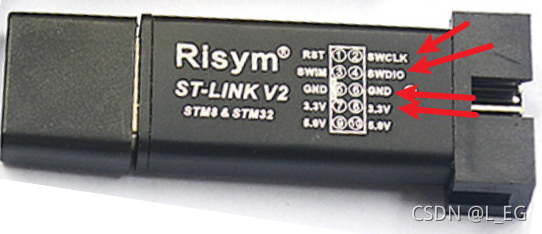
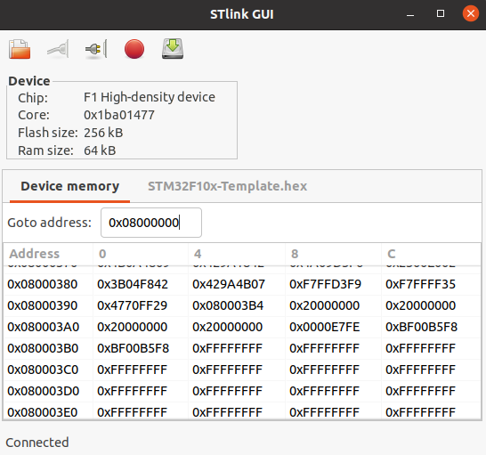

.. _03_stm32_summary_index:

======================
STM32 学习笔记
======================

STM32 是ST公司推出的基于ARM Cortex内核的MCU。
这里的目标型号为STM32F103CBT6
学习依据为正点原子STM32教学视频《手把手教你学STM32》系列

软件设计开发工具
======================

- OS：Ubuntu

- 环境搭建参照：https://shequ.stmicroelectronics.cn/thread-640966-1-1.html

- 开发IDE： VSCODE

- 编译软件： arm-none-eabi-gcc, cmake

ubuntu下安装： apt install arm-none-eabi-gcc

- 烧录软件1: stlink
```shell
# 安装依赖
$ sudo apt-get install libusb-1.0
$ sudo apt-get install cmake
$ sudo apt-get install libgtk-3-dev

安装
=========

$ git clone https://github.com/stlink-org/stlink
$ cd stlink
$ cmake
$ make
$ cd bin
$ sudo cp st-* /usr/local/bin
$ sudo cp -r ../../config/chips /usr/local/share/stlink
$ cd ../lib
$ sudo cp *.so* /lib32
$ cd ../..
$ sudo cp config/udev/rules.d/49-stlinkv* /etc/udev/rules.d/
$ sudo apt install stlink-tools
$ sudo apt install stlink-gui


$ st-flash --version
        v1.7.0

$ sudo apt-get install ninja-build

下载安装stm32cubemx，官网地址：
https://www.st.com/en/development-tools/stm32cubemx.html

下载安装STMCUFinder
https://www.st.com/zh/development-tools/st-mcu-finder-pc.html

下载安装STM32CudeCLT
https://www.st.com/zh/development-tools/stm32cubeclt.html


烧录
=========
- 1 连接stlink与开发板相应接口，参照下图：







使开发板上的tvcc, gnd, swdio, swclk分别与STLINK的相应针脚相连：



- 2 打开STLINK软件，如下图：



点击connect按钮后，芯片连接成功会显示设备相关信息，如果显示unknow device或者连接失败，请检查接线是否正确。

选择开发和编译完成的hex文件，点击flash按钮进行烧录。


学习总结
=============

`STM32F1学习-初级篇 <md/STM32F1_BL.md "STM32F1学习-初级篇">`_　　　　√

`STM32F1学习-中级篇 <md/STM32F1_ML.md "STM32F1学习-中级篇">`_　　　　√

`STM32F1学习-高级篇 <md/STM32F1_HL.md "STM32F1学习-高级篇">`_　　　　√

`STM32F1学习-LWIP篇 <md/STM32F1_LWIP.md "STM32F1学习-LWIP篇">`_　　　　√

`STM32F1学习-STemWin <md/STM32F1_STemWin.md "STM32F1学习-STemWin>`_)　　　√

`STM32F1学习-FreeRTOS篇 <md/STM32F1_FreeRTOS.md "STM32F1学习-FreeRTOS>`_")　　√

`STM32F1学习-HAL篇 <md/STM32F1_HAL.md "STM32F1学习-HAL篇">`_				√

===============   ==================   ============  ===================
      平台           微控制器             集成开发环境      图形驱动库
===============   ==================   ============  ===================
  S08             MC9S08DZ60AMLF        CodeWarrior   Processor expert
  S12             MC9S12XEQ512MAA       CodeWarrior   Processor expert
  ARM Cortex M0+  MKE06Z128VLK4         KDS3.2        Processor expert
  ARM Cortex M3   STM32F103CBT6         Keil MDK 5    STM32CubeMX
  ARM Cortex M4F  FS32K144HNT0CLLT      S32DS 2.0     Processor expert
  ARM Cortex M7   STM32H7               IAR 8.12      STM32CubeMX
  ARM Cortex A9   MCIMX6Q6AVT10AD       ~~GCC~~       ~~Android/Linux~~
===============   ==================   ============  ===================


| 操作系统  |文件系统 | 图形库 |TCP协议栈|USB协议栈|串行通讯协议栈|CAN协议栈|
|----------|-------|-------|--------|--------|------------|----------|
| FreeRTOS | FATFS | emWin |  LWIP  |Frankusb| Freemodbus | CANOpen  |
| RT Thread|       |       |        |        |            |          |
| uCOS     |       |       |        |        |            |          |