# STM32 学习笔记-初级篇 #

----------

### 第01讲 开发板的开机测试 ###

　(略)

### 第02讲 开发板入门 ###

　网络资源：  
　　开源电子网:www.openedv.com  
　　ST官方社区:www.stmcu.org  
　　百度:www.baidu.com  
　查找资料的方法：联想法，索引法，直搜法  
　5V设备如何接STM32:  
　　STM32的IO口绝大部分都是兼容5V的，可以查看数据手册，不是参考手册。凡是带有FT的都是。  
　　原理图上所有带ADC的都不是。  

### 第03讲 STM32学习方法 ###

　熟练掌握C语言，学会查找资料，掌握一种开发环境，如MDK，掌握一个调试工具，Jlink  
　库函数和寄存器对比学习  
　基本外设：GPIO，外部中断，定时器，串口。1/3的时间学习  
　高级外设：IIC SPI WDG ADC SDIO FSMC等  
　高级功能：os ，lwip gui  
　推荐学习方法：视频+开发板教程+配套源码+官方手册  
　视频介绍：  
　　准备篇--背景知识  
　　初级篇--STM32入门  
　　中级篇--提升STM32  
　　高级篇--摄像头、文件系统  
　　系统篇--ucos/lwip/emwin  

### 第04讲 开发板资源描述 ###

　(略)  

### 第05讲 STM32初探 ###

为什么选择STM32?  
新的基于ARM内核的32位MCU，高性能，低成本，低功耗。  
Cortex-M内核，标准的ARM架构。  
超前的体系结构  
简单易用、自由、风险低  
STM32F1属于Cortex-M3内核  
STM32F4属于Cortex-M4内核  
STM32F7属于Cortex-M7内核  
Cortex-M3属于ARMV7架构，哈弗架构  
ARM体系图谱：  
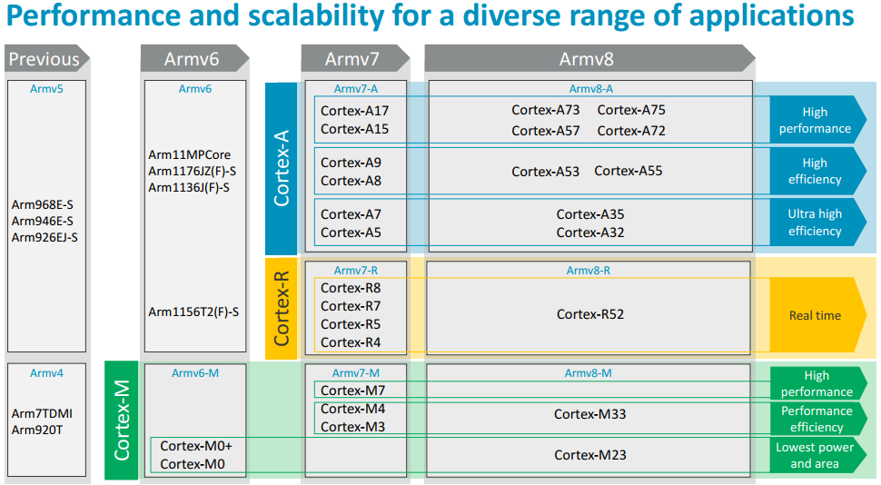   

ARMv7架构定义了三大系列  
A系列：面向尖端  
R系列：针对实时性  
M系列：对微控器  
之前用过NXP的KE06和KEAZ128属于Cortex-M0内核  
之前用过NXP的S32K144属于Cortex-M4内核  
总之，因为性价比更高，所以选择STM32  
STM32系列产品图谱如下：  

STM32F1系列产品图谱如下：  

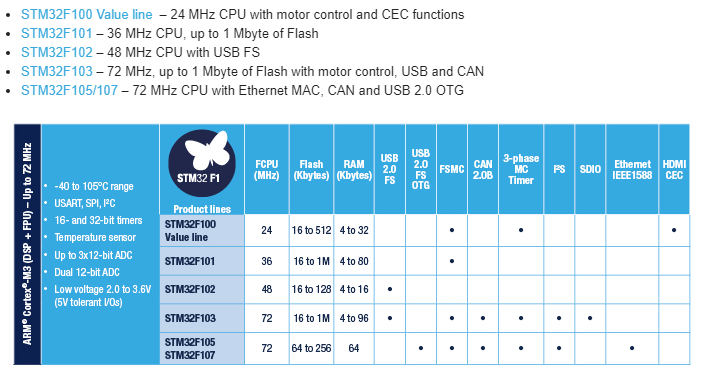

STM32F103产品图谱如下：  

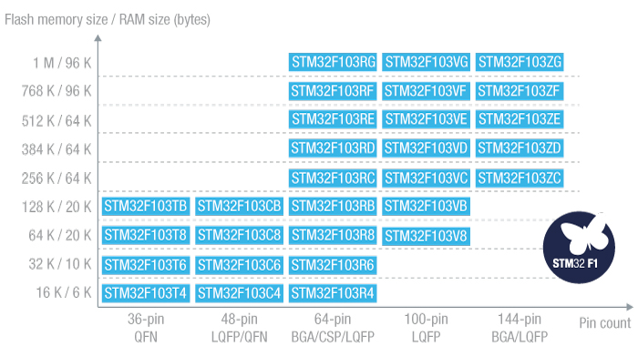

### 第06讲 STM32芯片解读 ###

芯片资源(STM32F103CBT6)  
　Cortex-M3内核  
　72MHz主频  
　128K Flash  
　20K  SDRAM  
　48Pin LQFP  
　2.0V-3.6V电压，大部分IO兼容5V  
　2个12位AD  
　SPI、IIC、USART、USB、CAN、SDIO  

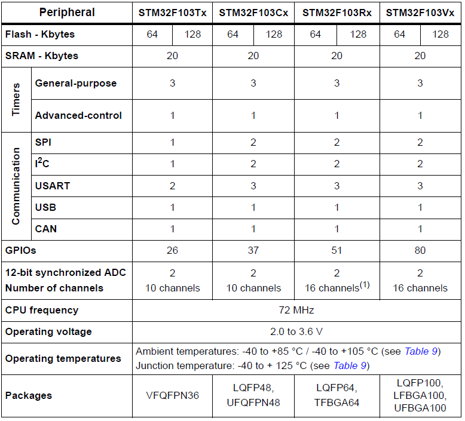  
  
最小系统：  
　时钟、复位、供电、下载、启动  

### 第07讲 开发环境搭建-软件的安装 ###

IDE选取Keil的MDK5  
安装完成后下载相应芯片的支持包  
安装路径不要有中文  
用户名不要有中文  
多个版本MKD不要安装在同一目录  
USB串口的作用：供电，通讯，下载  
USB串口芯片：CH340  
下载工具：MCUISP  
调试工具：Jlink或者STlink  

### 第08讲 程序下载方法1-ISP串口下载 ###

特别注意：  
STM32的ISP下载，只能使用串口1，也就是对应串口发送接收引脚PA9,PA10。  
不能使用其他串口（例如串口2：PA2,PA3)用来ISP下载。  
需要安装CH340驱动  
MCUISP下载注意：
选择串口，勾选“编程前重装文件”，勾选上“校验” 以及 “编程后执行”，选项字节区的“编程到FLASH时写选项直接”不要勾上  
STM32启动模式：  
STM32直接通过两个引脚Boot0和Boot1设置启动模式  
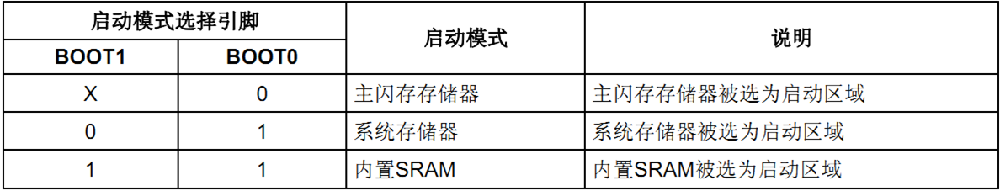  
ISP下载一般步骤：1) Boot0接3.3，Boot1接GND；2) 按复位按键，实现下载  
程序执行的一般步骤：Boot0接GND，Boot1接任意，按一次复位  
如果要实现一键下载，可以参考开发板电路。原理就是使用串口的DTR和RTS关键切换Boot管脚和复位管脚。  

### 第09讲 程序下载方法2-Jlink下载 ###

(略)

### 第10讲 新建工程模板-基于固件库 ###
库函数和寄存器的区别：  
本质上是一样的。我们可以再库函数模板里面，直接操作寄存器，因为官方库相关头文件有寄存器定义。但是不能在寄存器模板调用库函数，因为没有引入库函数相关定义。  
了解寄存器基本原理的目的是为了让我们对STM32相关知识有比较深入的理解，这样在开发过程中方可得心应手，游刃有余。底层代码配置出了问题需要调试的话，必须对寄存器有一定的了解才能找到问题，因为调试代码，底层只能查看寄存器相关配置。  
开发环境：MDK5  
固件库版本：V3.5  
重要的预编译全局宏定义标识符：  
　STM32F10X_HD,USE_STDPERIPH_DRIVER　　中间要用逗号“,”隔开。  
启动文件不要选错  

### 第11讲 新建工程模板-基于寄存器 ###

开发环境：MDK5
重要的预编译全局宏定义标识符：
　STM32F10X_HD  
启动文件不要选错  

### 第12讲 STM32 GPIO工作原理 ###

STM32F103CBT6共有37个GPIOs  
- PA0-15  
- PB0-15  
- PC13-15  
- PD0-1  

STM32的大部分引脚除了当GPIO使用外，还可以复用为外设功能引脚（比如串口）  
GPIO共有8中工作方式，4种输入，4种输出。  
- （1）GPIO_Mode_AIN 模拟输入   
- （2）GPIO_Mode_IN_FLOATING 浮空输入   
- （3）GPIO_Mode_IPD 下拉输入   
- （4）GPIO_Mode_IPU 上拉输入  
- （5）GPIO_Mode_Out_OD 开漏输出  
- （6）GPIO_Mode_Out_PP 推挽输出  
- （7）GPIO_Mode_AF_OD 复用开漏输出  
- （8）GPIO_Mode_AF_PP 复用推挽输出  

推挽输出:可以输出高,低电平,连接数字器件; 推挽结构一般是指两个三极管分别受两互补信号的控制,总是在一个三极管导通的时候另一个截止。  
开漏是用来连接不同电平的器件，匹配电平用的，因为开漏引脚不连接外部的上拉电阻时，只能输出低电平，如果需要同时具备输出高电平的功能，则需要接上拉电阻，很好的一个优点是通过改变上拉电源的电压，便可以改变传输电平。  
GPIO有三种最大翻转速度：  
- 　　2MHZ  
- 　　10MHz  
- 　　50MHz  

上电复位后，GPIO默认为浮空状态，部分特殊功能引脚为特定状态。  
每组GPIO端口的寄存器包括：  
- 两个32位配置寄存器(GPIOx_CRL ，GPIOx_CRH) ，  
- 两个32位数据寄存器 (GPIOx_IDR和GPIOx_ODR)，  
- 一个32位置位/ 复位寄存器(GPIOx_BSRR)，  
- 一个16位复位寄存器(GPIOx_BRR)，  
- 一个32位锁定寄存器(GPIOx_LCKR)。  

每个I/O端口位可以自由编程，然而I/O端口寄存器必须按32位字被访问(不允许半字或字节访问) 。  
是每组IO口含下面7个寄存器。也就是7个寄存器，一共可以控制一组GPIO的16个IO口。  
STM32的大部分端口都具有复用功能。  
所谓复用，就是一些端口不仅仅可以做为通用IO口，还可以复用为一些外设引脚，比如PA9,PA10可以复用为STM32的串口1引脚。  
作用：最大限度的利用端口资源  
端口重映射功能：就是可以把某些功能引脚映射到其他引脚。比如串口1默认引脚是PA9,PA10可以通过配置重映射映射到PB6,PB7  
作用：方便布线  
所有IO口都可以作为中断输入  

### 第13讲 手把手编写跑马灯实验-库函数 ###

GPIO输出方式：推挽输出  
- 头文件：stm32f10x_gpio.h  
- 源文件：stm32f10x_gpio.c  

重要函数：  
1个初始化函数：  
void GPIO_Init(GPIO_TypeDef* GPIOx, GPIO_InitTypeDef* GPIO_InitStruct);  
作用：初始化一个或者多个IO口（同一组）的工作方式和速度。  
　　该函数主要是操作GPIO_CRL(CRH)寄存器，在上拉或者下拉的时候有设置BSRR或者BRR寄存器   
　　GPIOx: GPIOA-GPIOG  
    typedef struct  
    {  
    　　uint16_t GPIO_Pin;   //指定要初始化的IO口   
    　　GPIOSpeed_TypeDef GPIO_Speed; //设置IO口输出速度  
    　　GPIOMode_TypeDef GPIO_Mode;//设置工作模式：8种中的一个  
    }GPIO_InitTypeDef;  

注意：外设（包括GPIO)在使用之前，几乎都要先使能对应的时钟。  
GPIO_Init函数初始化样例：  
    GPIO_InitTypeDef  GPIO_InitStructure;  
    GPIO_InitStructure.GPIO_Pin = GPIO_Pin_5; //LED0-->PB.5 端口配置  
    GPIO_InitStructure.GPIO_Mode = GPIO_Mode_Out_PP;  //推挽输出  
    GPIO_InitStructure.GPIO_Speed = GPIO_Speed_50MHz; //IO口速度为50MHz  
    GPIO_Init(GPIOB, &GPIO_InitStructure);	 //根据设定参数初始化GPIOB.5  

可以一次初始化一个IO组下的多个IO，前提是这些IO口的配置方式一样。  

2个读取输入电平函数：  
uint8_t GPIO_ReadInputDataBit(GPIO_TypeDef* GPIOx, uint16_t GPIO_Pin);  
作用：读取某个GPIO的输入电平。实际操作的是GPIOx_IDR寄存器。  
例如：GPIO_ReadInputDataBit(GPIOA, GPIO_Pin_5);//读取GPIOA.5的输入电平  

uint16_t GPIO_ReadInputData(GPIO_TypeDef* GPIOx);  
作用：读取某组GPIO的输入电平。实际操作的是GPIOx_IDR寄存器。  
例如： GPIO_ReadInputData(GPIOA);//读取GPIOA组中所有io口输入电平  

2个读取输出电平函数：  
uint8_t GPIO_ReadOutputDataBit(GPIO_TypeDef* GPIOx, uint16_t GPIO_Pin);  
作用：读取某个GPIO的输出电平。实际操作的是GPIO_ODR寄存器。  
例如：GPIO_ReadOutputDataBit(GPIOA, GPIO_Pin_5);//读取GPIOA.5的输出电平  

uint16_t GPIO_ReadOutputData(GPIO_TypeDef* GPIOx);  
作用：读取某组GPIO的输出电平。实际操作的是GPIO_ODR寄存器。  
例如：GPIO_ReadOutputData(GPIOA);//读取GPIOA组中所有io口输出电平  

4个设置输出电平函数：  
void GPIO_SetBits(GPIO_TypeDef* GPIOx, uint16_t GPIO_Pin);  
作用：设置某个IO口输出为高电平（1）。实际操作BSRR寄存器  

void GPIO_ResetBits(GPIO_TypeDef* GPIOx, uint16_t GPIO_Pin);  
作用：设置某个IO口输出为低电平（0）。实际操作的BRR寄存器。  

void GPIO_WriteBit(GPIO_TypeDef* GPIOx, uint16_t GPIO_Pin, BitAction BitVal);  
void GPIO_Write(GPIO_TypeDef* GPIOx, uint16_t PortVal);  
这两个函数不常用，也是用来设置IO口输出电平。 

手把手写跑马灯实验-库函数:   
- 使能IO口时钟。调用函数RCC_APB2PeriphColckCmd();不同的IO组，调用的时钟使能函数不一样。
- 初始化IO口模式。调用函数GPIO_Init();  
- 操作IO口，输出高低电平。GPIO_SetBits();GPIO_ResetBits();  

### 第14讲 手把手编写跑马灯实验-寄存器版本 ###

- 使能IO口时钟。配置寄存器RCC_APB2ENR。  
- 初始化IO口模式。配置寄存器GPIOx_CRH/CRL  
- 操作IO口，输出高低电平。配置寄存器GPIOX_ODR或者BSRR/BRR。  

### 第15讲 手把手编写跑马灯实验-位操作 ###

位操作原理：  
把每个比特膨胀为一个32位的字，当访问这些字的时候就达到了访问比特的目的，比如说BSRR寄存器有32个位，那么可以映射到32个地址上，我们去访问（读-改-写）这32个地址就达到访问32个比特的目的。  
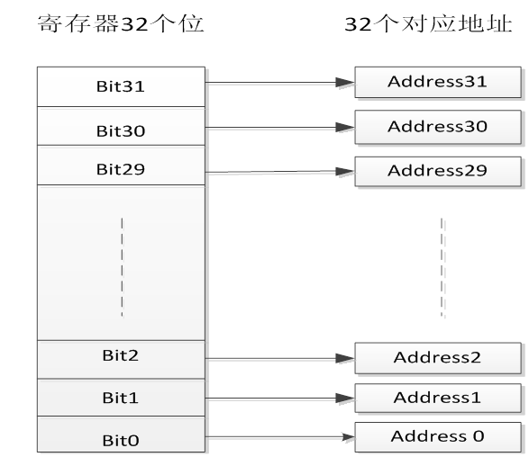   
哪些区域支持位操作：  
- 其中一个是 SRAM 区的最低 1MB 范围，0x20000000 ‐ 0x200FFFFF（SRAM   区中的最低 1MB）  
- 第二个则是片内外设区的最低 1MB范围，0x40000000 ‐ 0x400FFFFF（片上外设区中最低 1MB）
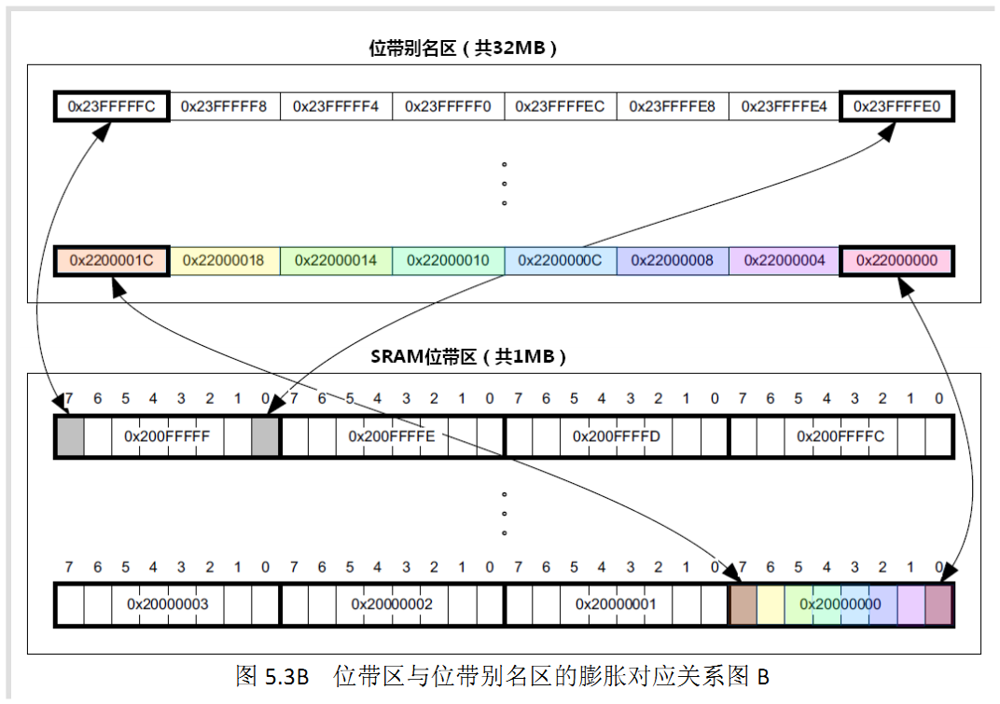   
位带操作优越性:  
- bit位控制，方便操作  
- 代码简洁  
- 实现原子操作，防止多任务中的任务切换带来的问题。  

映射关系：  
位带区：支持位带操作的地址区   
位带别名：对别名地址的访问最终作用到位带区的访问上（注意：这中间有一个地址映射过程）  
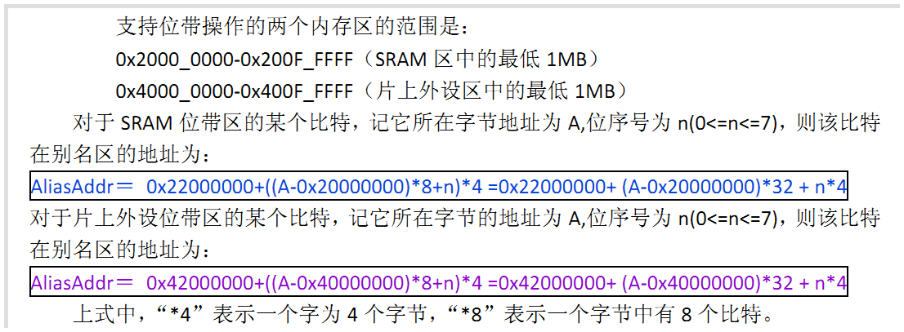   

sys.h里面对GPIO输入输出部分功能实现了位带操作：  

    #define BITBAND(addr, bitnum) ((addr & 0xF0000000)+0x2000000+((addr &0xFFFFF)<<5)+(bitnum<<2)) 
    #define MEM_ADDR(addr)  *((volatile unsigned long  *)(addr)) 
    #define BIT_ADDR(addr, bitnum)   MEM_ADDR(BITBAND(addr, bitnum)) 
    //IO口地址映射
    #define GPIOA_ODR_Addr(GPIOA_BASE+12) //0x4001080C 
    #define GPIOB_ODR_Addr(GPIOB_BASE+12) //0x40010C0C 
    #define GPIOF_ODR_Addr(GPIOF_BASE+12) //0x40011A0C
    #define GPIOG_ODR_Addr(GPIOG_BASE+12) //0x40011E0C
    #define GPIOA_IDR_Addr(GPIOA_BASE+8) //0x40010808 
    #define GPIOB_IDR_Addr(GPIOB_BASE+8) //0x40010C08 
    #define GPIOG_IDR_Addr(GPIOG_BASE+8) //0x40011E08 
    //IO口操作,只对单一的IO口!
    //确保n的值小于16!
    #define PAout(n)   BIT_ADDR(GPIOA_ODR_Addr,n)  //输出 
    #define PAin(n)BIT_ADDR(GPIOA_IDR_Addr,n)  //输入 
    
    #define PBout(n)   BIT_ADDR(GPIOB_ODR_Addr,n)  //输出 
    #define PBin(n) BIT_ADDR(GPIOB_IDR_Addr,n)  //输入 
    …
    #define PFout(n)   BIT_ADDR(GPIOF_ODR_Addr,n)  //输出 
    #define PFin(n)BIT_ADDR(GPIOF_IDR_Addr,n)  //输入
    
    #define PGout(n)   BIT_ADDR(GPIOG_ODR_Addr,n)  //输出 
    #define PGin(n)BIT_ADDR(GPIOG_IDR_Addr,n)  //输入

手把手写跑马灯实验-位带操作：  
- 使能IO口时钟。调用函数RCC_APB2PeriphColckCmd();  
- 初始化IO口模式。调用函数GPIO_Init();  
- 操作IO口，输出高低电平。使用位带操作。  

### 第16讲 蜂鸣器实验-M3 ###

蜂鸣器实验步骤：  
- 使能IO口时钟。调用函数RCC_APB2PeriphColckCmd();不同的IO组，调用的时钟使能函数不一样。  
- 初始化IO口模式。调用函数BEEP_Init();  
- 操作IO口，输出高低电平。  

### 第17讲 按键输入实验-GPIO做输入-M3 ###

读取IO口输入电平调用库函数为：uint8_t GPIO_ReadInputDataBit(GPIO_TypeDef* GPIOx, uint16_t GPIO_Pin);  
读取IO口输入电平操作寄存器为：GPIOx_IDR:端口输入寄存器  
使用位带操作读取IO口输入电平：  
　PEin(4)          -读取GPIOE.4口电平  
　PEin(n)          -读取GPIOE.n口电平  
手把手写按键输入实验：  
- 使能按键对应IO口时钟。调用函数：RCC_APB2PeriphClockCmd();  
- 初始化IO模式：上拉/下拉输入。调用函数：GPIO_Init();  
- 扫描IO口电平（库函数/寄存器/位操作）。  

C语言关键字 ：static  
- Static申明的局部变量，存储在静态存储区。  
- 它在函数调用结束之后，不会被释放。它的值会一直保留下来。  
- 所以可以说static申明的局部变量，具有记忆功能。  

按键扫描（支持连续按）的一般思路：   
    u8 KEY_Scan(void)  
    {  
      if(KEY按下）  
      {  
    delay_ms(10)；//延时10-20ms，防抖。  
    if(KEY确实按下)  
    {  
      return KEY_Value；  
    }  
    return 无效值；  
      }  
    }
     
如果我要实现：按键按下，没有松开，只能算按下一次，这个函数无法实现。  
按键扫描（不支持连续按）的一般思路：  
    u8 KEY_Scan(void)  
    {  
      static u8 key_up=1;  
      if（key_up &&  KEY按下）  
      {  
        delay_ms(10);//延时，防抖  
        key_up=0;//标记这次key已经按下  
        if(KEY确实按下)  
        {  
           return KEY_VALUE;  
        }  
      }else if(KEY没有按下)  key_up=1;  
       return 没有按下  
    }  
不支持连续按：就是说，按键按下了，没有松开，只能算一次。  
按键扫描（两种模式合二为一）的一般思路：  
    #ifdef A  
    u8 KEY_Scan(u8 mode)  
    {  
      static u8 key_up=1;  
      **if(mode==1) key_up=1;**//支持连续按  
      if（key_up &&  KEY按下）  
      {  
    delay_ms(10);//延时，防抖  
    key_up=0;//标记这次key已经按下  
    if(KEY确实按下)  
    {  
      return KEY_VALUE;  
    }  
      }else if(KEY没有按下)  key_up=1;  
      return 没有按下  
    }  
    #endif  

### 第18讲 C语言复习+寄存器地址名称映射_M3 ###

1、位操作  
6种位操作运算符：  
　&　 与  
　|　 或  
　^　 异或  
　~　 取反  
　<<　左移  
　>>　右移
  
2、define宏定义关键词  
define是C语言中的预处理命令，它用于宏定义，可以提高源代码的可读性，为编程提供方便。  
常见的格式：  
　#define 标识符 字符串  
　“标识符”为所定义的宏名。“字符串”可以是常数、表达式、格式串等。  
例如：  
　#define SYSCLK_FREQ_72MHz  72000000  
　定义标识符SYSCLK_FREQ_72MHz的值为72000000。  
3、ifdef条件编译  
单片机程序开发过程中，经常会遇到一种情况，当满足某条件时对一组语句进行编译，而当条件不满足时则编译另一组语句。  
4、extern变量申明  
C语言中extern可以置于变量或者函数前，以表示变量或者函数的定义在别的文件中，提示编译器遇到此变量和函数时在其他模块中寻找其定义。  
这里面要注意，对于extern申明变量可以多次，但定义只有一次。  
5、typedef类型别名  
定义一种类型的别名，而不只是简单的宏替换。可以用作同时声明指针型的多个对象。  
typedef unsigned          char uint8_t;
6、结构体  
Struct 结构体名{
成员列表1;
成员变量2；
…
}变量名列表；
在结构体申明的时候可以定义变量，也可以申明之后定义，方法是：  
Struct 结构体名字   结构体变量列表 ;  
同一个类型可以用数组，不同类型可以用结构体组织。结构体可扩展性强。
7、static关键字   
Static申明的局部变量，存储在静态存储区。  
它在函数调用结束之后，不会被释放。它的值会一直保留下来。  
所以可以说static申明的局部变量，具有记忆功能。  
  
**对MCU，一切底层配置，最终都是配置寄存器。**   
51中映射方法：  
sfr P0 =0x80;//P0映射到地址0x80  
P0=0x00//忘寄存器地址0x80赋值0x00  
STM32中操作：  
GPIOA->ODR=0x00000000;   
值0x00000000是怎么赋值给了GPIOA的ODR寄存器地址的呢？  
也就是说GPIOA->ODR这种写法，是怎么与GPIOA的ODR寄存器地址映射起来的？  
　#define PERIPH_BASE           ((uint32_t)0x40000000)  
　#define APB2PERIPH_BASE       (PERIPH_BASE + 0x10000)  
　#define GPIOA_BASE            (APB2PERIPH_BASE + 0x0800)  
　#define GPIOA               ((GPIO_TypeDef *) GPIOA_BASE)  
　typedef struct  
　{  
　　  __IO uint32_t CRL;  
　　  __IO uint32_t CRH;  
　　  __IO uint32_t IDR;  
　　  __IO uint32_t ODR;  
　　  __IO uint32_t BSRR;  
　　  __IO uint32_t BRR;  
　　  __IO uint32_t LCKR;  
　} GPIO_TypeDef;  
**对GPIO的所有操作，都通过这七个寄存器。**   
　#define     __IO    volatile  //用来替换成 volatile 和 const 的,就是不让编译器进行优化   
STM32F10x系列GPIO寄存器地址映射：  
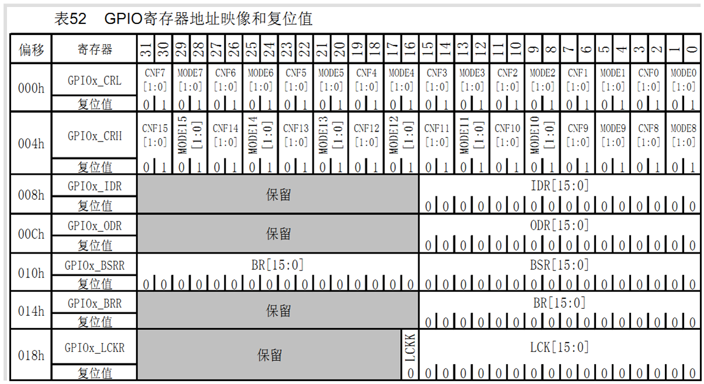  

### 第19讲 STM32时钟系统+SystemInit函数解读-M3 ###

时钟系统框图：

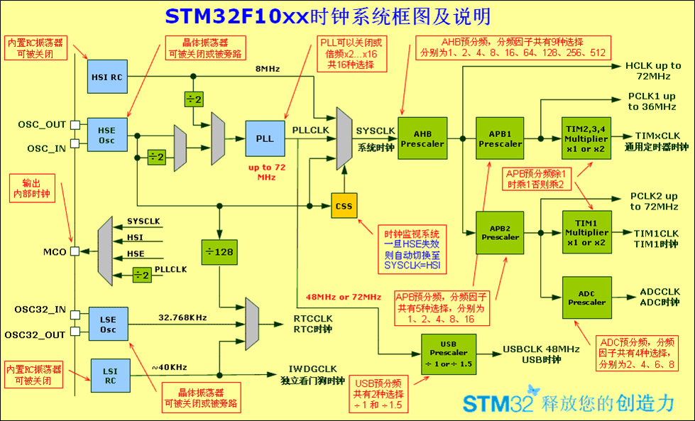  

1.STM32 有5个时钟源:HSI、HSE、LSI、LSE、PLL。  
　①、HSI是高速内部时钟，RC振荡器，频率为8MHz，精度不高。  
　②、HSE是高速外部时钟，可接石英/陶瓷谐振器，或者接外部时钟源，频率范围为4MHz-16MHz。  
　③、LSI是低速内部时钟，RC振荡器，频率为40kHz，提供低功耗时钟。WDG  
　④、LSE是低速外部时钟，接频率为32.768kHz的石英晶体。RTC  
　⑤、PLL为锁相环倍频输出，其时钟输入源可选择为HSI/2、HSE或者HSE/2。倍频可选择为2-16倍，但是其输出频率最大不得超过72MHz。  
2.系统时钟SYSCLK可来源于三个时钟源：  
　①、HSI振荡器时钟  
　②、HSE振荡器时钟  
　③、PLL时钟  
3.STM32可以选择一个时钟信号输出到MCO脚(PA8)上，可以选择为PLL输出的2分频、HSI、HSE、或者系统时钟。  
4.任何一个外设在使用之前，必须首先使能其相应的时钟。  

**几个重要的时钟：**   
- SYSCLK(系统时钟) :  
- AHB总线时钟  
- APB1总线时钟(低速): 速度最高36MHz  
- APB2总线时钟(高速): 速度最高72MHz  
- PLL时钟  
RCC相关配置寄存器(Reset and clock control)  
typedef struct  
{  
　__IO uint32_t CR;                //HSI,HSE,CSS,PLL等的使能和就绪标志位   
　__IO uint32_t CFGR;           //PLL等的时钟源选择，分频系数设定  
　__IO uint32_t CIR;               // 清除/使能 时钟就绪中断  
　__IO uint32_t APB2RSTR;  //APB2线上外设复位寄存器  
　__IO uint32_t APB1RSTR;   //APB1线上外设复位寄存器  
　__IO uint32_t AHBENR;    //DMA，SDIO等时钟使能  
　__IO uint32_t APB2ENR;   //APB2线上外设时钟使能  
　__IO uint32_t APB1ENR;   //APB1线上外设时钟使能  
　__IO uint32_t BDCR;        //备份域控制寄存器  
　__IO uint32_t CSR;           //控制状态寄存器  
} RCC_TypeDef;  
RCC相关头文件和固件库源文件  
头文件: stm32f10x_rcc.h  
源文件:stm32f10x_rcc.c  
1、时钟使能配置:  
　RCC_LSEConfig()  
　RCC_HSEConfig()  
　RCC_HSICmd()  
　RCC_LSICmd()  
　RCC_PLLCmd() ……  
2、时钟源相关配置：  
　RCC_PLLConfig ()  
　RCC_SYSCLKConfig()   
　RCC_RTCCLKConfig()   
3、分频系数选择配置：  
　RCC_HCLKConfig()  
　RCC_PCLK1Config()  
　RCC_PCLK2Config()…  
4、外设时钟使能：  
　RCC_APB1PeriphClockCmd():  //APB1线上外设时钟使能  
　RCC_APB2PeriphClockCmd();  //APB2线上外设时钟使能  
　RCC_AHBPeriphClockCmd();   //AHB线上外设时钟使能  
5、其他外设时钟配置：  
　RCC_ADCCLKConfig ();  
　RCC_RTCCLKConfig();  
6、状态参数获取参数：  
　RCC_GetClocksFreq();  
　RCC_GetSYSCLKSource();  
　RCC_GetFlagStatus()  
7、RCC中断相关函数 :  
　RCC_ITConfig()  
　RCC_GetITStatus()  
　RCC_ClearITPendingBit()…  

### 第20讲 SystemInit时钟系统初始化函数剖析-M3 ###

系统时钟初始化函数： SystemInit();  
使用V3.5版本的库函数，该函数在系统启动之后会自动调用：  
  startup_stm32f10x_xx.s文件中：  
         ; Reset handler  
         Reset_Handler   PROC  
         EXPORT  Reset_Handler             [WEAK]  
         IMPORT  __main  
         IMPORT  SystemInit  
         LDR     R0, =SystemInit  
         BLX     R0               
         LDR     R0, =__main  
         BX      R0  
         ENDP  

SystemInit函数解读:  
初始化之前首先通过宏定义定义系统时钟频率：  
　#define SYSCLK_FREQ_72MHz  72000000  
初始化之后的状态：  
　　　SYSCLK　　72MHz  
　　　AHB　　　　72MHz  
　　　PCLK1　　　36MHz  
　　　PCLK2　　　72MHz  
　　　PLL　　　　72MHz  
初始化之后可以通过变量SystemCoreClock获取系统变量。如果SYSCLK=72MHz，那么变量SystemCoreClock=72000000。  

### 第21讲 Systick滴答定时器-延时函数讲解 ###

Systick定时器是什么？  
　　Systick定时器，是一个简单的定时器，对于CM3,CM4内核芯片，都有Systick定时器。  
　　Systick定时器常用来做延时，或者实时系统的心跳时钟。这样可以节省MCU资源，不用浪费一个定时器。比如UCOS中，分时复用，需要一个最小的时间戳，一般在STM32+UCOS系统中，都采用Systick做UCOS心跳时钟。  
　　Systick定时器就是系统滴答定时器，一个24 位的倒计数定时器，计到0 时，将从RELOAD 寄存器中自动重装载定时初值。只要不把它在SysTick 控制及状态寄存器中的使能位清除，就永不停息，即使在睡眠模式下也能工作。  
　　SysTick定时器被捆绑在NVIC中，用于产生SYSTICK异常（异常号：15）。  
　　Systick中断的优先级也可以设置。  
**4个Systick寄存器**  
　　CTRL　　　　SysTick控制和状态寄存器   
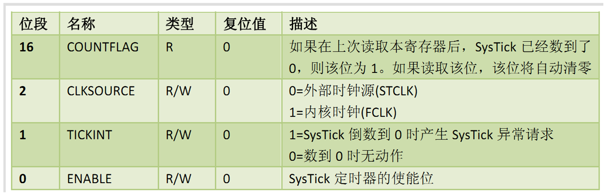  
　　对于STM32，外部时钟源是 HCLK(AHB总线时钟）的1/8,内核时钟是HCLK时钟.  
　　配置函数：SysTick_CLKSourceConfig();  
　　LOAD       SysTick自动重装载除值寄存器   
   
　　VAL　　　　 SysTick当前值寄存器   
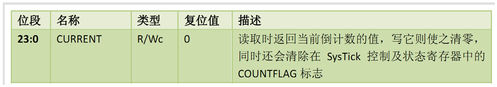   
　　CALIB      SysTick校准值寄存器  

固件库中的Systick相关函数：  
　　SysTick_CLKSourceConfig()    //Systick时钟源选择  misc.c文件中  
　　　　void SysTick_CLKSourceConfig(uint32_t SysTick_CLKSource)  
　　　　{  
　　　　　　/* Check the parameters */  
　　　　　　assert_param(IS_SYSTICK_CLK_SOURCE(SysTick_CLKSource));  
　　　　　　if (SysTick_CLKSource == SysTick_CLKSource_HCLK)  
　　　　　　{  
　　　　　　　　SysTick->CTRL |= SysTick_CLKSource_HCLK;  
　　　　　　}  
　　　　　　else  
　　　　　　{  
　　　　　　　　SysTick->CTRL &= SysTick_CLKSource_HCLK_Div8;  
　　　　　　}  
　　　　}  

　　SysTick_Config(uint32_t ticks) //初始化systick,时钟为HCLK,并开启中断,在core_cm3.h/core_cm4.h文件中  
　　　　static __INLINE uint32_t SysTick_Config(uint32_t ticks)  
　　　　{   
　　　　　　if (ticks > SysTick_LOAD_RELOAD_Msk)  return (1);         //Reload value impossible  
　　　　　　//set reload register  
　　　　　　SysTick->LOAD  = (ticks & SysTick_LOAD_RELOAD_Msk) - 1;  
　　　　　　// set Priority for Cortex-M0 System Interrupts   
　　　　　　NVIC_SetPriority (SysTick_IRQn, (1<<__NVIC_PRIO_BITS) - 1);  
　　　　　　SysTick->VAL   = 0;                                        // Load the SysTick Counter Value   
　　　　　　SysTick->CTRL  = SysTick_CTRL_CLKSOURCE_Msk |   
　　　　　　　　　　　　　　　　SysTick_CTRL_TICKINT_Msk   |   
　　　　　　　　　　　　　　　　SysTick_CTRL_ENABLE_Msk;     // Enable SysTick IRQ and SysTick Timer   
　　　　　　return (0);                          // Function successful   
　　　　}  

Systick中断服务函数：  
　　void SysTick_Handler(void);

用中断的方式实现delay延时: 
static __IO uint32_t TimingDelay;  
void Delay(__IO uint32_t nTime)  
{   
　　TimingDelay = nTime;  
　　while(TimingDelay != 0);  
}  
void SysTick_Handler(void)  
{  
　　if (TimingDelay != 0x00)   
　　{   
　　　　TimingDelay--;  
　　}  
}  
int main(void)  
{  …  
　　if (SysTick_Config(SystemCoreClock / 1000)) //systick时钟为HCLK，中断时间间隔1ms  
　　{  
　　　　while (1);  
　　}  
　　while(1)  
　　{ Delay(200);//2ms  
　　　　…   
　　}  
}  
用查询方式实现delay延时:  
看具体实验工程  
**Cortex-M系统中，Systick代码可以通用。**  
如果使用中发现延时不一致，问题一般都是因为不同内核时钟不一样而已。修改ticks值即可。  

### 第22讲 JLINK在线调试_软件调试方法与技巧 ###
 
JTAG/SWD调试原理简析:  
STM32F10X试用Cortex-M3内核，该内核含硬件调试模块，支持复杂的调试操作，硬件调试模块允许内核在取指令或者访问数据时停止。内核停止时，内核的内部状态和系统的外部状态都是可以查询的。完成查询后，内核和外设可以被复原，程序将继续执行。当STM32F10x连接到调试器并开始调试时，调试器将使用内核的硬件调试模块进行调试操作。  
支持两种调试接口：JTAG和SWD  
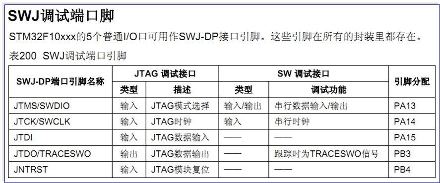  
有用户下载到板子，然后说PB3,PB4不能输出他所需要的电平状态，为什么？  
与调试模式有关  
JTAG/SWD接口常见硬件图：  
（略）尽量别用JTAG，用SWD，管脚占用少。
JTAG/SWD模式设置库函数（在文件stm32f10x_gpio.c中）：  
void GPIO_PinRemapConfig(uint32_t GPIO_Remap, FunctionalState NewState)  
调试工具条：  
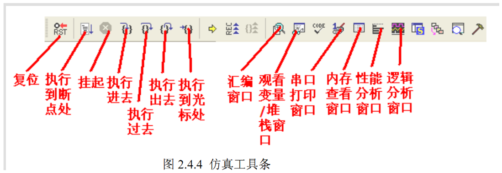  
Peripheral工具栏，用于仿真时查看外设信息。  

### 第23讲 端口复用和重映射-M3 ###

什么是端口复用？  
STM32有很多的内置外设，这些外设的外部引脚都是与GPIO复用的。也就是说，一个GPIO如果可以复用为内置外设的功能引脚，那么当这个GPIO作为内置外设使用的时候，就叫做复用。  
例如串口1 的发送接收引脚是PA9,PA10，当我们把PA9,PA10不用作GPIO，而用做复用功能串口1的发送接收引脚的时候，叫端口复用。  
端口复用配置过程---以PA9,PA10配置为串口1为例：  
1、GPIO端口时钟使能。  
RCC_APB2PeriphClockCmd(RCC_APB2Periph_GPIOA, ENABLE);  
2、复用外设时钟使能。比如你要将端口PA9,PA10复用为串口，所以要使能串口时钟。  
RCC_APB2PeriphClockCmd(RCC_APB2Periph_USART1, ENABLE);   
3、端口模式配置。 GPIO_Init（）函数。查表：《STM32中文参考手册V10》P110的表格“8.1.11外设的GPIO配置”  
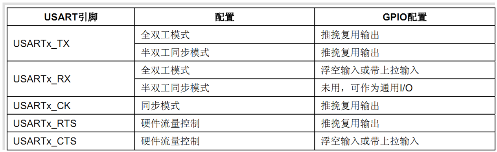  
PA9,PA10复用为串口1配置过程:    
RCC_APB2PeriphClockCmd(RCC_APB2Periph_GPIOA, ENABLE);//①IO时钟使能  
RCC_APB2PeriphClockCmd(RCC_APB2Periph_USART1, ENABLE);//②外设时钟使能  
//③初始化IO为对应的模式  
GPIO_InitStructure.GPIO_Pin = GPIO_Pin_9; //PA.9//复用推挽输出  
GPIO_InitStructure.GPIO_Speed = GPIO_Speed_50MHz;  
GPIO_InitStructure.GPIO_Mode = GPIO_Mode_AF_PP;   
GPIO_Init(GPIOA, &GPIO_InitStructure);  
GPIO_InitStructure.GPIO_Pin = GPIO_Pin_10;//PA10 PA.10 浮空输入  
GPIO_InitStructure.GPIO_Mode = GPIO_Mode_IN_FLOATING;//浮空输入  
GPIO_Init(GPIOA, &GPIO_InitStructure);    

什么是端口重映射？  
每个内置外设都有若干个输入输出引脚，一般这些引脚的输出端口都是固定不变的，为了让设计工程师可以更好地安排引脚的走向和功能，在STM32中引入了外设引脚重映射的概念，即一个外设的引脚除了具有默认的端口外，还可以通过设置重映射寄存器的方式，把这个外设的引脚映射到其它的端口。  
为了使不同器件封装的外设IO功能数量达到最优，可以把一些复用功能重新映射到其他一些引脚上。STM32中有很多内置外设的输入输出引脚都具有重映射(remap)的功能。  
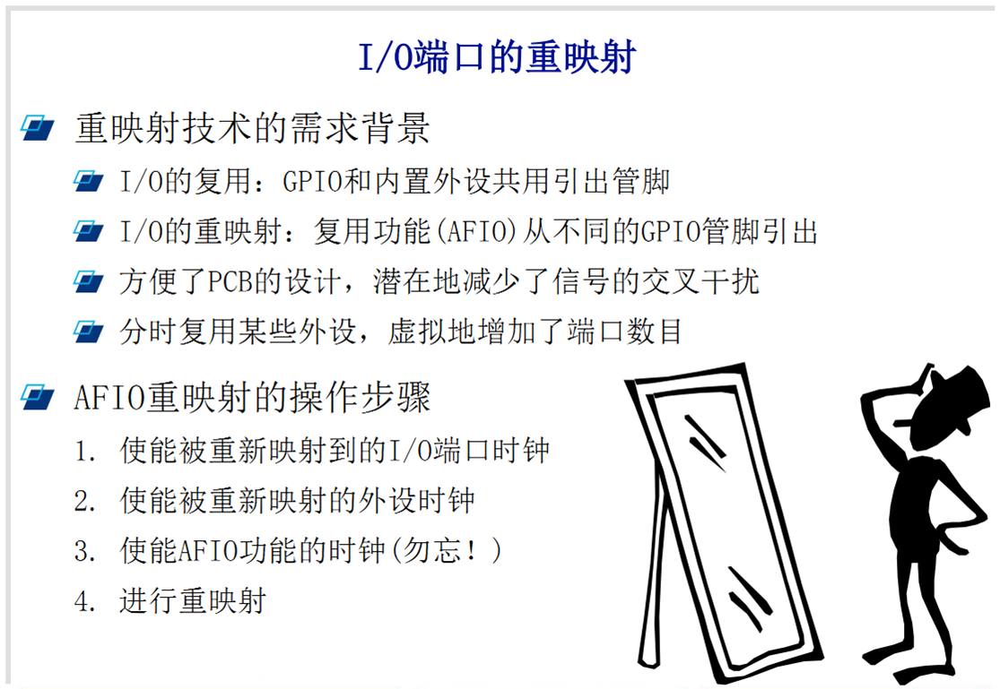     
部分重映射 & 完全重映射  
部分重映射：功能外设的部分引脚重新映射，还有一部分引脚是原来的默认引脚。  
完全重映射：功能外设的所有引脚都重新映射。  
引脚重映射配置过程（串口1为例）：  
1. 使能GPIO时钟（重映射后的IO);  
2. 使能功能外设时钟（例如串口1);  
3. 使能AFIO时钟。重映射必须使能AFIO时钟：RCC_APB2PeriphClockCmd(RCC_APB2Periph_AFIO, ENABLE);  
4. 开启重映射。GPIO_PinRemapConfig(GPIO_Remap_USART1, ENABLE);根据第一个参数，来确定是部分重映射还是全部重映射  
哪些情况需要开启AFIO辅助功能时钟？  
对寄存器AFIO_MAPR，AFIO_EXTICRX和AFIO_EVCR进行读写操作前，应当首先打开AFIO时钟。  
- AFIO_MAPR：配置复用功能重映射  
- AFIO_EXTICRX:配置外部中断线映射  
- AFIO_EVCR:   配置EVENTOUT事件输出  

### 第24讲 NVIC中断优先级管理-M3 ###

称之为“内嵌向量中断控制器:Nested Vectored Interrupt Controller (NVIC)”。  
CM3内核支持256个中断，其中包含了16个内核中断和240个外部中断，并且具有256级的可编程中断设置。  
STM32并没有使用CM3内核的全部东西，而是只用了它的一部分。  
STM32有84个中断，包括16个内核中断和68个可屏蔽中断，具有16级可编程的中断优先级。  
STM32F103系列上面，又只有60个可屏蔽中断（在107系列才有68个）  
几十个中断，怎么管理？  
首先，对STM32中断进行分组，组0-4。同时，对每个中断设置一个抢占优先级和一个响应优先级值。  
分组配置是在寄存器SCB->AIRCR中配置：  
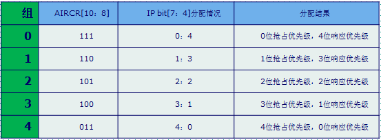  
抢占优先级 & 响应优先级区别：  
高优先级的抢占优先级是可以打断正在进行的低抢占优先级中断的。  
抢占优先级相同的中断，高响应优先级不可以打断低响应优先级的中断。  
抢占优先级相同的中断，当两个中断同时发生的情况下，哪个响应优先级高，哪个先执行。  
如果两个中断的抢占优先级和响应优先级都是一样的话，则看哪个中断先发生就先执行；  
举例：  
假定设置中断优先级组为2，然后设置中断3(RTC中断)的抢占优先级为2，响应优先级为1。  中断6（外部中断0）的抢占优先级为3，响应优先级为0。中断7（外部中断1）的抢占优先级为2，响应优先级为0。  
那么这3个中断的优先级顺序为：中断7>中断3>中断6。   
**特别说明：**  
一般情况下，系统代码执行过程中，只设置一次中断优先级分组，比如分组2，设置好分组之后一般不会再改变分组。随意改变分组会导致中断管理混乱，程序出现意想不到的执行结果。  
中断优先级分组函数：   
void NVIC_PriorityGroupConfig(uint32_t NVIC_PriorityGroup)  
{  
　assert_param(IS_NVIC_PRIORITY_GROUP(NVIC_PriorityGroup));  
　SCB->AIRCR = AIRCR_VECTKEY_MASK | NVIC_PriorityGroup;  
}  
例如：NVIC_PriorityGroupConfig(NVIC_PriorityGroup_2);  
分组设置好之后，怎么设置单个中断的抢占优先级和响应优先级？  
中断设置相关寄存器   
　__IO uint8_t  IP[240]; //中断优先级控制的寄存器组  
　__IO uint32_t ISER[8]; //中断使能寄存器组  
　__IO uint32_t ICER[8]; //中断失能寄存器组  
　__IO uint32_t ISPR[8]; //中断挂起寄存器组  
　__IO uint32_t ICPR[8]; //中断解挂寄存器组  
　__IO uint32_t IABR[8]; //中断激活标志位寄存器组  

MDK中NVIC寄存器结构体  
typedef struct  
{  
  __IO uint32_t ISER[8];             
       uint32_t RESERVED0[24];                                   
  __IO uint32_t ICER[8];                    
       uint32_t RSERVED1[24];                                    
  __IO uint32_t ISPR[8];                     
       uint32_t RESERVED2[24];                                   
  __IO uint32_t ICPR[8];                   
       uint32_t RESERVED3[24];                                   
  __IO uint32_t IABR[8];                     
       uint32_t RESERVED4[56];                                   
  __IO uint8_t  IP[240];                     
       uint32_t RESERVED5[644];                                  
  __O  uint32_t STIR;                         
}  NVIC_Type;   
对于每个中断怎么设置优先级？   
中断优先级控制的寄存器组：IP[240]   
全称是：Interrupt Priority Registers  
240个8位寄存器，每个中断使用一个寄存器来确定优先级。STM32F10x系列一共60个可屏蔽中断，使用IP[59]-IP[0]。  
每个IP寄存器的高4位用来设置抢占和响应优先级（根据分组），低4位没有用到。  
void NVIC_Init(NVIC_InitTypeDef* NVIC_InitStruct);  
中断使能寄存器组：ISER[8]  
作用：用来使能中断  
32位寄存器，每个位控制一个中断的使能。STM32F10x只有60个可屏蔽中断，所以只使用了其中的ISER[0]和ISER[1]。  
ISER[0]的bit0-bit31分别对应中断0-31。ISER[1]的bit0-27对应中断32-59；  
void NVIC_Init(NVIC_InitTypeDef* NVIC_InitStruct);  
中断失能寄存器组：ICER[8]  
作用：用来失能中断  
32位寄存器，每个位控制一个中断的失能。STM32F10x只有60个可屏蔽中断，所以只使用了其中的ICER[0]和ICER[1]。  
ICER[0]的bit0-bit31分别对应中断0-31。ICER[1]的bit0-27对应中断32-59；  
配置方法跟ISER一样。  
void NVIC_Init(NVIC_InitTypeDef* NVIC_InitStruct);  
中断挂起控制寄存器组：ISPR[8]  
作用：用来挂起中断  
中断解挂控制寄存器组：ICPR[8]  
作用：用来解挂中断  
static __INLINE void NVIC_SetPendingIRQ(IRQn_Type IRQn)；  
static __INLINE uint32_t NVIC_GetPendingIRQ(IRQn_Type IRQn)；   
static __INLINE void NVIC_ClearPendingIRQ(IRQn_Type IRQn)  
中断激活标志位寄存器组：IABR [8]  
作用：只读，通过它可以知道当前在执行的中断是哪一个,如果对应位为1，说明该中断正在执行。  
static __INLINE uint32_t NVIC_GetActive(IRQn_Type IRQn)  
中断参数初始化函数  
void NVIC_Init(NVIC_InitTypeDef* NVIC_InitStruct);  

typedef struct   
{  
　uint8_t NVIC_IRQChannel; //设置中断通道  
　uint8_t NVIC_IRQChannelPreemptionPriority;//设置响应优先级  
　uint8_t NVIC_IRQChannelSubPriority; //设置抢占优先级  
　FunctionalState NVIC_IRQChannelCmd; //使能/使能  
} NVIC_InitTypeDef;  

NVIC_InitTypeDef   NVIC_InitStructure;  
NVIC_InitStructure.NVIC_IRQChannel = USART1_IRQn;//串口1中断  
NVIC_InitStructure.NVIC_IRQChannelPreemptionPriority=1 ;// 抢占优先级为1  
NVIC_InitStructure.NVIC_IRQChannelSubPriority = 2;// 子优先级位2  
NVIC_InitStructure.NVIC_IRQChannelCmd = ENABLE;//IRQ通道使能  
NVIC_Init(&NVIC_InitStructure);	//根据上面指定的参数初始化NVIC寄存器  

中断优先级设置步骤  

1. 系统运行后先设置中断优先级分组。调用函数：
void NVIC_PriorityGroupConfig(uint32_t NVIC_PriorityGroup);
整个系统执行过程中，只设置一次中断分组。
2. 针对每个中断，设置对应的抢占优先级和响应优先级：
void NVIC_Init(NVIC_InitTypeDef* NVIC_InitStruct);
3. 如果需要挂起/解挂，查看中断当前激活状态，分别调用相关函数即可。

### 第25讲 串口通信基本原理-M3 ###

处理器与外部设备通信的两种方式：  
并行通信  
　　-传输原理：数据各个位同时传输。  
　　-优点：速度快  
　　-缺点：占用引脚资源多  
串行通信  
　　-传输原理：数据按位顺序传输。  
　　-优点：占用引脚资源少  
　　-缺点：速度相对较慢  
串行通信：  
按照数据传送方向，分为：  
单工：数据传输只支持数据在一个方向上传输  
半双工：允许数据在两个方向上传输，但是，在某一时刻，只允许数据在一个方向上传输，它实际上是一种切换方向的单工通信；  
全双工：允许数据同时在两个方向上传输，因此，全双工通信是两个单工通信方式的结合，它要求发送设备和接收设备都有独立的接收和发送能力。 
串行通信的通信方式:  
同步通信：带时钟同步信号传输。-SPI，IIC通信接口  
异步通信：不带时钟同步信号。-UART(通用异步收发器),单总线  
常见的串行通信接口：  
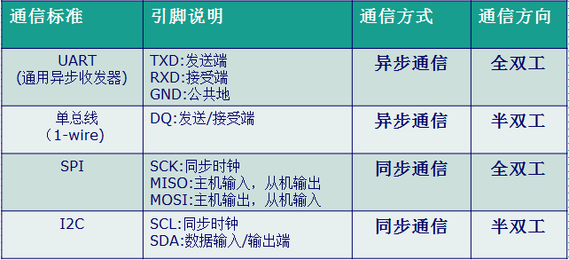  
STM32的串口通信接口:  
UART:通用异步收发器  
USART:通用同步异步收发器  
大容量STM32F10x系列芯片，包含3个USART和2个UART  
UART异步通信方式引脚连接方法：  
-RXD:数据输入引脚。数据接受。  
-TXD:数据发送引脚。数据发送。  
-GND:共地  
串口号　 RXD　　 TXD  
1　　　　PA10　　PA9  
2　　　　PA3　　 PA2  
3　　　　PB11　　PB10  
4　　　　PC11　　PC10  
5　　　　PD2　　 PC12  
UART异步通信方式特点：  
全双工异步通信。  
分数波特率发生器系统，提供精确的波特率。-发送和接受共用的可编程波特率，最高可达4.5Mbits/s  
可编程的数据字长度（8位或者9位）；  
可配置的停止位（支持1或者2位停止位）；  
可配置的使用DMA多缓冲器通信。  
单独的发送器和接收器使能位。  
检测标志：① 接受缓冲器  ②发送缓冲器空 ③传输结束标志  
多个带标志的中断源。触发中断。  
其他：校验控制，四个错误检测标志。  
串口通信过程：MCU内核<--->输入/输出数据缓冲器<--->串行输入/输出移位寄存器<--->RXD/TXD<--->外设  
STM32串口异步通信需要定义的参数：  
1. 起始位  
2. 数据位（8位或者9位）  
3. 奇偶校验位（第9位）  
4. 停止位（1,15,2位）  
5. 波特率设置  

### 第26讲 STM32串口寄存器库函数配置方法+手把手教你写串口通信实例-M3 ###

常用的串口相关寄存器  
- USART_SR状态寄存器(bit0-bit9)  
- USART_DR数据寄存器(bit0-bit8)  
- USART_BRR波特率寄存器（bit0-bit3，小数部分；bit4-bit15，整数部分）   
串口操作相关库函数（省略入口参数）：  
void USART_Init(); //串口初始化：波特率，数据字长，奇偶校验，硬件流控以及收发使能  
void USART_Cmd();//使能串口  
void USART_ITConfig();//使能相关中断  

void USART_SendData();//发送数据到串口，DR  
uint16_t USART_ReceiveData();//接受数据，从DR读取接受到的数据  

FlagStatus USART_GetFlagStatus();//获取状态标志位  
void USART_ClearFlag();//清除状态标志位  
ITStatus USART_GetITStatus();//获取中断状态标志位  
void USART_ClearITPendingBit();//清除中断状态标志位  
波特率计算方法：  
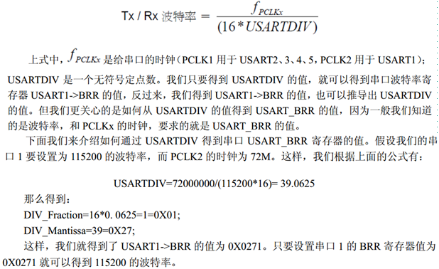   

串口配置的一般步骤:  
1. 串口时钟使能，GPIO时钟使能:RCC_APB2PeriphClockCmd();  
2. 串口复位:USART_DeInit(); 这一步不是必须的  
3. GPIO端口模式设置:GPIO_Init(); 模式设置为GPIO_Mode_AF_PP  
4. 串口参数初始化：USART_Init();  
5. 开启中断并且初始化NVIC（如果需要开启中断才需要这个步骤）  
 NVIC_Init();  
 USART_ITConfig();  
6. 使能串口:USART_Cmd();  
7. 编写中断处理函数：USARTx_IRQHandler();  
8. 串口数据收发：  
void USART_SendData();//发送数据到串口，DR  
uint16_t USART_ReceiveData();//接受数据，从DR读取接受到的数据  
9. 串口传输状态获取：  
FlagStatus USART_GetFlagStatus(USART_TypeDef* USARTx, uint16_t USART_FLAG);  
void USART_ClearITPendingBit(USART_TypeDef* USARTx, uint16_t USART_IT);  

### 第27讲 串口实验讲解-M3 ###

Printf支持：  
//加入以下代码,支持printf函数,而不需要选择use MicroLIB	  
　#if 1  
　#pragma import(__use_no_semihosting)             
　//标准库需要的支持函数                 
　struct __FILE  
　{ int handle;  
　};  

　FILE __stdout;       
　//定义_sys_exit()以避免使用半主机模式    
　_sys_exit(int x)  
　{ x = x; }  

　//重定义fputc函数  
　int fputc(int ch, FILE *f)  
　{      
　　while((USART1->SR&0X40)==0);//循环发送,直到发送完毕   
　　USART1->DR = (u8) ch;      
　　return ch;  
　}  
　#endif  
定义一些变量：  
　#define USART_REC_LEN   200  	//定义最大接收字节数 200  
　u8 USART_RX_BUF[USART_REC_LEN]; //接收缓冲,最大USART_REC_LEN个字节.末字节为换行符  
　u16 USART_RX_STA;         		//接收状态标记	
bit15　　　　bit14　　　　　　bit13-0  
接收完成标志　接收到0X0D标志　接收到的有效数据个数   
程序要求，发送的字符是以回车换行结束（0x0D,0x0A)  
ABCDEFGHI…….(0x0D),(0x0A)  

### 第28讲 外部中断实验-M3 ###

STM32的每个IO都可以作为外部中断输入。  
STM32的中断控制器支持19个外部中断/事件请求：  
线0-15：对应外部IO口的输入中断。  
线16：连接到PVD输出。  
线17：连接到RTC闹钟事件。  
线18：连接到USB唤醒事件。  
每个外部中断线可以独立的配置触发方式（上升沿，下降沿或者双边沿触发），触发/屏蔽，专用的状态位。  
从上面可以看出，STM32供IO使用的中断线只有16个，但是STM32F10x系列的IO口多达上百个，STM32F103ZET6(112),STM32F103RCT6(51)，那么中断线怎么跟io口对应呢？  
GPIOx.0映射到EXTI0  
GPIOx.1映射到EXTI1  
…  
GPIOx.15映射到EXTI15  
对于每个中断线，我们可以设置相应的触发方式（上升沿触发，下降沿触发，边沿触发）以及使能。  
是不是16个中断线就可以分配16个中断服务函数呢？  
IO口外部中断在中断向量表中只分配了7个中断向量，也就是只能使用7个中断服务函数  
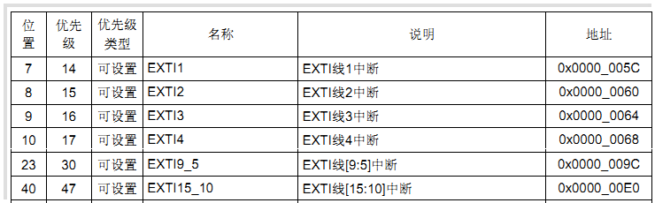  
从表中可以看出，外部中断线5-9分配一个中断向量，共用一个服务函数外部中断线10-15分配一个中断向量，共用一个中断服务函数。  
中断服务函数列表：  
EXTI0_IRQHandler    
EXTI1_IRQHandler  
EXTI2_IRQHandler           
EXTI3_IRQHandler           
EXTI4_IRQHandler           
EXTI9_5_IRQHandler         
EXTI15_10_IRQHandler     
外部中断常用库函数  
①void GPIO_EXTILineConfig(uint8_t GPIO_PortSource, uint8_t GPIO_PinSource);//设置IO口与中断线的映射关系  
exp:  GPIO_EXTILineConfig(GPIO_PortSourceGPIOE,GPIO_PinSource2);  
②void EXTI_Init(EXTI_InitTypeDef* EXTI_InitStruct); //初始化中断线：触发方式等   
③ITStatus EXTI_GetITStatus(uint32_t EXTI_Line);//判断中断线中断状态，是否发生   
④void EXTI_ClearITPendingBit(uint32_t EXTI_Line);  //清除中断线上的中断标志位  
EXTI_Init函数  
void EXTI_Init(EXTI_InitTypeDef* EXTI_InitStruct)；  
typedef struct  
{  
  uint32_t EXTI_Line;   //指定要配置的中断线            
  EXTIMode_TypeDef EXTI_Mode;   //模式：事件 OR中断  
  EXTITrigger_TypeDef EXTI_Trigger;//触发方式：上升沿/下降沿/双沿触发  
  FunctionalState EXTI_LineCmd;  //使能 OR失能  
}EXTI_InitTypeDef;  

EXTI_InitStructure.EXTI_Line=EXTI_Line2;	 
EXTI_InitStructure.EXTI_Mode = EXTI_Mode_Interrupt;	  
EXTI_InitStructure.EXTI_Trigger = EXTI_Trigger_Falling;  
EXTI_InitStructure.EXTI_LineCmd = ENABLE;  
EXTI_Init(&EXTI_InitStructure);  
外部中断的一般配置步骤：  
1. 初始化IO口为输入。 GPIO_Init();  
2. 开启IO口复用时钟。RCC_APB2PeriphClockCmd(RCC_APB2Periph_AFIO,ENABLE);  
3. 设置IO口与中断线的映射关系。void GPIO_EXTILineConfig();  
4. 初始化线上中断，设置触发条件等。EXTI_Init();  
5. 配置中断分组（NVIC），并使能中断。NVIC_Init();  
6. 编写中断服务函数。EXTIx_IRQHandler();  
7. 清除中断标志位  EXTI_ClearITPendingBit();  

### 第29讲 独立看门狗实验-IWDG-M3 ###

为什么要看门狗？  
在由单片机构成的微型计算机系统中，由于单片机的工作常常会受到来自外界电磁场的干扰，造成程序的跑飞，而陷入死循环，程序的正常运行被打断，由单片机控制的系统无法继续工作，会造成整个系统的陷入停滞状态，发生不可预料的后果，所以出于对单片机运行状态进行实时监测的考虑，便产生了一种专门用于监测单片机程序运行状态的模块或者芯片，俗称“看门狗”(watchdog) 。  
看门狗解决的问题是什么？  
在启动正常运行的时候，系统不能复位。  
在系统跑飞（程序异常执行）的情况，系统复位，程序重新执行。  
STM32内置两个看门狗，提供了更高的安全性，时间的精确性和使用的灵活性。两个看门狗设备（独立看门狗/窗口看门狗)可以用来检测和解决由软件错误引起的故障。当计数器达到给定的超时值时，触发一个中断（仅适用窗口看门狗）或者产生系统复位。  
独立看门狗（IWDG)由专用的低速时钟（LSI)驱动，即使主时钟发生故障它仍有效。  
独立看门狗适合应用于需要看门狗作为一个在主程序之外 能够完全独立工作，并且对时间精度要求低的场合。  
窗口看门狗由从APB1时钟分频后得到时钟驱动。通过可配置的时间窗口来检测应用程序非正常的过迟或过早操作。  
窗口看门狗最适合那些要求看门狗在精确计时窗口起作用的程序。  
独立看门狗功能描述  
在键值寄存器（IWDG_KR)中写入0xCCCC，开始启用独立看门狗。此时计数器开始从其复位值0xFFF递减，当计数器值计数到尾值0x000时会产生一个复位信号（IWDG_RESET)。  
无论何时，只要在键值寄存器IWDG_KR中写入0xAAAA（通常说的喂狗）, 自动重装载寄存器IWDG_RLR的值就会重新加载到计数器，从而避免看门狗复位。  
如果程序异常，就无法正常喂狗，从而系统复位。  
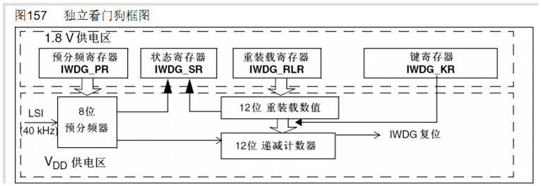  
键值寄存器IWDG_KR: 0-15位有效  
预分频寄存器IWDG_PR：0-2位有效。具有写保护功能，要操作先取消写保护  
重装载寄存器IWDG_RLR：0-11位有效。具有写保护功能，要操作先取消写保护。  
状态寄存器IWDG_SR：0-1位有效  
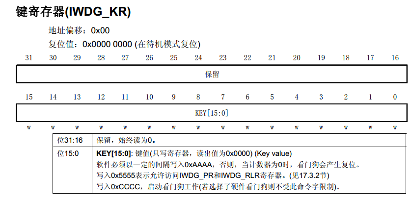  
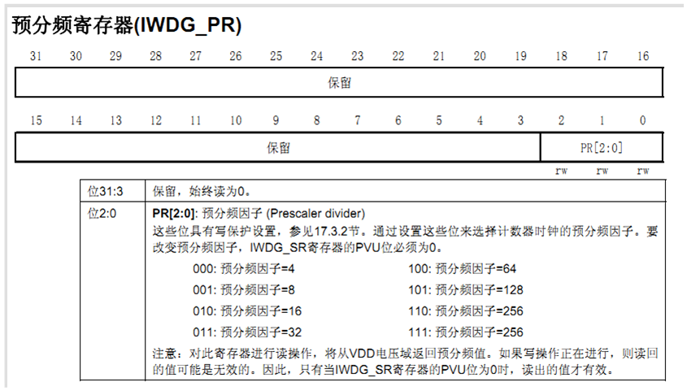  
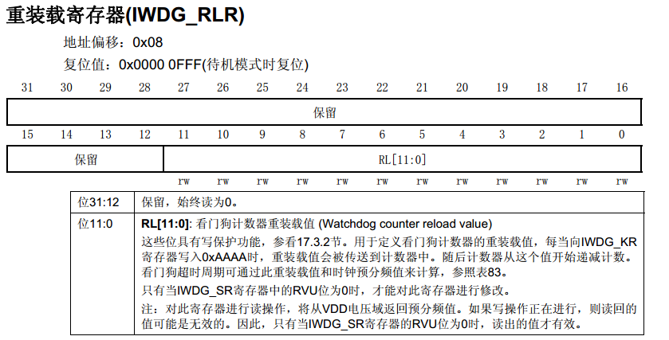  
  
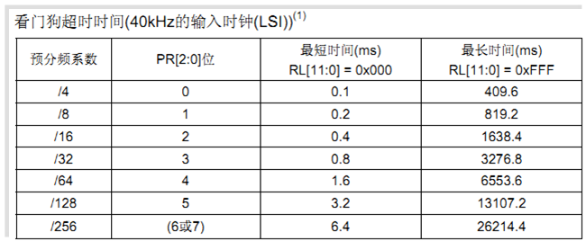  
溢出时间计算：  
   Tout=((4×2^prer) ×rlr) /40 （M3)  
时钟频率LSI=40K， 一个看门狗时钟周期就是最短超时时间。  
最长超时时间= (IWDG_RLR寄存器最大值）X看门狗时钟周期  
IWDG独立看门狗操作库函数  
void IWDG_WriteAccessCmd(uint16_t IWDG_WriteAccess);//取消写保护：0x5555使能  
void IWDG_SetPrescaler(uint8_t IWDG_Prescaler);//设置预分频系数：写PR  
void IWDG_SetReload(uint16_t Reload);//设置重装载值：写RLR  
void IWDG_ReloadCounter(void);//喂狗：写0xAAAA到KR  
void IWDG_Enable(void);//使能看门狗：写0xCCCC到KR  
FlagStatus IWDG_GetFlagStatus(uint16_t IWDG_FLAG);//状态：重装载/预分频 更新  
独立看门狗操作步骤  
①取消寄存器写保护：IWDG_WriteAccessCmd();  
②设置独立看门狗的预分频系数，确定时钟:IWDG_SetPrescaler();  
③设置看门狗重装载值，确定溢出时间:IWDG_SetReload();  
④使能看门狗: IWDG_Enable();  
⑤应用程序喂狗:IWDG_ReloadCounter();  
溢出时间计算：Tout=((4×2^prer) ×rlr) /40 （M3)  

### 第30讲 窗口看门狗实验-WWDG - M3 ###

窗口看门狗？  
之所以称为窗口就是因为其喂狗时间是一个有上下限的范围内(窗口），你可以通过设定相关寄存器，设定其上限时间（下限固定）。喂狗的时间不能过早也不能过晚。  
而独立看门狗限制喂狗时间在0-x内，x由相关寄存器决定。喂狗的时间不能过晚。  
窗口看门狗工作示意图:   
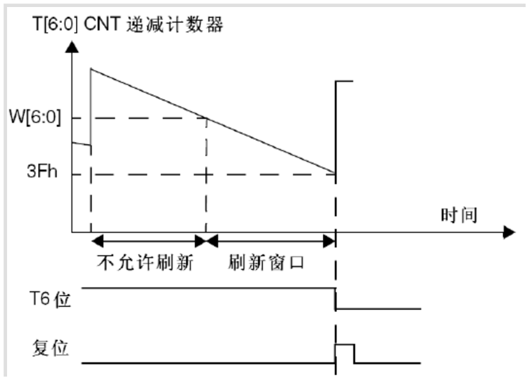  
窗口看门狗框图：  
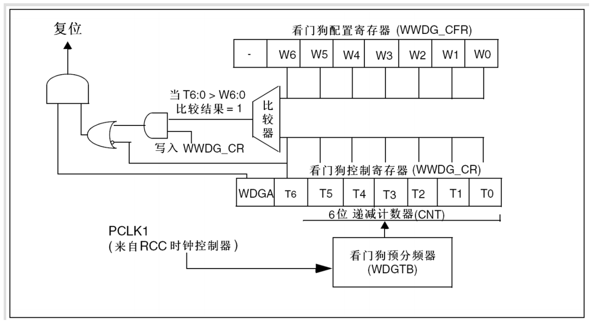   
窗口看门狗工作过程总结:  
STM32F的窗口看门狗中有一个7位的递减计数器T[6:0]，它会在出现下述2种情况之一时产生看门狗复位：  
1. 当喂狗的时候如果计数器的值大于某一设定数值W[6:0]时，此设定数值在WWDG_CFR寄存器定义。  
2. 当计数器的数值从0x40减到0x3F时【T6位跳变到0】 。  
如果启动了看门狗并且允许中断，当递减计数器等于0x40时产生早期唤醒中断（EWI),它可以用于喂狗以避免WWDG复位。
窗口看门狗超时时间:  
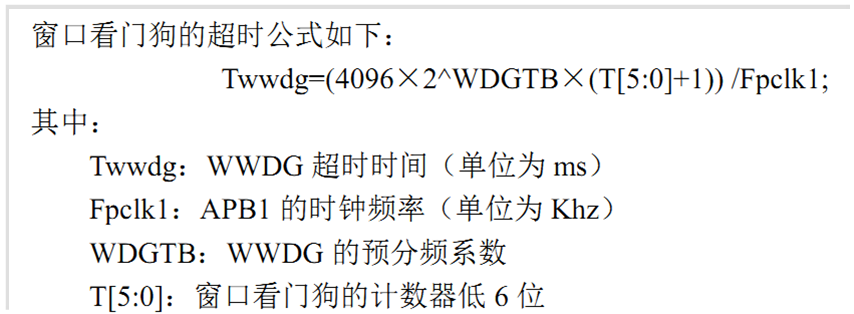   
  
为什么要窗口看门狗？  
对于一般的看门狗，程序可以在它产生复位前的任意时刻刷新看门狗，但这有一个隐患，有可能程序跑乱了又跑回到正常的地方，或跑乱的程序正好执行了刷新看门狗操作，这样的情况下一般的看门狗就检测不出来了；  
如果使用窗口看门狗，程序员可以根据程序正常执行的时间设置刷新看门狗的一个时间窗口，保证不会提前刷新看门狗也不会滞后刷新看门狗，这样可以检测出程序没有按照正常的路径运行非正常地跳过了某些程序段的情况。  
窗口看门狗其他注意事项：  
上窗口值W[6:0]必须大于下窗口值0x40。否则就无窗口了。  
窗口看门狗时钟来源PCLK1（APB1总线时钟）分频后。  

控制寄存器WWDG_CR  
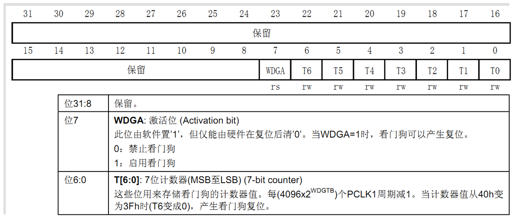   
void WWDG_Enable(uint8_t Counter);//启动并设置初始值  
void WWDG_SetCounter(uint8_t Counter);//喂狗  

配置寄存器WWDG_CFR  
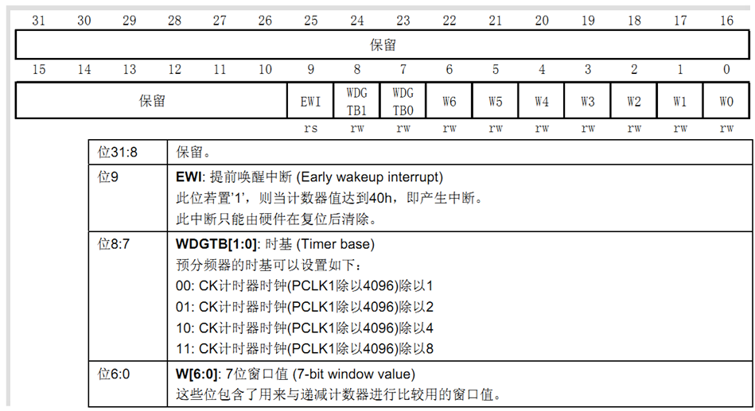  
void WWDG_EnableIT(void);//使能提前唤醒中断  
void WWDG_SetPrescaler(uint32_t WWDG_Prescaler);  
void WWDG_SetWindowValue(uint8_t WindowValue);  
  
状态寄存器WWDG_SR  
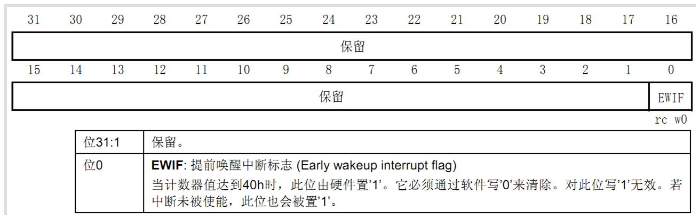  
FlagStatus WWDG_GetFlagStatus(void);  
void WWDG_ClearFlag(void);  

窗口看门狗配置过程  
①使能看门狗时钟：RCC_APB1PeriphClockCmd();  
②设置分频系数：WWDG_SetPrescaler();  
③设置上窗口值：WWDG_SetWindowValue();  
④开启提前唤醒中断并分组(可选)：WWDG_EnableIT(); NVIC_Init();  
⑤使能看门狗：WWDG_Enable();  
⑥喂狗:WWDG_SetCounter();  
⑦编写中断服务函数: WWDG_IRQHandler();  

### 第31讲 通用定时器基本原理 -M3 ###

通用定时器概述  
STM32F10x系列总共最多有8个定时器：  
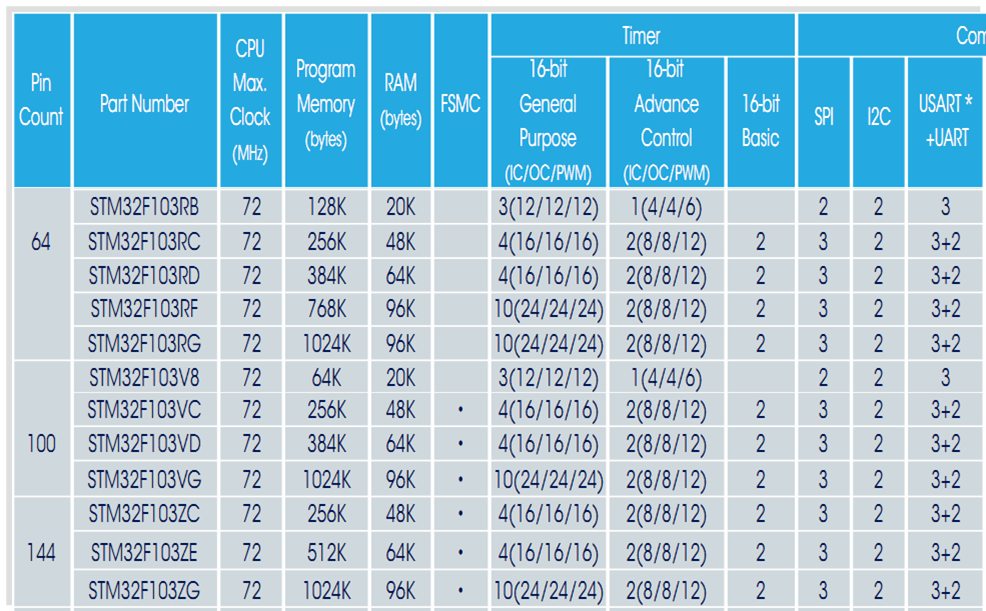   
三种STM32定时器区别  
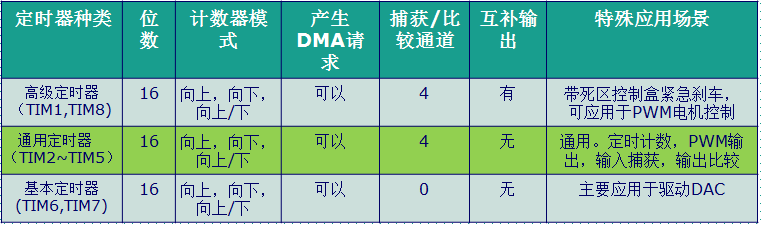  
通用定时器功能特点描述  
STM32的通用 TIMx (TIM2、TIM3、TIM4 和 TIM5)定时器功能特点包括：  
　位于低速的APB1总线上(APB1)  
　16 位向上、向下、向上/向下(中心对齐)计数模式，自动装载计数器（TIMx_CNT）。  
　16 位可编程(可以实时修改)预分频器(TIMx_PSC)，计数器时钟频率的分频系数 为 1～65535 之间的任意数值。  
　4 个独立通道（TIMx_CH1-4），这些通道可以用来作为：   
　　输入捕获   
　　输出比较  
　　PWM 生成(边缘或中间对齐模式)   
　　单脉冲模式输出   
　可使用外部信号（TIMx_ETR）控制定时器和定时器互连（可以用 1 个定时器控制另外一个定时器）的同步电路。  
如下事件发生时产生中断/DMA（6个独立的IRQ/DMA请求生成器）：   
　更新：计数器向上溢出/向下溢出，计数器初始化(通过软件或者内部/外部触发)   
　触发事件(计数器启动、停止、初始化或者由内部/外部触发计数)   
　输入捕获   
　输出比较   
　支持针对定位的增量(正交)编码器和霍尔传感器电路   
　触发输入作为外部时钟或者按周期的电流管理  
STM32 的通用定时器可以被用于：测量输入信号的脉冲长度(输入捕获)或者产生输出波形(输出比较和 PWM)等。     
使用定时器预分频器和 RCC 时钟控制器预分频器，脉冲长度和波形周期可以在几个微秒到几个毫秒间调整。STM32 的每个通用定时器都是完全独立的，没有互相共享的任何资源。  
计数器模式  
通用定时器可以向上计数、向下计数、向上向下双向计数模式。  
①向上计数模式：计数器从0计数到自动加载值(TIMx_ARR)，然后重新从0开始计数并且产生一个计数器溢出事件。  
②向下计数模式：计数器从自动装入的值(TIMx_ARR)开始向下计数到0，然后从自动装入的值重新开始，并产生一个计数器向下溢出事件。  
③中央对齐模式（向上/向下计数）：计数器从0开始计数到自动装入的值-1，产生一个计数器溢出事件，然后向下计数到1并且产生一个计数器溢出事件；然后再从0开始重新计数。  
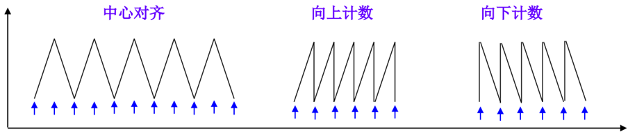  
通用定时器工作过程：  
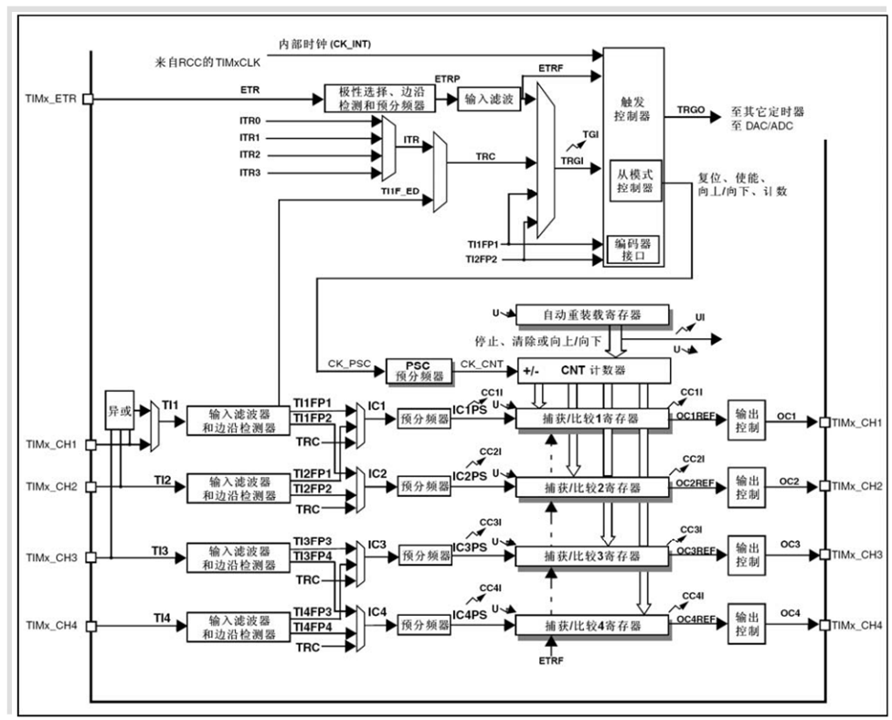  
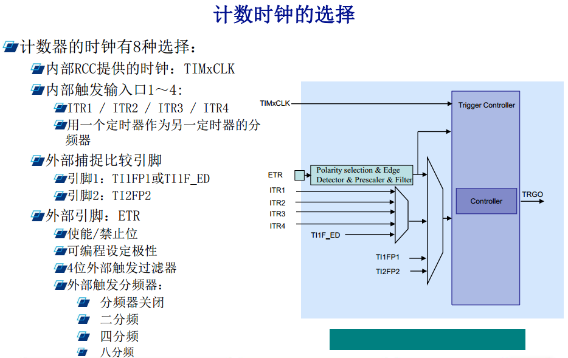  
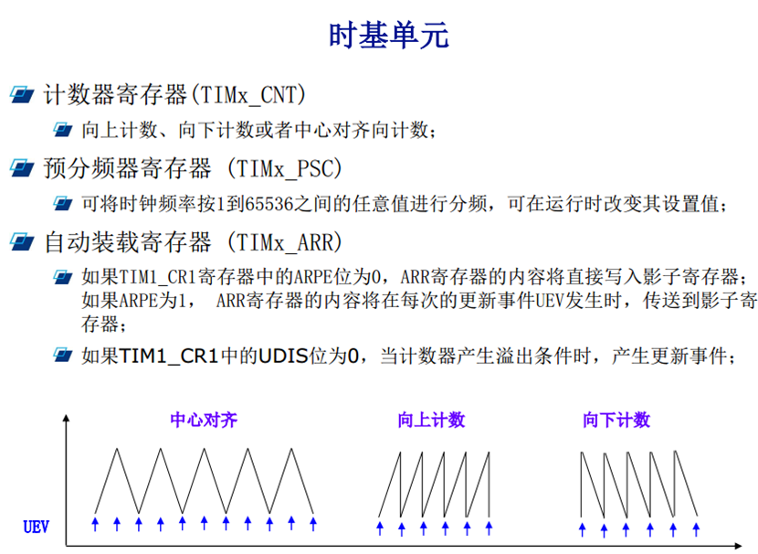  
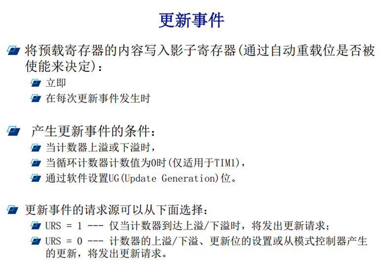  
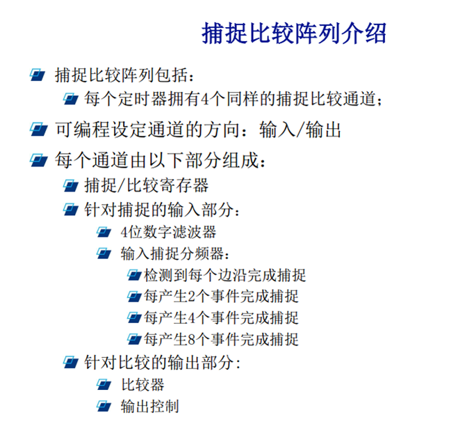  
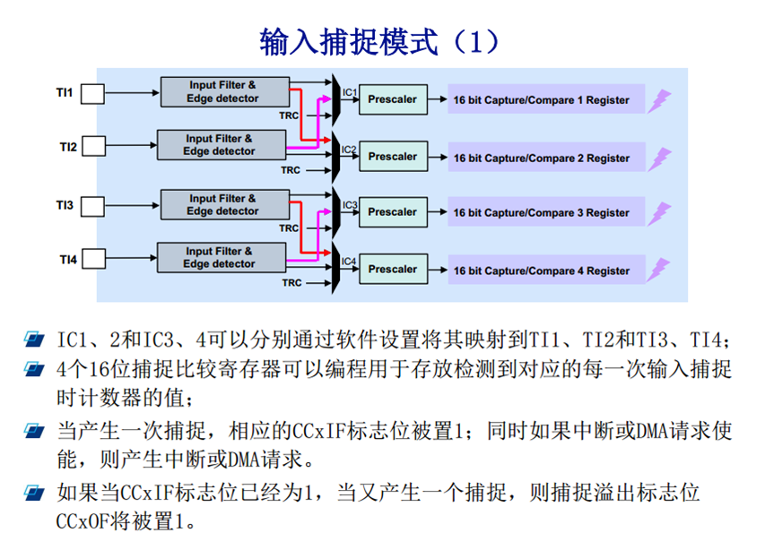  
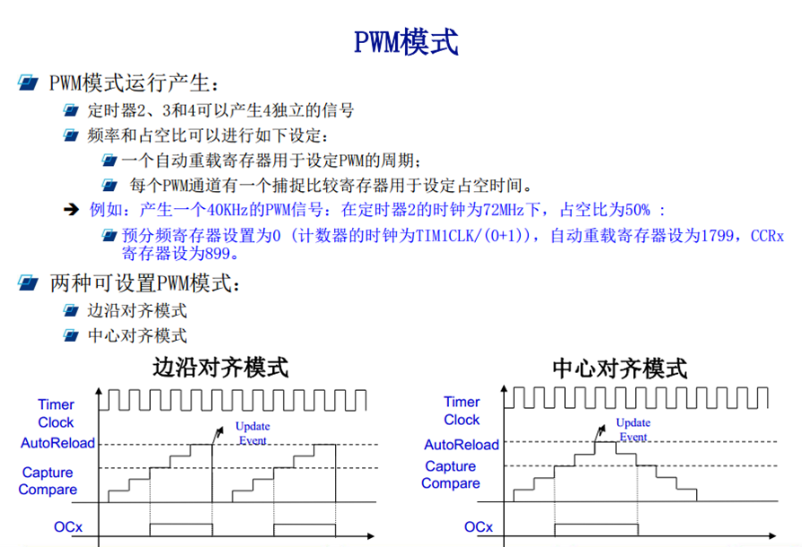  

### 第32讲 定时器中断实验-TIMER - M3 ###

时钟选择  
计数器时钟可以由下列时钟源提供：  
　内部时钟(CK_INT)  
　外部时钟模式1：外部输入脚(TIx)  
　外部时钟模式2：外部触发输入(ETR)  
　内部触发输入(ITRx)：使用一个定时器作为另一个定时器的预分频器，如可以配置一个定时器Timer1而作为另一个定时器Timer2的预分频器。  
内部时钟选择  
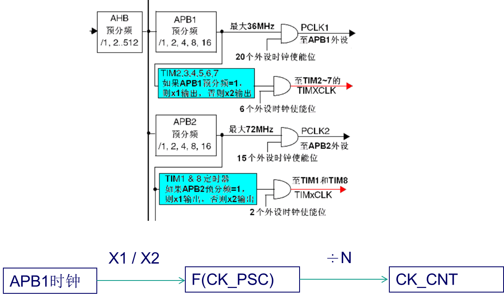  
时钟计算方法:   
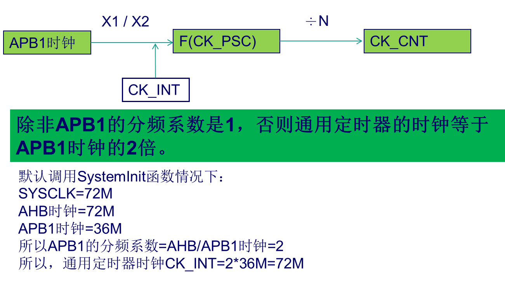  
向下计数模式（时钟分频因子=1）  
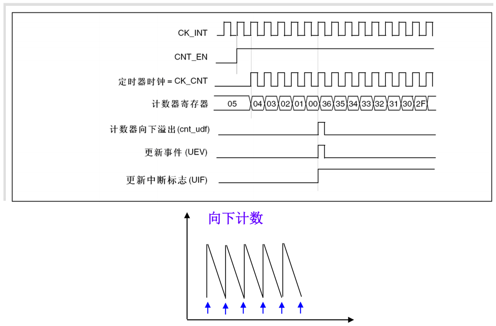  
向上计数模式（时钟分频因子=1）  
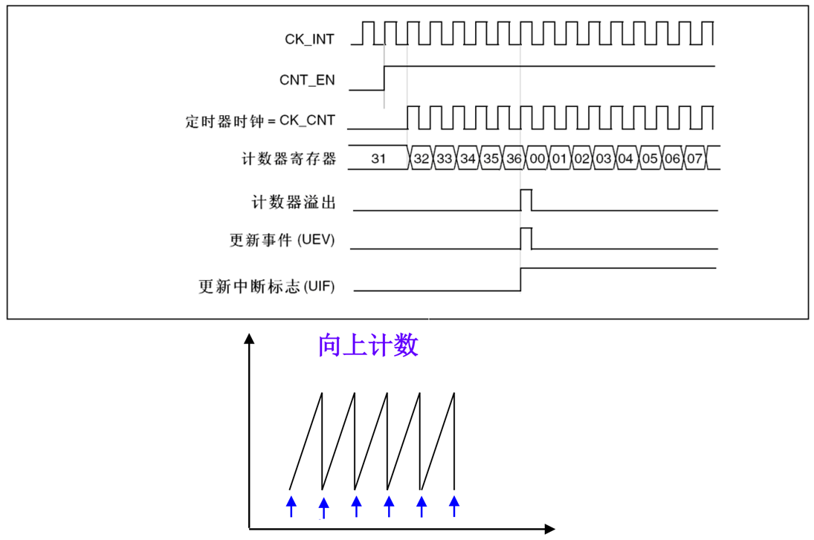  
中央对齐计数模式（时钟分频因子=1  ARR=6）  
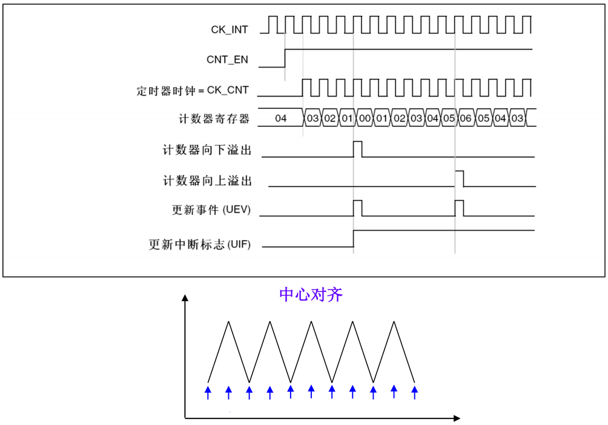  
定时器中断实验相关寄存器  
计数器当前值寄存器CNT  
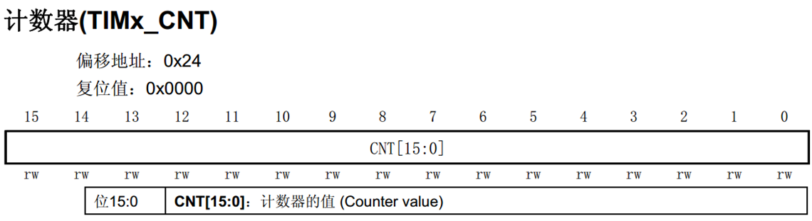  
预分频寄存器TIMx_PSC  
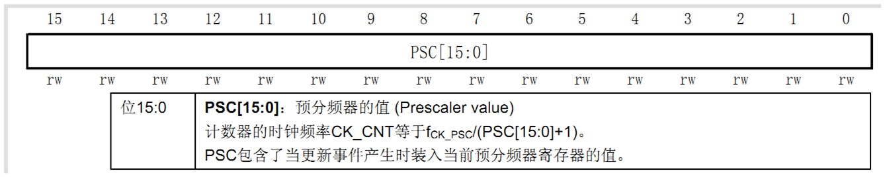  
自动重装载寄存器（TIMx_ARR)  
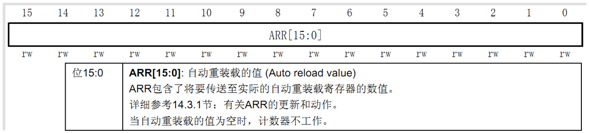  
控制寄存器1（TIMx_CR1）  
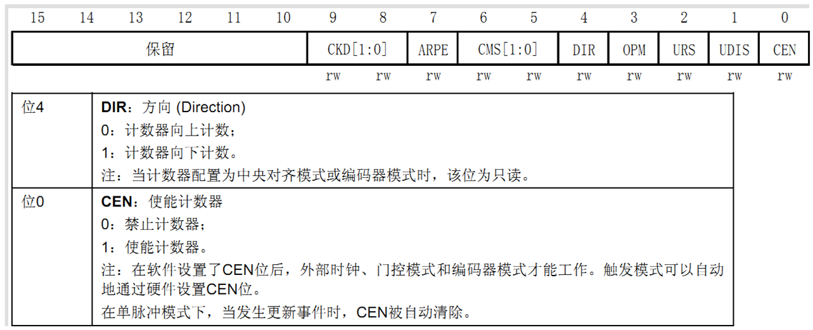  
DMA中断使能寄存器（TIMx_DIER）  
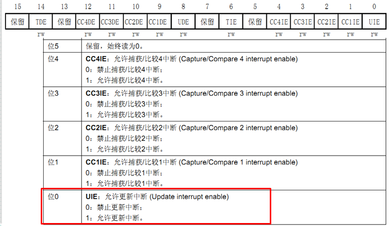  
常用库函数  
定时器参数初始化：  
void TIM_TimeBaseInit(TIM_TypeDef* TIMx,TIM_TimeBaseInitTypeDef* TIM_TimeBaseInitStruct);  
typedef struct  
{  
  uint16_t TIM_Prescaler;         
  uint16_t TIM_CounterMode;     
  uint16_t TIM_Period;        
  uint16_t TIM_ClockDivision;  
  uint8_t TIM_RepetitionCounter;  
} TIM_TimeBaseInitTypeDef;   

TIM_TimeBaseStructure.TIM_Period = 4999; TIM_TimeBaseStructure.TIM_Prescaler =7199;   
TIM_TimeBaseStructure.TIM_ClockDivision =   TIM_CKD_DIV1;      
TIM_TimeBaseStructure.TIM_CounterMode =   TIM_CounterMode_Up;  
TIM_TimeBaseInit(TIM3, &TIM_TimeBaseStructure);  
定时器使能函数：  
void TIM_Cmd(TIM_TypeDef* TIMx, FunctionalState NewState)  
定时器中断使能函数：  
void TIM_ITConfig(TIM_TypeDef* TIMx, uint16_t TIM_IT, FunctionalState NewState);  
状态标志位获取和清除  
FlagStatus TIM_GetFlagStatus(TIM_TypeDef* TIMx, uint16_t TIM_FLAG);  
void TIM_ClearFlag(TIM_TypeDef* TIMx, uint16_t TIM_FLAG);  
ITStatus TIM_GetITStatus(TIM_TypeDef* TIMx, uint16_t TIM_IT);  
void TIM_ClearITPendingBit(TIM_TypeDef* TIMx, uint16_t TIM_IT);  
定时器中断实现步骤  
1. 能定时器时钟。  
 RCC_APB1PeriphClockCmd();  
2. 初始化定时器，配置ARR,PSC。  
 TIM_TimeBaseInit();  
3. 开启定时器中断，配置NVIC。  
 void TIM_ITConfig();  
 NVIC_Init();  
4. 使能定时器。  
 TIM_Cmd();  
5. 编写中断服务函数。  
 TIMx_IRQHandler();  
程序要求  
通过定时器中断配置，每500ms中断一次，然后中断服务函数中控制LED实现LED1状态取反（闪烁）。   
Tout（溢出时间）=（ARR+1)(PSC+1)/Tclk  

### 第33讲 定时器PWM输出实验-TIMER-M3 ###

STM32 PWM工作过程  
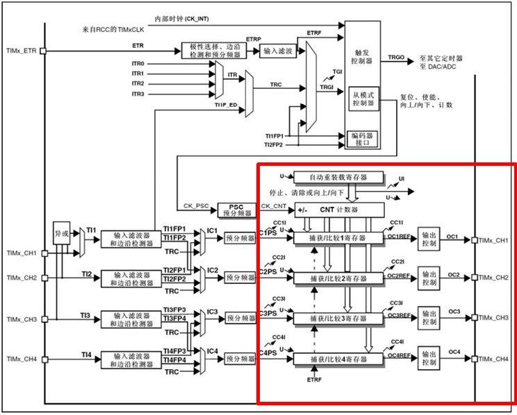  
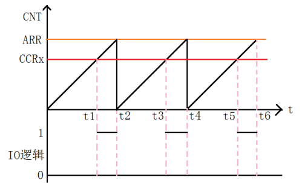  
通道1为例  
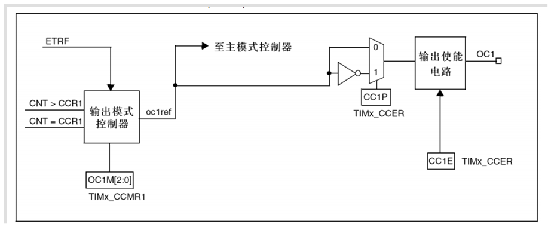  
CCR1:捕获比较(值)寄存器（x=1,2,3,4):设置比较值。  
CCMR1: OC1M[2:0]位：对于PWM方式下，用于设置PWM模式1【110】或者PWM模式2【111】  
CCER:CC1P位：输入/捕获1输出极性。0：高电平有效，1：低电平有效。  
CCER:CC1E位：输入/捕获1输出使能。0：关闭，1：打开。  
PWM模式1 & PWM模式2  
寄存器TIMx_CCMR1的OC1M[2:0]位来分析：  
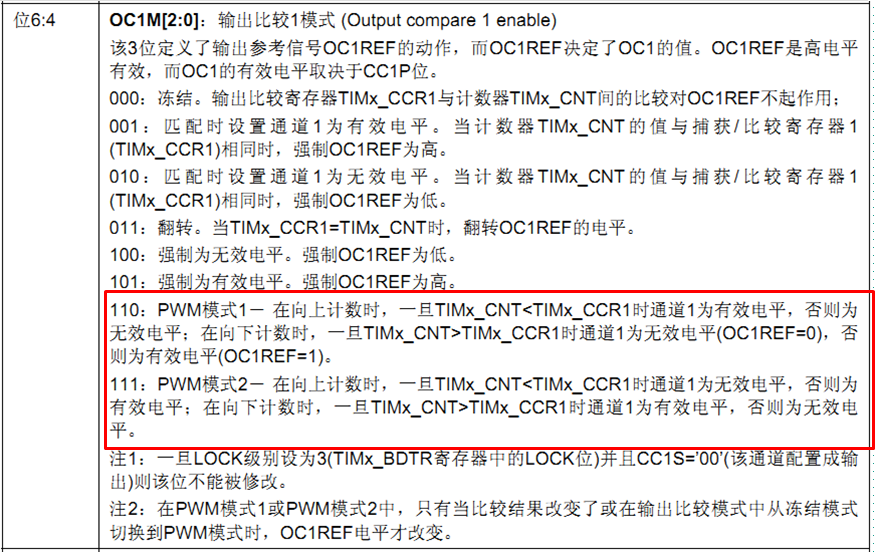   
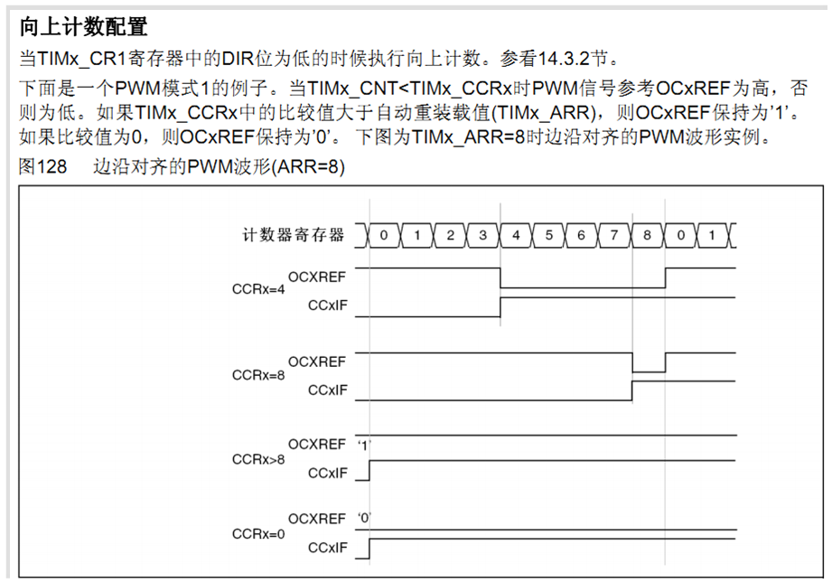   
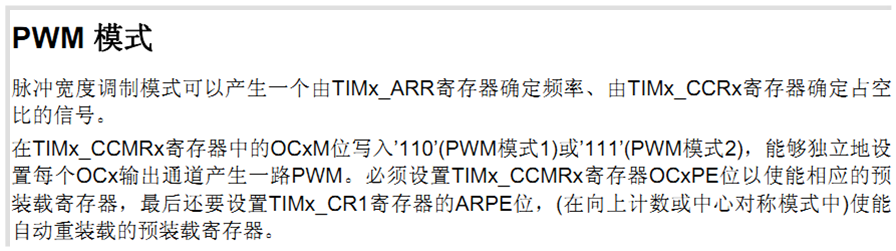   
void TIM_OC2PreloadConfig(TIM_TypeDef* TIMx, uint16_t TIM_OCPreload);  
void TIM_ARRPreloadConfig(TIM_TypeDef* TIMx, FunctionalState NewState);  
自动重载的预装载寄存器  
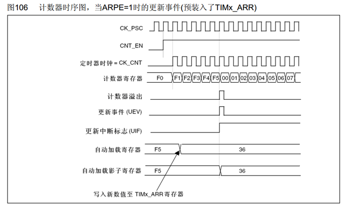   
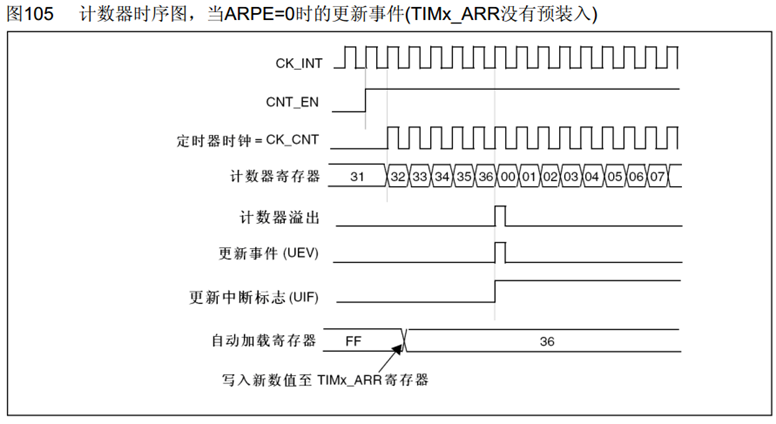   
void TIM_ARRPreloadConfig(TIM_TypeDef* TIMx, FunctionalState NewState);  
简单的说，ARPE=1,ARR立即生效。。。APRE=0,ARR下个比较周期生效。  
STM32 定时器3输出通道引脚  
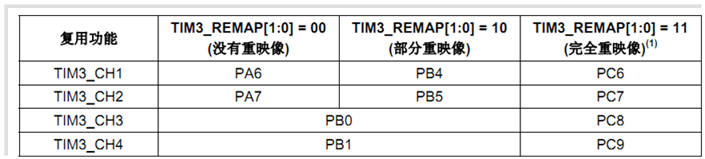   
Datasheet中表格会有详细说明  
PWM输出库函数  
void TIM_OCxInit(TIM_TypeDef* TIMx, TIM_OCInitTypeDef* TIM_OCInitStruct);  
typedef struct  
{  
  uint16_t TIM_OCMode;  //PWM模式1或者模式2  
  uint16_t TIM_OutputState; //输出使能 OR失能  
  uint16_t TIM_OutputNState;  
  uint16_t TIM_Pulse; //比较值，写CCRx  
  uint16_t TIM_OCPolarity; //比较输出极性  
  uint16_t TIM_OCNPolarity;   
  uint16_t TIM_OCIdleState;    
  uint16_t TIM_OCNIdleState;   
} TIM_OCInitTypeDef;  

TIM_OCInitStructure.TIM_OCMode = TIM_OCMode_PWM2; //PWM模式2  
TIM_OCInitStructure.TIM_OutputState = TIM_OutputState_Enable; //比较输出使能  
TIM_OCInitStructure. TIM_Pulse=100;  
TIM_OCInitStructure.TIM_OCPolarity = TIM_OCPolarity_High; //输出极性:TIM输出比较极性高  
TIM_OC2Init(TIM3, &TIM_OCInitStructure);  //根据T指定的参数初始化外设TIM3 OC2  
设置比较值函数：  
void TIM_SetCompareX(TIM_TypeDef* TIMx, uint16_t Compare2);  
使能输出比较预装载：  
void TIM_OC2PreloadConfig(TIM_TypeDef* TIMx, uint16_t TIM_OCPreload);  
使能自动重装载的预装载寄存器允许位：  
void TIM_ARRPreloadConfig(TIM_TypeDef* TIMx, FunctionalState NewState);  
手把手写PWM输出实验  
要求：  
使用定时器3的PWM功能，输出占空比可变的PWM波，用来驱动LED灯，从而达到LED[PB5]亮度由暗变亮，又从亮变暗，如此循环。  
PWM输出配置步骤：  
1. 使能定时器3和相关IO口时钟。  
使能定时器3时钟：RCC_APB1PeriphClockCmd();  
使能GPIOB时钟：RCC_APB2PeriphClockCmd();  
2. 初始化IO口为复用功能输出。函数：GPIO_Init();  
GPIO_InitStructure.GPIO_Mode = GPIO_Mode_AF_PP;      
3. 这里我们是要把PB5用作定时器的PWM输出引脚，所以要重映射配置，所以需要开启AFIO时钟。同时设置重映射。  
RCC_APB2PeriphClockCmd(RCC_APB2Periph_AFIO,ENABLE);  
GPIO_PinRemapConfig(GPIO_PartialRemap_TIM3, ENABLE);   
4. 初始化定时器：ARR,PSC等：TIM_TimeBaseInit();  
5. 初始化输出比较参数:TIM_OC2Init();  
6. 使能预装载寄存器： TIM_OC2PreloadConfig(TIM3, TIM_OCPreload_Enable);   
7. 使能定时器。TIM_Cmd();  
8. 不断改变比较值CCRx，达到不同的占空比效果:TIM_SetCompare2();  

### 第34讲 输入捕获实验-TIMER-M3 ###

STM32 输入捕获工作过程（通道1为例）  
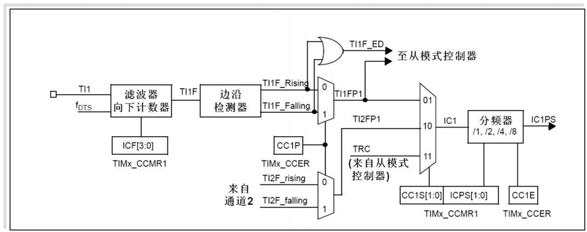   
一句话总结工作过程：通过检测TIMx_CHx上的边沿信号，在边沿信号发生跳变（比如上升沿/下降沿）的时候，将当前定时器的值(TIMx_CNT)存放到对应的捕获/比较寄存器（TIMx_CCRx)里面，完成一次捕获。 
步骤1：设置输入捕获滤波器（通道1为例）  
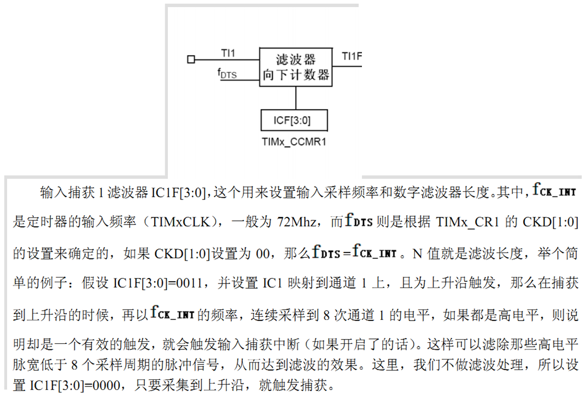   
步骤2：设置输入捕获极性（通道1为例）  
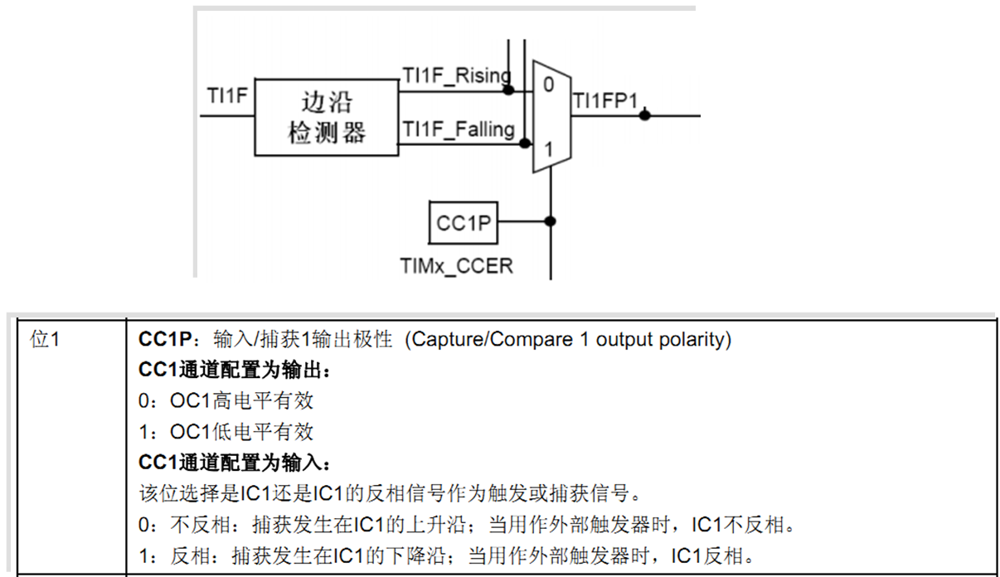   
步骤三：设置输入捕获映射通道（通道1为例）  
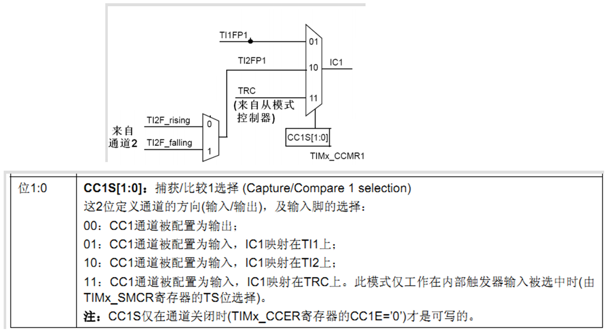   
步骤四：设置输入捕获分频器（通道1为例）  
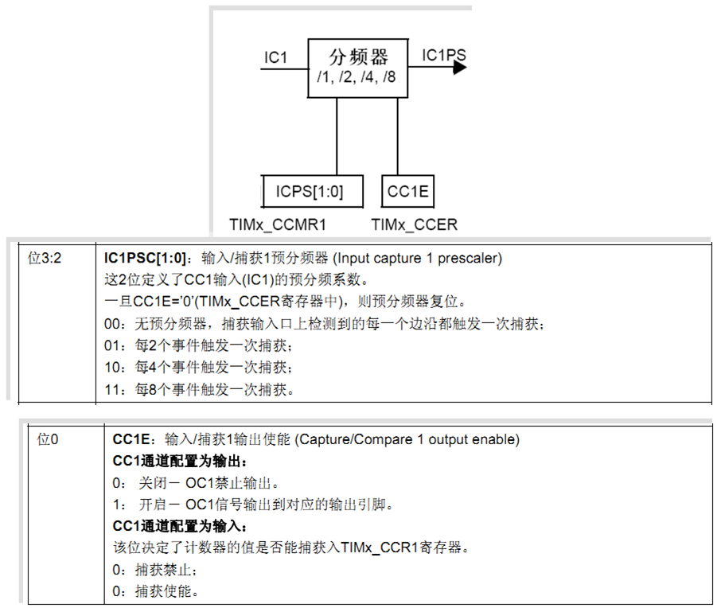   
步骤五：捕获到有效信号可以开启中断  
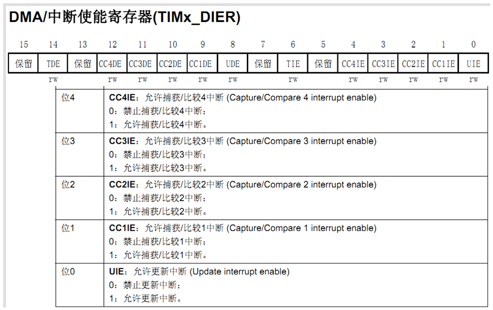   
最后：看看定时器通道对应引脚TIM5为例  
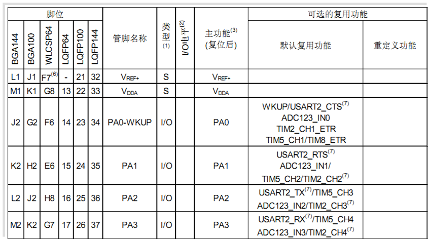   
输入捕获通道初始化函数：  
void TIM_ICInit(TIM_TypeDef* TIMx, TIM_ICInitTypeDef* TIM_ICInitStruct);  
typedef struct  
{  
  uint16_t TIM_Channel; //捕获通道1-4   
  uint16_t TIM_ICPolarity; //捕获极性  
  uint16_t TIM_ICSelection; //映射关系  
  uint16_t TIM_ICPrescaler; //分频系数  
  uint16_t TIM_ICFilter;  //滤波器  
} TIM_ICInitTypeDef;  

TIM5_ICInitStructure.TIM_Channel = TIM_Channel_1;  
TIM5_ICInitStructure.TIM_ICPolarity = TIM_ICPolarity_Rising;  
TIM5_ICInitStructure.TIM_ICSelection = TIM_ICSelection_DirectTI;   
TIM5_ICInitStructure.TIM_ICPrescaler = TIM_ICPSC_DIV1;  
TIM5_ICInitStructure.TIM_ICFilter = 0x00;  
TIM_ICInit(TIM5, &TIM5_ICInitStructure);  
通道极性设置独立函数：  
void TIM_OCxPolarityConfig(TIM_TypeDef* TIMx, uint16_t TIM_OCPolarity)；  
获取通道捕获值  
uint32_t TIM_GetCapture1(TIM_TypeDef* TIMx)；  
输入捕获的一般配置步骤：  
① 初始化定时器和通道对应IO的时钟。  
② 初始化IO口，模式为输入：GPIO_Init(); GPIO_InitStructure.GPIO_Mode = GPIO_Mode_IPD; //PA0 输入  
③ 初始化定时器ARR，PSC: TIM_TimeBaseInit();  
④ 初始化输入捕获通道 TIM_ICInit();   
⑤ 如果要开启捕获中断:TIM_ITConfig(); NVIC_Init();  
⑥ 使能定时器：TIM_Cmd();  
⑦ 编写中断服务函数：TIMx_IRQHandler();  

实验目的：测量信号的脉冲宽度  
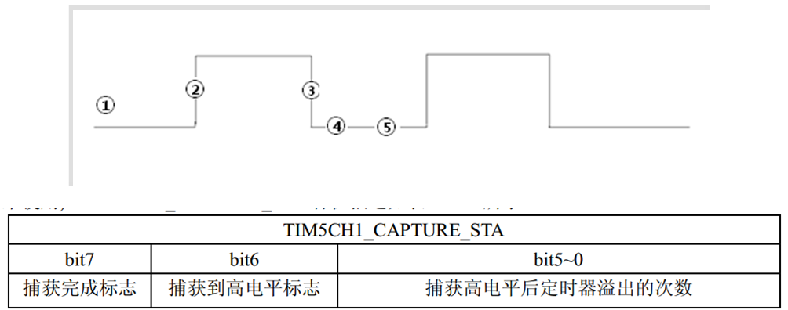   
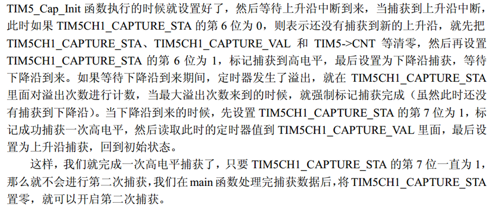   

### 第35讲 电容触摸按键 -M3 ###

电容触摸按键原理  
RC充放电电路原理：  
   
RC电路充放电公式：  
Vt = V0+（V1-V0）* [1-exp(-t/RC)]  
　V0 为电容上的初始电压值；  
　V1 为电容最终可充到或放到的电压值；  
　Vt 为t时刻电容上的电压值。  
如果V0为0，也就是从0V开始充电。那么公式简化为：  
Vt=  V1* [1-exp(-t/RC)]  
结论：同样的条件下，电容值C跟时间值t成正比关系，电容越大，充电到达某个临界值的时间越长。  
电容充电时间与电容大小关系  
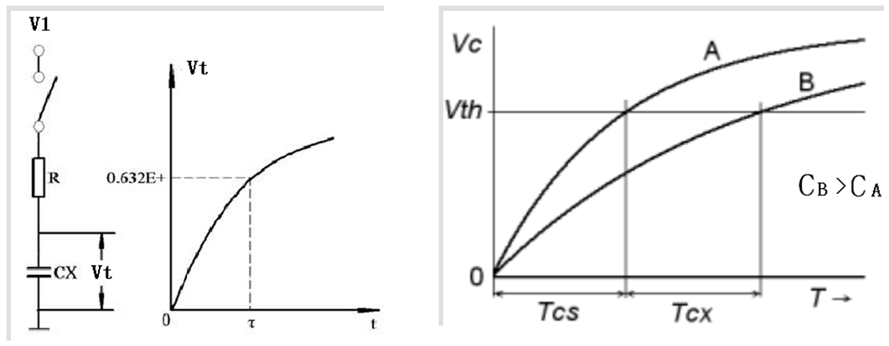  
电容触摸按键原理：  
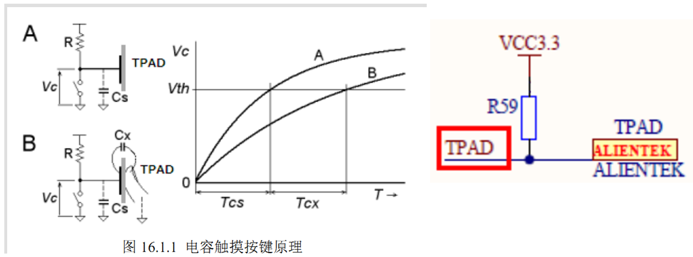  
R:外接电容充放电电阻。  
Cs:TPAD和PCB间的杂散电容。  
Cx:手指按下时，手指和TPAD之间的电容。  
开关：电容放电开关，由STM32 IO口代替。  
检测电容触摸按键过程  
　TPAD引脚设置为推挽输出，输出0，实现电容放电到0。  
　TPAD引脚设置为浮空输入（IO复位后的状态）,电容开始充电。   
　同时开启TPAD引脚的输入捕获开始捕获。  
　等待充电完成（充电到底Vx,检测到上升沿）。  
　计算充电时间。  
没有按下的时候，充电时间为T1（default)。按下TPAD，电容变大，所以充电时间为T2。我们可以通过检测充放电时间，来判断是否按下。如果T2-T1大于某个值，就可以判断有按键按下。  
程序设计思路  
几个重要的函数  
说明：对于不同的平台，区别主要是定时器底层相关以及IO口初始化。  
1. void TPAD_Reset(void)函数：复位TPAD  
设置IO口为推挽输出输出0，电容放电。等待放电完成之后，设置为浮空  
输入，从而开始充电。同时把计数器的CNT设置为0。  
2. TPAD_Get_Val()函数：获取一次捕获值（得到充电时间）  
复位TPAD,等待捕获上升沿，捕获之后，得到定时器的值，计算充电时间。  
3. TPAD_Get_MaxVal()函数：  
多次调用TPAD_Get_Val函数获取充电时间。获取最大的值。  
4. TPAD_Init()函数：初始化TPAD   
在系统启动后，初始化输入捕获。先10次调用TPAD_Get_Val()函数获取10次充电时间，然后获取中间N(N=8或者6）次的平均值，作为在没有电容触摸按键按下的时候的充电时间缺省值tpad_default_val。  
5. TPAD_Scan()函数：扫描TPAD   
调用TPAD_Get_MaxVal函数获取多次充电中最大的充电时间，跟tpad_default_val比较，如果大于某个阈值tpad_default_val+TPAD_GATE_VAL，则认为有触摸动作。  
6. void TIM5_CH2_Cap_Init(u16 arr,u16 psc)//输入捕获通道初始化   
可以使用任何一个定时器。M3使用定时器5，M4使用的定时器2。  
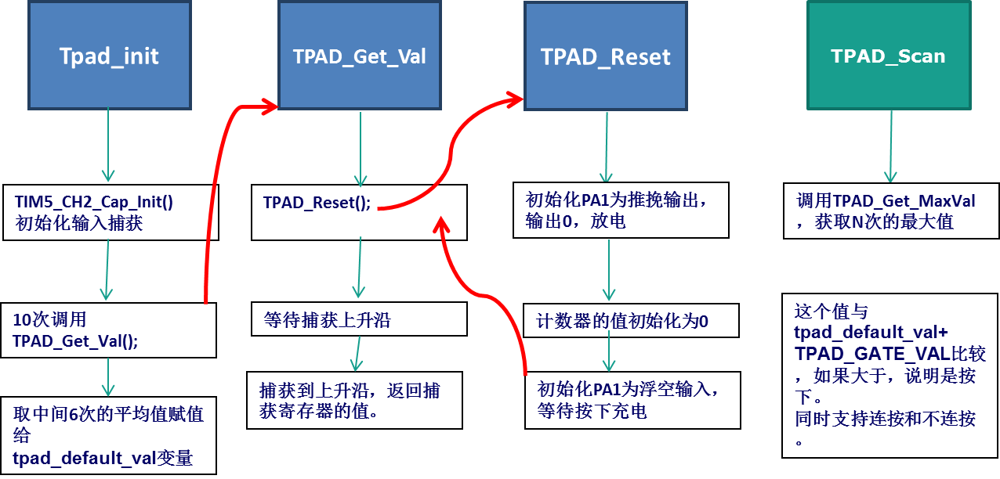   

### 第36讲 OLED显示实验 ###

OLED显示原理  
OLED，即有机发光二极管（Organic Light-Emitting Diode），又称为有机电激光显示（Organic Electroluminesence Display， OELD）。OLED由于同时具备自发光，不需背光源、对比度高、厚度薄、视角广、反应速度快、可用于挠曲性面板、使用温度范围广、构造及制程较简单等优异之特性，被认为是下一代的平面显示器新兴应用技术。  
OLED显示技术具有自发光的特性，采用非常薄的有机材料涂层和玻璃基板，当有电流通过时，这些有机材料就会发光，而且OLED显示屏幕可视角度大，并且能够节省电能，从2003年开始这种显示设备在MP3播放器上得到了应用。   
LCD都需要背光，而OLED不需要，因为它是自发光的。这样同样的显示，OLED效果要来得好一些。以目前的技术，OLED的尺寸还难以大型化，但是分辨率确可以做到很高。  
ALINETEK 0.96 寸OLED模块   
1）模块有单色和双色两种可选，单色为纯蓝色，而双色则为黄蓝双色。  
单色模块每个像素点只有亮与不亮两种情况，没有颜色区分。  
2）尺寸小，显示尺寸为0.96寸，而模块的尺寸仅为27mm*26mm大小。  
3）高分辨率，该模块的分辨率为128*64。  
4）多种接口方式，该模块提供了总共4种接口包括：6800、8080两种并行接口方式、 4线的穿行SPI接口方式，、IIC接口方式（只需要2根线就可以控制OLED了！）。  
5）不需要高压，直接接3.3V就可以工作了。  
这里要提醒大家的是，该模块不和5.0V接口兼容，所以请大家在使用的时候一定要小心，别直接接到5V的系统上去，否则可能烧坏模块  
OLED模块工作模式选择  
4种模式通过模块的BS1/BS2设置，BS1/BS2的设置与模块接口模式的关系如表所示：  
   
OLED模块原理图  
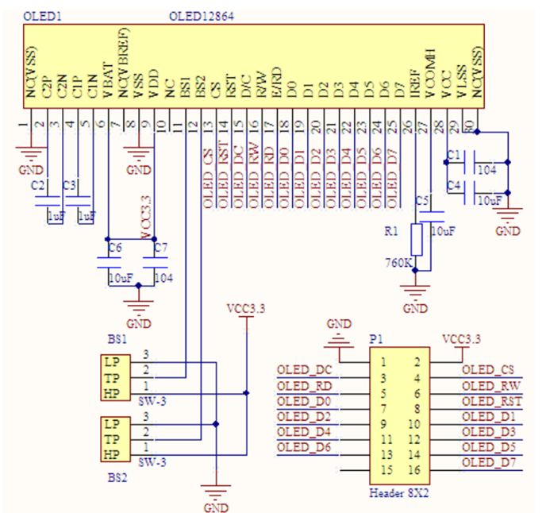   
OLED 8080并行接口信号线说明  
　CS：OLED片选信号。  
　WR：向OLED写入数据。  
　RD：从OLED读取数据。  
　D[7：0]：8位双向数据线。  
　RST(RES)：硬复位OLED。  
　DC：命令/数据标志（0，读写命令；1，读写数据）。  
OLED控制器为SSD1306  
OLED8080并口读写过程  
模块的8080并口读/写的过程为：  
先根据要写入/读取的数据的类型，设置DC为高（数据）/低（命令），然后拉低片选，选中SSD1306，接着我们根据是读数据，还是要写数据置RD/WR为低，然后：  
1.读数据：在RD的上升沿， 使数据锁存到数据线（D[7：0]）上；  
2.写数据：在WR的上升沿，使数据写入到SSD1306里面；  
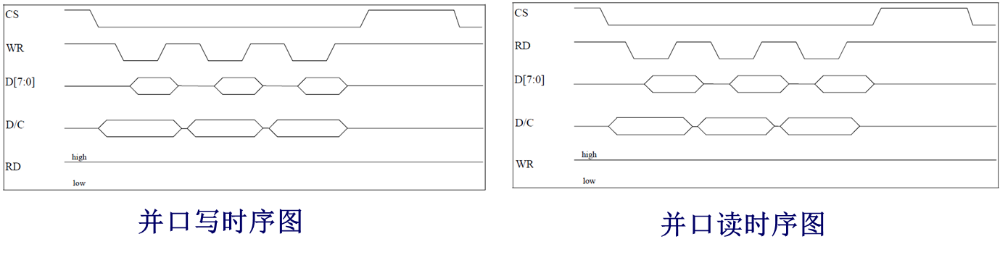   
OLED模块显存  
SSD1306的显存总共为128*64bit大小，SSD1306将这些显存分为了8页。每页包含了128个字节，总共8页，这样刚好是128*64的点阵大小。  
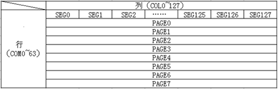   
程序显示原理  
在STM32的内部建立一个 缓存（共128*8个字节），在每次修改的时候，只是修改STM32上的缓存（实际上就是SRAM），在修改完了之后，一次性把STM32上的缓存数据写入到OLED的GRAM。当然这个方法也有坏处，就是对于那些SRAM很小的单片机（比如51系列）就比较麻烦了。  
SSD1306的命令  
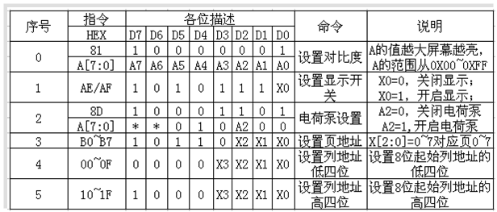  
命令0X81：设置对比度。包含两个字节，第一个0X81为命令，随后发送的一个字节为要设置的对比度的值。这个值设置得越大屏幕就越亮。  
命令0XAE/0XAF：0XAE为关闭显示命令；0XAF为开启显示命令。  
命令0X8D：包含2个字节，第一个为命令字，第二个为设置值，第二个字节的BIT2表示电荷泵的开关状态，该位为1，则开启电荷泵，为0则关闭。在模块初始化的时候，这个必须要开启，否则是看不到屏幕显示的。  
命令0XB0-B7：用于设置页地址，其低三位的值对应着GRAM的页地址。  
命令0X00-0X0F：用于设置显示时的起始列地址低四位。  
命令0X10-0X1F：用于设置显示时的起始列地址高四位。  
OLED初始化过程  
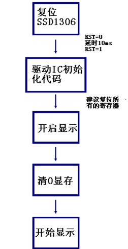  
OLED初始化  
//初始化SSD1306					    
void OLED_Init(void)  
{  
 …//设置IO口模式，所有用到的io口设置为推挽模式。  
GPIO_Init();  
 …//初始化代码，写相关寄存器  
OLED_WR_Byte(0xAE,OLED_CMD); //关闭显示  
OLED_WR_Byte(0xD5,OLED_CMD); //设置时钟分频因子,震荡频率  
OLED_WR_Byte(80,OLED_CMD);   //[3:0],分频因子;[7:4],震荡频率  
OLED_WR_Byte(0xA8,OLED_CMD); //设置驱动路数  
OLED_WR_Byte(0X3F,OLED_CMD); //默认0X3F(1/64)   
OLED_WR_Byte(0xD3,OLED_CMD); //设置显示偏移  
OLED_WR_Byte(0X00,OLED_CMD); //默认为0  
…  
…  
OLED_Clear();  
}  

OLED写一个字节  
//向SSD1306写入一个字节。  
//dat:要写入的数据/命令  
//cmd:数据/命令标志 0,表示命令;1,表示数据;  
void OLED_WR_Byte(u8 dat,u8 cmd)  
{  
 DATAOUT(dat);	    
 if(cmd)  
 OLED_RS_Set();  
 else   
 OLED_RS_Clr();		    
 OLED_CS_Clr();  
 OLED_WR_Clr();	  
 OLED_WR_Set();   
 OLED_CS_Set();	  
 OLED_RS_Set();	   
} 	 
OLED更新缓存，显示内容。  
u8 OLED_GRAM[128][8];  
void OLED_Refresh_Gram(void)  
{  
  u8 i,n;		    
  for(i=0;i<8;i++)  
  {  
    OLED_WR_Byte (0xb0+i,OLED_CMD);    //设置页地址（0~7）  
    OLED_WR_Byte (0x00,OLED_CMD);      //设置显示位置—列低地址  
    OLED_WR_Byte (0x10,OLED_CMD);      //设置显示位置—列高地址   
    
   for(n=0;n<128;n++)  
     OLED_WR_Byte(OLED_GRAM[n][i],OLED_DATA);   
  }    
}  
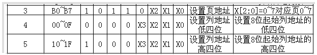  
OLED画点函数  
void OLED_DrawPoint(u8 x,u8 y,u8 t)  
{  
   u8 pos,bx,temp=0;  
   if(x>127||y>63)return;//超出范围了.  
   pos=7-y/8;  
   bx=y%8;  
   temp=1<<(7-bx);  
   if(t)OLED_GRAM[x][pos]|=temp;  
   else OLED_GRAM[x][pos]&=~temp;	~       
}  
OLED字符显示函数  
//在指定位置显示一个字符,包括部分字符  
//x:0-127  y:0-63  
//mode:0,反白显示;1,            size:选择字体 12/16/24  
void OLED_ShowChar(u8 x,u8 y,u8 chr,u8 size,u8 mode)  
{      			    
   u8 temp,t,t1; u8 y0=y;  
   u8 csize=(size/8+((size%8)?1:0))*(size/2);	//得到字体一个字符对应点阵集所占的字节数  
   chr=chr-' ';//得到偏移后的值		  
    for(t=0;t<csize;t++)  
    {    
     if(size==12)temp=asc2_1206[chr][t]; 	 	//调用1206字体  
    else if(size==16)temp=asc2_1608[chr][t];	//调用1608字体  
    else if(size==24)temp=asc2_2412[chr][t];	//调用2412字体  
    else return;	//没有的字库  
     for(t1=0;t1<8;t1++)  
    {  
	if(temp&0x80)OLED_DrawPoint(x,y,mode);  
	else OLED_DrawPoint(x,y,!mode);  
	temp<<=1;  
	y++;  
	if((y-y0)==size)  
	{  
	  y=y0;  
	  x++;  break;  
	}  
  }  	  
    }          
} 
字符码表  
const unsigned char oled_asc2_1206[95][12]={  
{0x00,0x00,0x00,0x00,0x00,0x00,0x00,0x00,0x00,0x00,0x00,0x00},/*" ",0*/  
{0x18,0x00,0x24,0xC0,0x1B,0x00,0x0D,0x80,0x32,0x40,0x01,0x80},/*"%",5*/  
{0x03,0x80,0x1C,0x40,0x27,0x40,0x1C,0x80,0x07,0x40,0x00,0x40},/*"&",6*/  
…  
{0x00,0x00,0x03,0x80,0x04,0x40,0x04,0x40,0x06,0x40,0x00,0x00},/*"c",67*/  
{0x00,0x00,0x03,0x80,0x04,0x40,0x24,0x40,0x3F,0xC0,0x00,0x40},/*"d",68*/  
…  
{0x00,0x00,0x40,0x20,0x7B,0xE0,0x04,0x00,0x00,0x00,0x00,0x00},/*"}",93*/  
{0x40,0x00,0x80,0x00,0x40,0x00,0x20,0x00,0x20,0x00,0x40,0x00},/*"~~",94*/  
};  

const unsigned char oled_asc2_1608[95][16]={	  
{0x00,0x00,0x00,0x00,0x00,0x00,0x00,0x00,0x00,0x00,0x00,0x00,0x00,0x00,0x00,0x00},/*" ",0*/ {0x0F,0x00,0x10,0x84,0x0F,0x38,0x00,0xC0,0x07,0x78,0x18,0x84,0x00,0x78,0x00,0x00},/*"%",5*/  
{0x00,0x78,0x0F,0x84,0x10,0xC4,0x11,0x24,0x0E,0x98,0x00,0xE4,0x00,0x84,0x00,0x08},/*"&",6*/  
…  
{0x00,0x00,0x1C,0x00,0x10,0x00,0x10,0xFC,0x13,0x00,0x1C,0x00,0x10,0x00,0x00,0x00},/*"7",23*/  
{0x00,0x00,0x0E,0x38,0x11,0x44,0x10,0x84,0x10,0x84,0x11,0x44,0x0E,0x38,0x00,0x00},/*"8",24*/  
{0x00,0x00,0x07,0x00,0x08,0x8C,0x10,0x44,0x10,0x44,0x08,0x88,0x07,0xF0,0x00,0x00},/*"9",25*/  
}  

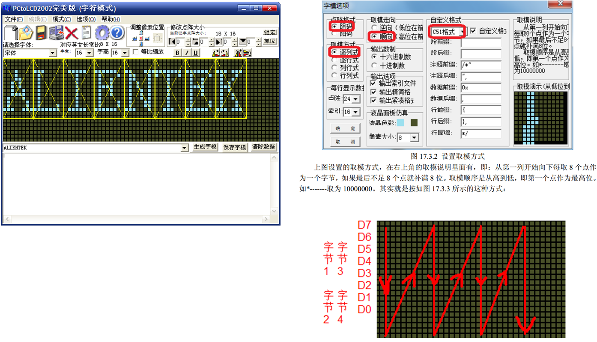   
 
### 第37讲 LCD-TFTLCD原理与配置介绍-M3 ###

TFTLCD驱动原理-TFTLCD简介  
TFTLCD即薄膜晶体管液晶显示器。它与无源TN-LCD、STN-LCD的简单矩阵不同，它在液晶显示屏的每一个象素上都设置有一个薄膜晶体管（TFT），可有效地克服非选通时的串扰，使显示液晶屏的静态特性与扫描线数无关，因此大大提高了图像质量。  
TFTLCD具有：亮度好、对比度高、层次感强、颜色鲜艳等特点。是目前最主流的LCD显示器。广泛应用于电视、手机、电脑、平板等各种电子产品。  
ALINETEK TFTLCD模块介绍  
ALIENTEK提供丰富的TFTLCD模块型号，供大家选择，目前有以下型号可选：  
1，ATK-2.8寸 TFTLCD模块  
   分辨率：240*320，驱动IC：ILI9341，电阻触摸屏，16位并口驱动  
2，ATK-3.5寸 TFTLCD模块  
   分辨率：320*480，驱动IC：NT35310，电阻触摸屏，16位并口驱动  
3，ATK-4.3寸 TFTLCD模块  
   分辨率：480*800，驱动IC：NT35510，电容触摸屏，16位并口驱动  
4，ATK-7寸 TFTLCD模块(V1版本)   
   分辨率：480*800，驱动IC：CPLD+SDRAM，电容触摸屏，16位并口驱动  
5，ATK-7寸 TFTLCD模块(V2版本)  
   分辨率：480*800，驱动IC：SSD1963，电容触摸屏，8/9/12/16位并口驱动  

ALINETEK 2.8寸 TFTLCD模块特点  
240*320分辨率  
16位真彩显示（65536色）  
自带电阻触摸屏  
自带背光电路  
注意：模块是3.3V供电的，不支持5V电压的MCU，如果是5V MCU，必须在信号线串接120R电阻使用。 
ALINETEK 2.8寸 TFTLCD模块原理图  
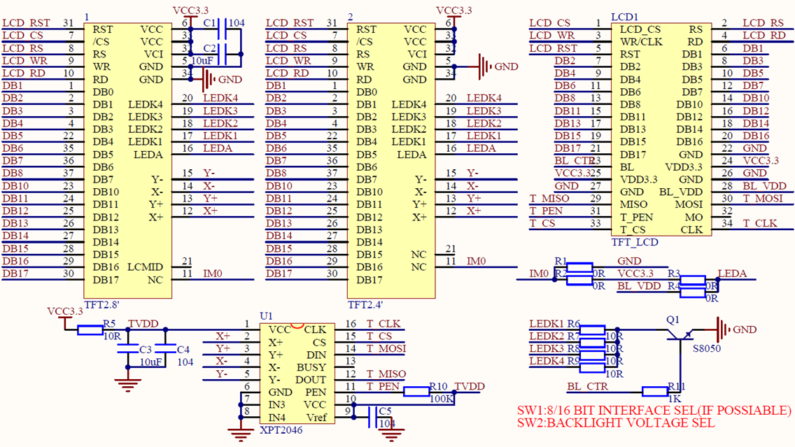   
ALINETEK 2.8寸 TFTLCD接口说明（16位80并口）   
注意：DB1-DB8，DB10-DB17，总是按顺序连接MCU的D0-D15  
LCD_CS：LCD片选信号  
LCD_WR：LCD写信号  
LCD_RD：LCD读信号   
DB[17：1]：16位双向数据线。  
LCD_RST：硬复位LCD信号  
LCD_RS：命令/数据标志(0:命令,1:数据)  
BL_CTR：背光控制信号  
T_MISO/T_MOSI/T_PEN/T_CS/T_CLK，触摸屏接口信号  
ILI9341 驱动时序  
重点时序：  
读ID低电平脉宽(trdl)  
读ID高电平脉宽(trdh)  
读FM低电平脉宽(trdlfm)  
读FM高电平脉宽(trdhfm)  
写控制低电平脉宽(twrl)  
写控制高电平脉宽(twrh)  
注意：ID指LCD的ID号;FM指帧缓存，即:GRAM  
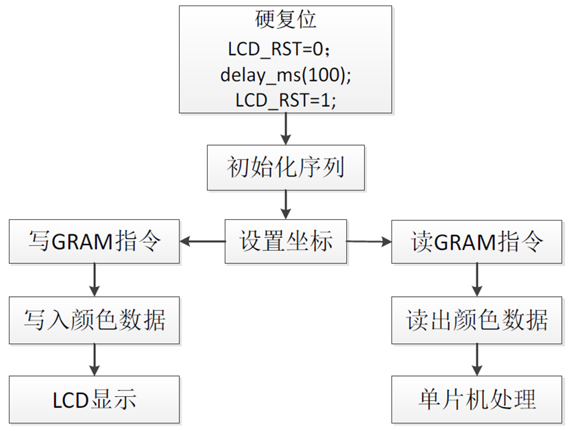   
RGB565格式说明  
模块对外接口采用16位并口，颜色深度为16位，格式为RGB565，关系如下图：  
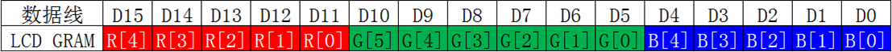   
ILI9341指令格式说明  
ILI9341所有的指令都是8位的（高8位无效），且参数除了读写GRAM的时候是16位，其他操作参数，都是8位的。  
ILI9341的指令很多，这里不一一介绍，仅介绍几个重要的指令，他们是：0XD3，0X36，0X2A，0X2B，0X2C，0X2E等6条指令。   
**0XD3指令**  
该指令为读ID4指令，用于读取LCD控制器的ID 。因此，同一个代码，可以根据ID的不同，执行不同的LCD驱动初始化，以兼容不同的LCD屏幕。  
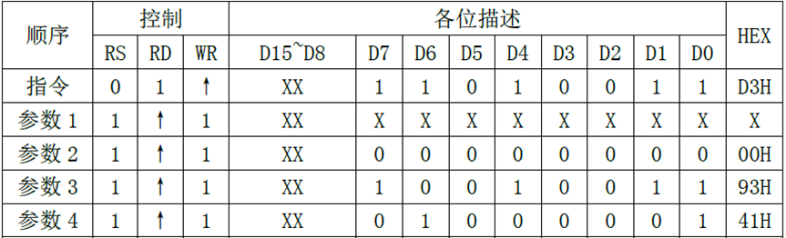   
**0X36指令**  
该指令为存储访问控制指令，可以控制ILI9341存储器的读写方向，简单的说，就是在连续写GRAM的时候，可以控制GRAM指针的增长方向，从而控制显示方式（读GRAM也是一样）。  
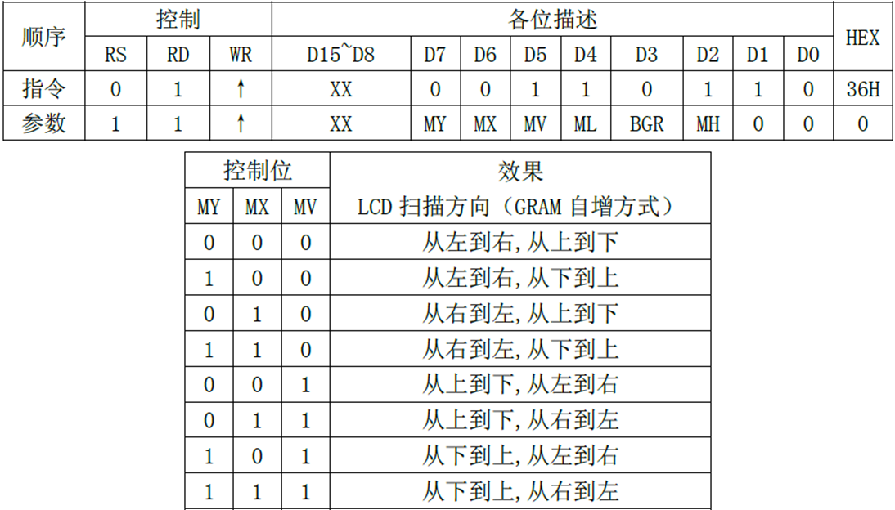   
**0X2A指令**  
该指令是列地址设置指令，在从左到右，从上到下的扫描方式（默认）下面，该指令用于设置横坐标（x坐标）  
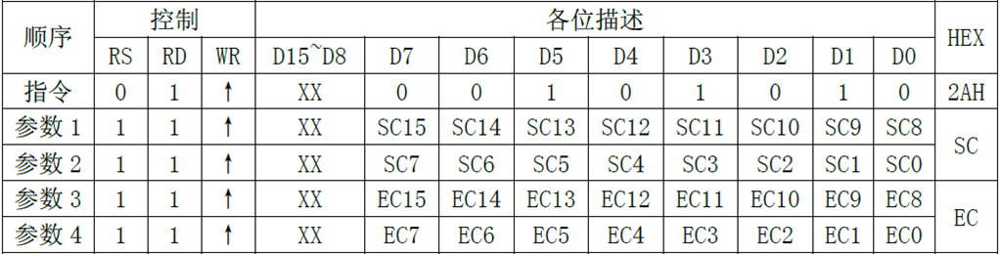  
在默认扫描方式时，该指令用于设置x坐标，该指令带有4个参数，实际上是2个坐标值：SC和EC，即列地址的起始值和结束值，SC必须小于等于EC，且0≤SC/EC≤239。一般在设置x坐标的时候，我们只需要带2个参数即可，也就是设置SC即可，因为如果EC没有变化，我们只需要设置一次即可（在初始化ILI9341的时候设置），从而提高速度。  
**0X2B指令**  
该指令是页地址设置指令，在从左到右，从上到下的扫描方式（默认）下面，该指令用于设置纵坐标（y坐标）   
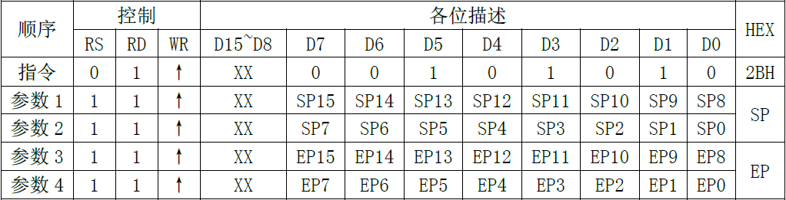 
在默认扫描方式时，该指令用于设置y坐标，该指令带有4个参数，实际上是2个坐标值：SP和EP，即页地址的起始值和结束值，SP必须小于等于EP，且0≤SP/EP≤319。一般在设置y坐标的时候，我们只需要带2个参数即可，也就是设置SP即可，因为如果EP没有变化，我们只需要设置一次即可（在初始化ILI9341的时候设置），从而提高速度。  
**0X2C指令**  
该指令是写GRAM指令，在发送该指令之后，我们便可以往LCD的GRAM里面写入颜色数据了，该指令支持连续写 (地址自动递增)  
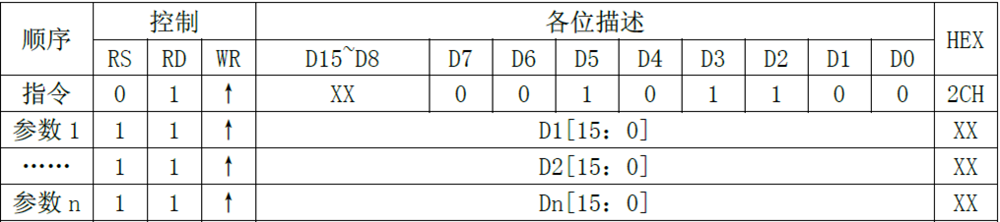  
在收到指令0X2C之后，数据有效位宽变为16位，我们可以连续写入LCD GRAM值，而GRAM的地址将根据MY/MX/MV设置的扫描方向进行自增。例如：假设设置的是从左到右，从上到下的扫描方式，那么设置好起始坐标（通过SC，SP设置）后，每写入一个颜色值，GRAM地址将会自动自增1（SC++），如果碰到EC，则回到SC，同时SP++，一直到坐标：EC，EP结束，其间无需再次设置的坐标，从而大大提高写入速度。  
**0X2E指令**  
该指令是读GRAM指令，用于读取ILI9341的显存（GRAM），同0X2C指令，该指令支持连续读 (地址自动递增)  
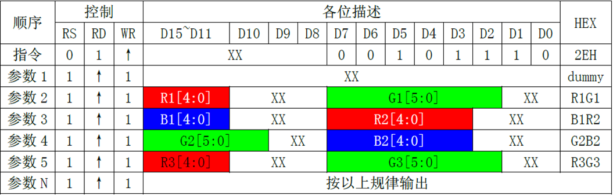   
ILI9341在收到该指令后，第一次输出的是dummy数据（无效），第二次开始，读取到的才是有效的GRAM数据（从坐标：SC，SP开始），输出规律为：每个颜色分量占8个位，一次输出2个颜色分量。比如：第一次输出是R1G1，随后的规律为：B1R2G2B2R3G3B3R4G4B4R5G5... 以此类推  

### 第38讲 LCD-FSMC原理简介-M3 ###

FSMC介绍  
FSMC，即灵活的静态存储控制器，能够与同步或异步存储器和16位PC存储器卡连接，STM32的FSMC接口支持包括SRAM、NAND FLASH、NOR FLASH和PSRAM等存储器。FSMC的框图如下图所示：  
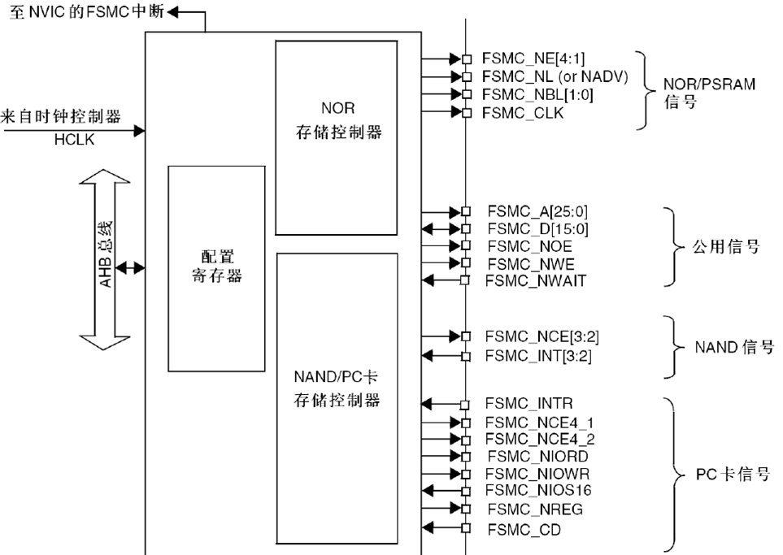   
FSMC驱动LCD原理  
FSMC驱动外部SRAM时，外部SRAM的控制一般有：地址线（如A0-A25）、数据线（如D0-D15）、写信号（WE，即WR）、读信号（OE，即RD）、片选信号（CS），如果SRAM支持字节控制，那么还有UB/LB信号。  
而TFTLCD的信号我们在前面介绍过，包括：RS、D0-D15、WR、RD、CS、RST和BL等，其中真正在操作LCD的时候需要用到的就只有：RS、D0-D15、WR、RD和CS。其操作时序和SRAM的控制完全类似，唯一不同就是TFTLCD有RS信号，但是没有地址信号。  
TFTLCD通过RS信号来决定传送的数据是数据还是命令，本质上可以理解为一个地址信号，比如我们把RS接在A0上面，那么当FSMC控制器写地址0的时候，会使得A0变为0，对TFTLCD来说，就是写命令。而FSMC写地址1的时候，A0将会变为1，对TFTLCD来说，就是写数据了。这样，就把数据和命令区分开了，他们其实就是对应SRAM操作的两个连续地址。当然RS也可以接在其他地址线上，战舰V3和精英板开发板都是把RS连接在A10上面，而探索者STM32F4把RS接在A6上面。  
因此，可以把TFTLCD当成一个SRAM来用，只不过这个SRAM有2个地址，这就是FSMC可以驱动LCD的原理。  
NOR PSRAM外设接口  
STM32的FSMC支持8/16/32位数据宽度，我们这里用到的LCD是16位宽度的，所以在设置的时候，选择16位宽就OK了。FSMC的外部设备地址映像，STM32的FSMC将外部存储器划分为固定大小为256M字节的四个存储块  
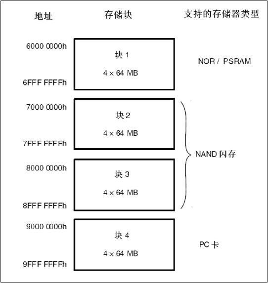  
存储块1 操作简介  
STM32的FSMC存储块1（Bank1）用于驱动NOR FLASH/SRAM/PSRAM，被分为4个区，每个区管理64M字节空间，每个区都有独立的寄存器对所连接的存储器进行配置。Bank1的256M字节空间由28根地址线（HADDR[27:0]）寻址。  
这里HADDR，是内部AHB地址总线，其中，HADDR[25:0]来自外部存储器地址FSMC_A[25:0]，而HADDR[26:27]对4个区进行寻址。如下表所示：  
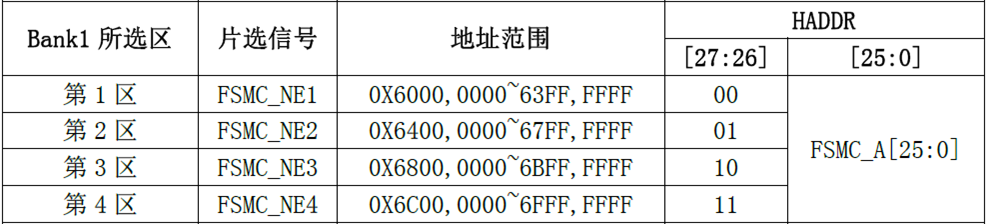   
当Bank1接的是16位宽度存储器的时候：HADDR[25:1] FSMC_A[24:0]  
当Bank1接的是8位宽度存储器的时候：HADDR[25:0] FSMC_A[25:0]  
不论外部接8位/16位宽设备，FSMC_A[0]永远接在外部设备地址A[0]  
STM32的FSMC存储块1 支持的异步突发访问模式包括：模式1、模式A-D等多种时序模型，驱动SRAM时一般使用模式1或者模式 A，这里我们使用模式A来驱动LCD（当SRAM用），其他模式说明详见：STM32中文参考手册-FSMC章节。  
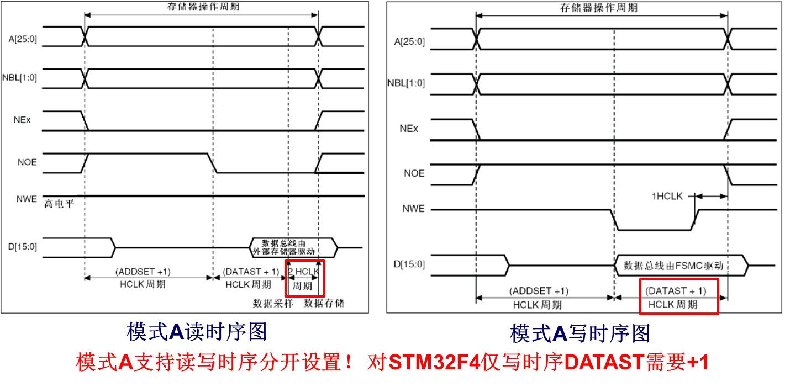  
寄存器介绍  
对于NOR FLASH/PSRAM控制器(存储块1)，通过FSMC_BCRx、FSMC_BTRx和FSMC_BWTRx寄存器设置（其中x=1-4，对应4个区）。通过这3个寄存器，可以设置FSMC访问外部存储器的时序参数，拓宽了可选用的外部存储器的速度范围。    
SRAM/NOR闪存片选控制寄存器（FSMC_BCRx）  
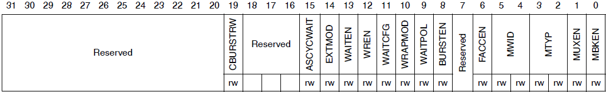   
EXTMOD：扩展模式使能位，控制是否允许读写不同的时序，需设置为1   
WREN：写使能位。我们需要向TFTLCD写数据，故该位必须设置为1  
MWID[1:0]：存储器数据总线宽度。00，表示8位数据模式；01表示16位数据模式；10和11保留。我们的TFTLCD是16位数据线，所以设置WMID[1:0]=01。  
MTYP[1:0]：存储器类型。00表示SRAM、ROM；01表示PSRAM；10表示NOR FLASH;11保留。我们把LCD当成SRAM用，所以需要设置MTYP[1:0]=00。  
MBKEN：存储块使能位。需设置为1  
SRAM/NOR闪存片选时序寄存器（FSMC_BTRx）  
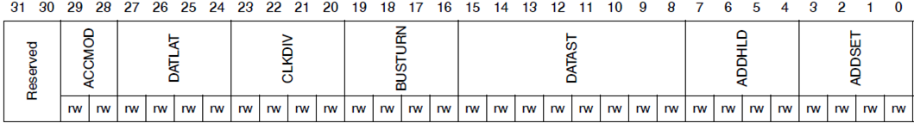   
ACCMOD[1:0]：访问模式。00:模式A；01:模式B；10:模式C；11:模式D。   
DATAST[7:0]：数据保持时间，等于: DATAST(+1)个HCLK时钟周期，DATAST最大为255。对ILI9341来说，其实就是RD低电平持续时间，最大为355ns。对STM32F1，一个HCLK=13.8ns (1/72M)，设置为15；对STM32F4，一个HCLK=6ns(1/168M) ，设置为60。   
ADDSET[3:0]：地址建立时间。表示：ADDSET (+1)个HCLK周期，ADDSET最大为15。对ILI9341来说，这里相当于RD高电平持续时间，为90ns。STM32F1的FSMC性能存在问题，即便设置为0，RD也有190ns的高电平，我们这里设置为1。而对STM32F4，则设置为15。   
如果未设置EXTMOD位，则读写共用这个时序寄存器！  
SRAM/NOR闪存写时序寄存器（FSMC_BWTRx）  
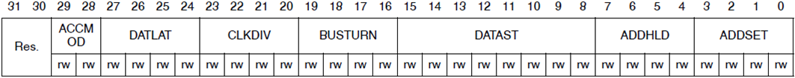   
ACCMOD[1:0]：访问模式。00:模式A；01:模式B；10:模式C；11:模式D。 
DATAST[7:0]：数据保持时间，等于: DATAST(+1)个HCLK时钟周期，DATAST最大为255。对ILI9341来说，其实就是WR低电平持续时间，为15ns，不过ILI9320等则需要50ns。考虑兼容性，对STM32F1，一个HCLK=13.8ns (1/72M)，设置为3；对STM32F4，一个HCLK=6ns(1/168M) ，设置为9。   
ADDSET[3:0]：地址建立时间。表示：ADDSET+1个HCLK周期，ADDSET最大为15。对ILI9341来说，这里相当于WR高电平持续时间，为15ns。同样考虑兼容ILI9320，对STM32F1，这里即便设置为1，WR也有100ns的高电平，我们这里设置为1。而对STM32F4，则设置为8。   
寄存器组合说明  
在ST官方库提供的的寄存器定义里面，并没有定义FSMC_BCRx、FSMC_BTRx、FSMC_BWTRx等这个单独的寄存器，而是将他们进行了一些组合。规律如下：  	
FSMC_BCRx和FSMC_BTRx，组合成BTCR[8]寄存器组，他们的对应关系如下：  
BTCR[0]对应FSMC_BCR1，BTCR[1]对应FSMC_BTR1   
BTCR[2]对应FSMC_BCR2，BTCR[3]对应FSMC_BTR2   
BTCR[4]对应FSMC_BCR3，BTCR[5]对应FSMC_BTR3   
BTCR[6]对应FSMC_BCR4，BTCR[7]对应FSMC_BTR4   
FSMC_BWTRx则组合成BWTR[7]，他们的对应关系如下：  
BWTR[0]对应FSMC_BWTR1，BWTR[2]对应FSMC_BWTR2，  
BWTR[4]对应FSMC_BWTR3，BWTR[6]对应FSMC_BWTR4，  
BWTR[1]、BWTR[3]和BWTR[5]保留，没有用到。  

### 第39讲 LCD液晶显示实验讲解-M3 ###

源码讲解  
1. 硬件连接  
2. LCD&lcddev结构体讲解  
3. 底层接口函数讲解  
4. 初始化函数讲解  
5. 坐标设置函数讲解  
6. 画点函数讲解  
7. 读点函数讲解  
8. 字符显示函数讲解  
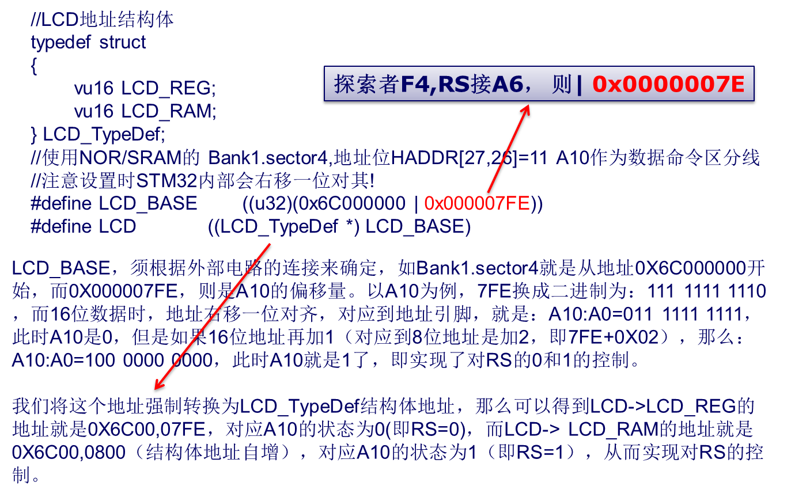    
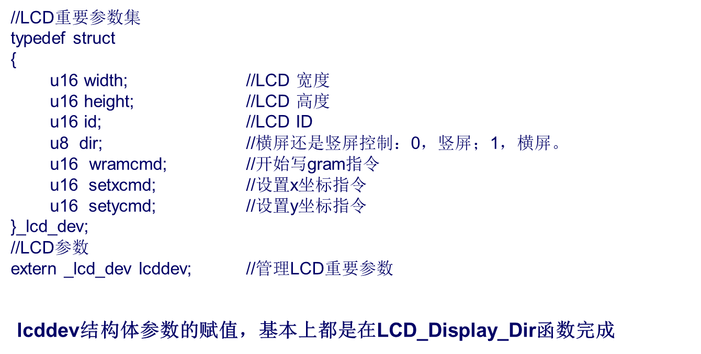  
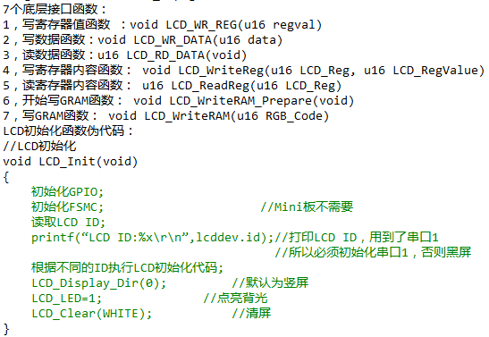   
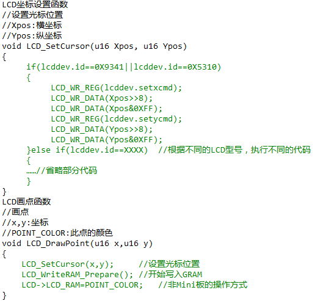   
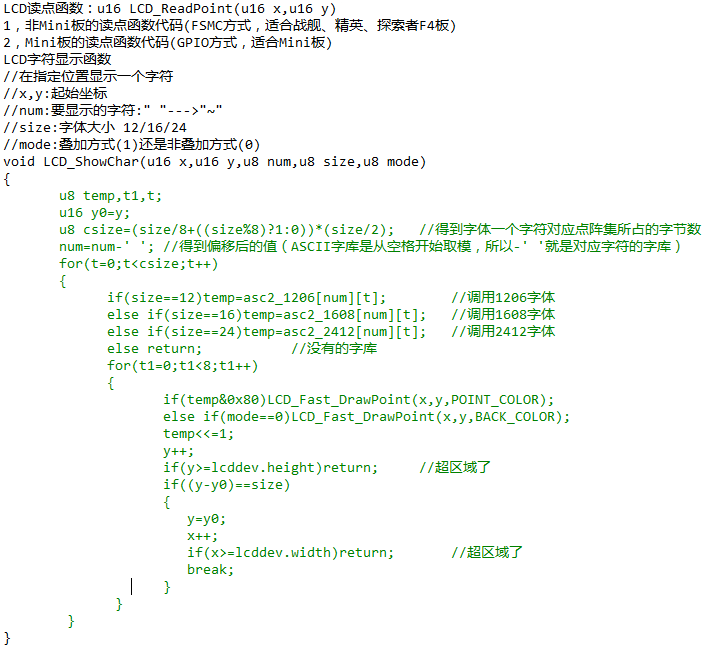   

----------
[STM32F1学习-中级篇](STM32F1_ML.md "STM32F1学习-中级篇")  
[STM32F1学习-高级篇](STM32F1_HL.md "STM32F1学习-高级篇")  
[STM32F1学习-LWIP篇](STM32F1_LWIP.md "STM32F1学习-LWIP篇")  
[STM32F1学习-UCOS篇](STM32F1_UCOS.md "STM32F1学习-UCOS篇")  
[STM32F1学习-STemWin](STM32F1_STemWin.md "STM32F1学习-STemWin")  
[STM32F1学习-HAL篇](STM32F1_HAL.md "STM32F1学习-HAL篇")  
