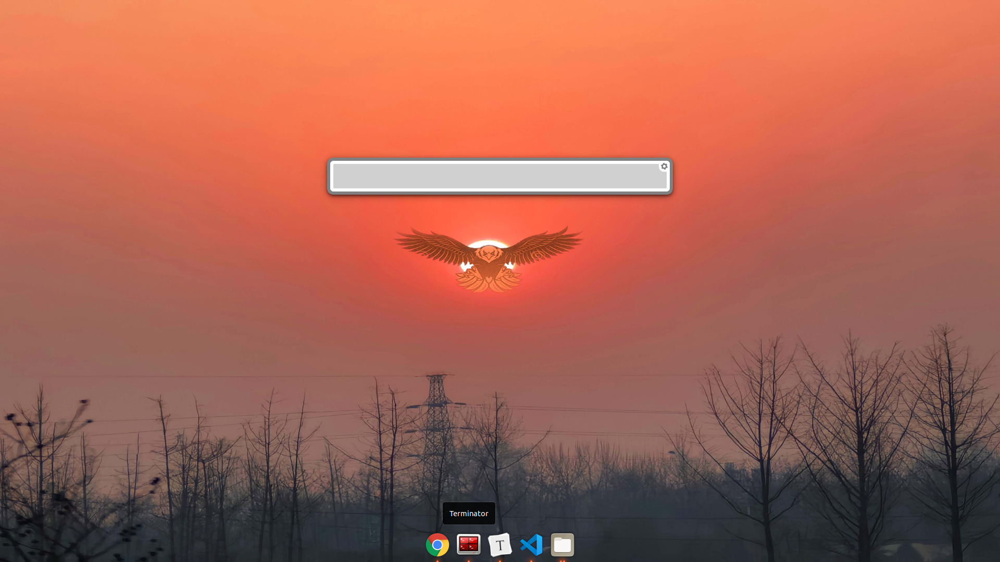

# Ubuntu 开发环境搭建体验

| 软件名                                        | 说明                                                         | 备注                                                         |
| --------------------------------------------- | ------------------------------------------------------------ | ------------------------------------------------------------ |
| GIMP                                          | 图片处理                                                     |                                                              |
| MPV                                           | 播放器                                                       |                                                              |
| plank                                         | 轻量DOCK，与 Mac OS X 的 Dock 非常相似                       | 开机启动                                                     |
| Gnome Tweaks                                  | 桌面管理                                                     | 去掉边框和状态栏，体验很赞                                   |
| Terminator                                    | 最好用的terminal，terminal终结者                             |                                                              |
| zsh                                           | 终极shell                                                    | bash_profile中配置ll等别名，并在.zshrc中加载                 |
| oh-my-zsh                                     | a delightful, open source, community-driven framework for managing your Zsh configuration. It comes bundled with thousands of helpful functions, helpers, plugins, themes, and a few things that make you shout. | https://github.com/ohmyzsh/ohmyzsh/tree/master/tools   Plugins:  git z zsh-autosuggestions extract web-search zsh-syntax-highlighting extract docker python pip vagrant dotnet sudo golang npm node cp docker-compose man pylint tig vscode yarn zsh-interactive-cd zsh-autosuggestions zsh-completions rust ubuntu |
| git                                           | 配置管理                                                     |                                                              |
| remmina                                       | ssh client                                                   | ubuntu自带，很难用，不如直接用Terminator                     |
| albert                                        | 搜索工具                                                     | 替代 Mac Spotlight。 开机启动。 hotkey不要配置windows(super)键组合。如果出现诡异问题，手动在~/.config/albert/albert.conf中修改，然后重启albert(直接kill进程后手动拉起)再试。 |
| htop                                          | 类似top小工具                                                |                                                              |
| iotop                                         | 磁盘性能查看小工具                                           |                                                              |
| iftop                                         | 网络性能查看小工具                                           |                                                              |
| axel                                          | 多线程下载工具                                               |                                                              |
| tig                                           | git历史查看工具                                              |                                                              |
| siege                                         | 性能测试工具                                                 |                                                              |
| aria2c                                        | 下载工具                                                     |                                                              |
| figlet                                        | 字体放大显示                                                 |                                                              |
| cowsay                                        | cow say words                                                |                                                              |
| mosh                                          | 远程登录                                                     |                                                              |
| duf                                           | du + df工具                                                  |                                                              |
| sl                                            | 小火车                                                       |                                                              |
| cmatrix                                       | 代码雨屏保                                                   |                                                              |
| vscode                                        | 微软良心开发编辑器                                           |                                                              |
| typoca                                        | markdown编辑器                                               |                                                              |
| virtualbox                                    | 虚拟机管理                                                   |                                                              |
| pcmanfm                                       | 文件管理器                                                   |                                                              |
| sshd                                          | sshd服务                                                     |                                                              |
| net tools                                     | 网络相关工具集，包括netstat, ifconfig等                      |                                                              |
| docker                                        | docker                                                       |                                                              |
| docker-compose                                | docker-compose                                               |                                                              |
| IDEA,Pycharm, Goland,Webstorm              | JetBrains IDE集                                              |                                                              |
| java,maven, npm,nodejs, python,go,rust | 编程语言运行环境                                             |                                                              |
| systemback                                    | 系统备份、恢复、镜像制作                                     | sblive超过4G后不能通过工具转ISO文件，需要手动操作。 sudo tar -xf ubuntu_20210214_mx250.sblive -C sblive sudo mv sblive/syslinux/syslinux.cfg sblive/syslinux/isolinux.cfg sudo mv sblive/syslinux sblive/isolinux sudo mkisofs -iso-level 3 -r -V sblive -cache-inodes -J -l -b isolinux/isolinux.bin -no-emul-boot -boot-load-size 4 -allow-limited-size -boot-info-table -c isolinux/boot.cat -o sblive.iso sblive |
| mx250 driver                                  | 网卡驱动                                                     | 非相关显卡不涉及。 安装前一定备份好系统，并用U盘拷贝一份，防止驱动装挂了，再也进不了系统了。  按网上教程使用清华镜像源报public key获取越时，恢复使用原source.list文件，使用原来的镜像源，在/etc/apt/sources.list.d中找到相应的文件，将文件中内容加到原来的source.list中，再执行sudo apt update，以及后面的操作。 |

附一张配置后的桌面：

