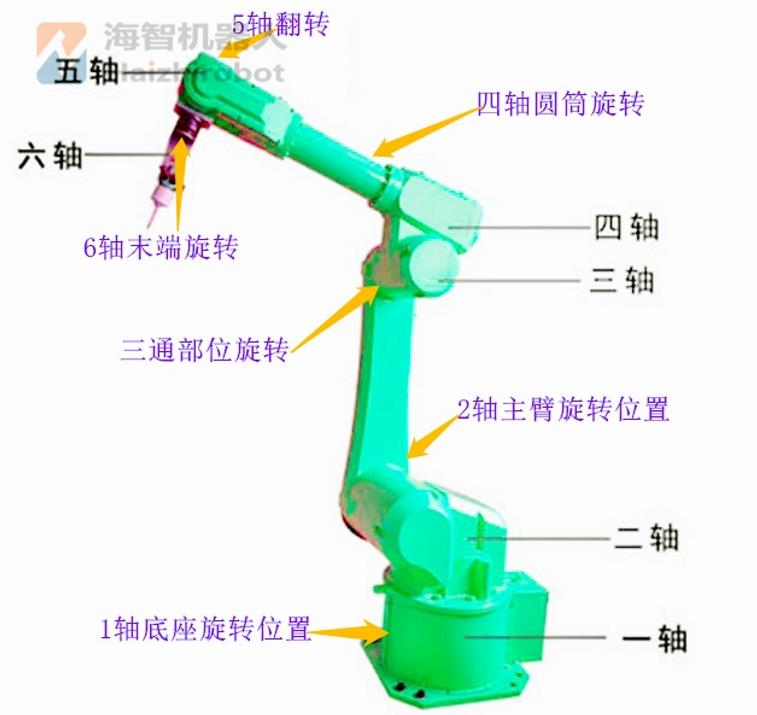
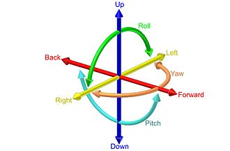

# robot-learning

智能机器人相关知识学习

#### 6自由度说明

[参照: https://www.dghzjqr.com/xinwenzixun/845.html](https://www.dghzjqr.com/xinwenzixun/845.html)

六自由度（Six degrees of freedom）是指剛體在三維空間中運動的自由度。特別是指剛體可以在前後、上下、左右三個互相垂直的坐標軸上平移，也可以在三個垂直軸上旋轉其方向，
三種旋轉方向稱為俯仰（pitch）、偏擺（yaw）及翻滾（Roll）。

平移：

1. 沿X軸前後移動

2. 沿Y軸左右移動

3. 沿Z軸上下移動

旋轉：

4. 繞X軸旋轉（翻滾、roll）。

5. 繞Y軸前後旋轉（俯仰、pitch）

6. 繞Z軸左右旋轉(偏擺、yaw）。

