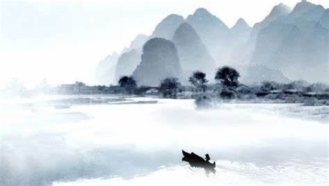

早年，在地摊买了《易经》和《道德经》，比较厚，读起来十分费劲，就搁置了。后来直接读这两个经文的原文及简单翻译，发现看那么厚的书，不如直接看原文。近期拜读我师傅对道德经的博客，有所领悟。 

很多人吹易经多么深奥、神秘、玄乎，其实都是装神弄鬼，好算个命，天机不可泄漏啥的。易经和道德经不过是根据观察到的自然规律思考为人和治国方面的哲学罢了。 

比起易经，我更喜欢《道德经》，主要还是容易理解、更具象一点。  《吃透道德经》是苏辙和王弼对道德经的注解汇总而得，确实比地摊那些越讲越玄乎，还不如看原文的书强百倍。关于道德经一些基本概念，可以阅读我师傅的专栏：<https://gitee.com/Kenneth-Lee-2012/daodejing_translation>   

先辈大师们已经对道德经解读的比较详尽了，我这里总结输出，一是巩固个人理解认知，梳理核心要点和逻辑，二是补充一些个人的认知理解。

## 基本逻辑

###### 道可道，非常道；名可名，非常名。无名天地之始，有名万物之母。故常无欲，以观其妙；常有欲，以观其徼。此两者同出而异名，同谓之玄，玄之又玄，众妙之门。

###### 译文：

能够讲出来的规律，都不是最根本、永恒的规律，能够定义的名称、形状、性质都不是根本的事物性质，而是片面的、现象的、一时的。无名、无概念、无状态是形成天地的原始状态，有名，有概念，有状态，是成物发生、发展、变化的根源。

所以常常从无概念、无称谓、无特征来观察世界和万物的奥妙；常常从有概念、有称谓、有特征来观察某一特定事物与其他事物的边界，即万物复杂差异和千变万化。

无和有来自宇宙而名称不同，但又都是深黑色的，如黑色一般抽象、神秘、悠远、深不可测。黑而又黑，深而又深，这是洞察其它一切具象具体的奥妙的门径。

###### 白话理解：

道：指的是规律。 名：指的是事物的名称，以及其形状、性质等表现。 

有和无，有两种理解。一种是事物本身的发展，比如生物，刚开始是“无”的，后来产生胚胎开始发展，就是“有”了。另一种理解是认知，某个事物刚开始人们并没有观察到它，是“无”的，后来随着科技进步，认知到了它，就是“有”了。比如世界的组成，当前已知的世界是：夸克－》中子／质子－》元素－》分子－》金／木／水／火／土。实际上，这两种理解本身又是一致的，正是因为事物的发展，人们才有机会观察到它。所以，“故常无欲，以观其妙；常有欲，以观其徼。”指的就是观察一个事物从初始状态、不认识到发展壮大、逐渐深入理解认知这样一个过程。

妙：王弼理解为妙者，微之极也。意思就是事物的具体的，最小的组成部分。

徼：事物的边界，及其与周边的关系。

这两个名词的解释就非常有意思了。学过数据库理论的人都知道，数据库E－R图设计是建模核心理论，E为entity，实体的意思，就是指真实存在的物体，比如一本书，一个人； R为relation，关系的意思，就是指各个物体间的关系，比如学生和课程之间有多对多的关系，体现是成绩。还有DDD设计，核心也是在找实体，然后划分领域，整理出领域间的依赖关系。所以，“故常无欲，以观其妙；常有欲，以观其徼。”实际上就是在做系统建模、系统分析。

做软件的人都知道，软件的复杂性在于关系，前日熊博总结：“硬件0到1难，1到N容易；软件0到1容易，1到N难。”便缘于此。当前软件基础的元素已经非常丰富，很容易使用开源软件组装搭建出一套软件系统，但是，这种容易会让人们忽视它们之间的关系，软件随意的关系依赖，造成的麻团会迟早变成死疙瘩，无法继续发展下去，进而再重新组装一遍。

不管是有还是无，那个事物都真实存在，只是人类还没有认知到它。所以，它是同出而异名的，所以说它是深奥的。宇宙一切人类未认识的事物都归属在了这些深奥的玄幻中。

###### 天下皆知美之为美，恶已；皆知善，斯不善矣。有无之相生也，难易之相成也，长短之相刑也，高下之相盈也，音声之相和也，先后之相随，恒也。是以圣人居无为之事，行不言之教，万物作而不辞也，为而不恃也，成功而弗居也。夫唯弗居，是以不去。

第一章讲到名的解释，第二章就讲了名对立统一。我们倡导和谐社会，有了和谐这个名词，那么就存在不和谐的事情，才需要大家要和谐；我们倡导讲信用，那也是因为坑蒙拐骗实在太多。所以，最好是大家路不拾遗，夜不闭户，再夸张点说，像原始社会，会提和谐、信用这些名词么？

所以，真正的理想状态是压根没有这些名词的存在。

###### 不上贤，使民不争；不贵难得之货，使民不为盗；不见可欲，使民不乱。是以圣人之治也，虚其心，实其腹，弱其志，强其骨，恒使民无知、无欲也。使夫知不敢为也，为无为，则无不治矣。

《素书》、《菜根谭》中也无不充斥着这些论调。没有了这些所谓的名词存在，没有了这些名利的东西，大家就不会木乱，不会为这些名利争的头破血流的。关于欲，其实也并不是啥欲没有，皈衣佛门，哪个帝王不是有着极强的欲望实现的宏图霸业？

在此核心思想下，我总结老子核心思想有以下三大客观规律：

## 三大客观规律 

#### 1 反者道之动，弱者道之用。 

世界就是一个循环往复的过程。所以，月盈则亏，金玉满堂，莫之能守，所以功成身退，天之道。 所以，公司在不断的寻找新的业务增长点。 太阳总有一天会完事，宇宙总有一天也会完事，有点恐怖。。。  

#### 2 美之为美，斯恶已。  

我觉得这就是辩证唯物论，所谓对立统一，不过如此。  道德经中大量此类论述： 大巧若拙，大智惹愚。 信言不美，美言不信。 不尚贤， 使民不争。 民不畏死，奈何以死惧之。   

#### 3 有之以为利，无之以为用。 

简单理解就是主管们常说的我搭台子你唱戏。给人发挥的空间。《素书》有讲，地薄者大物不产，水浅者大鱼不游，因为没空间啊。   

## 那么如何遵守客观规律呢？ 

### 四要： 

#### 1 夫唯病病，是以不病。 

自己要知道自己不知道，这样的话就知道自己的毛病所在，以自己的毛病当毛病来改进，进步，就会没有这些毛病，成为高手。  

#### 2 执古御今。 

怎么知道自己有没有毛病呢？那就多看，看古人，看周边，你比所有的人都了解了，你就是专家。 有了古人和他人的经验，自己琢磨琢磨，改进演进，这就是站在巨人的肩膀上。  

#### 3 少思寡欲，绝学无忧。 

意思是少点欲望，抛弃书中的繁文缛节，追求内心的真善美，就能没有太多忧虑。《素书》 也讲无欲则刚。 但是，《素书》注解中又讲大欲则大成。这一矛盾如何理解？ 大欲则大成的欲，是指自己的主要目标。有大的目标，矢志不渝，就会有大的成就。 无欲则刚，是指抛弃自己主要目标之外的其它无关紧要的目标和事情，就不会受到干扰。比如高三学生，这时绝对不可以搞个书法比赛之流。  

#### 4 为道日损，无为而治。 

为道日损，无为而治，意思是遵守客观规律下，应该越来越顺其自然，减少对其干涉。比如，为道的软件开发，应该没有过多的COE干涉流程，没有过多的门禁限制，而是应该水到渠成的把质量做好。 为什么能够这样，因为是法道的，是每个开发人员下意识的，感觉很爽很有成就感的事情。 版本屡次通宵过点，考核DTS值，奖励先进，并非无为而治。 但是经过通宵，抢占了市场，既取得了成功，后面大家可以歇口气，慢慢演进。没通宵的，失去了市场，死在了半道。那么先前的通宵，是不是又算无为了呢？ 无为和有为，就像实事求是一样，谁又能说的清呢？ 

### 三不：

####  1 夫唯不居，是以不去。 

意思是你这占有某个虚名，所以也就不怕失去。 举个例子，我们每个人都有职级，都有职称，如果你不在乎这些职称职级，降个级又能咋？ 当前钱的损失可能在乎。  

#### 2 夫唯不争，故无尤，天下莫能与之争。 

水善，利万物而不争。天之道，利而不害，人之道，为而不争。很多人把上善若水这几个从挂在墙上，可是又有几个人能做到呢？ 争与不争，还是看自己到底想要的是什么。  

#### 3 夫唯不盈，故能弊而新成。 

意思是不自满，就能够去故成新，不断进步。骄傲使人退步，谦虚使人进步。   

## 为人框架：道德仁义礼 

关于为人框架道德仁义礼，《素书》中有详细解释： 夫道、德、仁、义、礼，五者一体也。

道者，人之所蹈，使万物不知其所由。

德者，人之所得，使万物各得其所欲。

仁者，人之所亲，有慈惠恻隐之心，以遂其生成。

义者，人之所宜，赏善罚恶，以立功立事。

礼者，人之所履，夙兴夜寐，以成人伦之序。夫欲为人之本，不可无一焉。 

贤人君子，明于盛衰之道，通乎成败之数，审乎治乱之势，达乎去就之理。故潜居抱道，以待其时。若时至而行，则能极人臣之位；得机而动，则能成绝代之功。如其不遇，没身而已。是以其道足高，而名重于后代。  

《道德经》更多是对为人的警示，不要舍本求末： 上德不德，是以有德；下德不失德，是以无德。上德无为而无以为；下德无为而有以为。上仁为之而无以为；上义为之而有以为。上礼为之而莫之应，则攘臂而扔之。故失道而后德，失德面后仁，失仁而后义，失义而后礼。夫礼者，忠信之薄，而乱之首。前识者，道之华，而愚之始。是以大丈夫处其厚，不居其薄；处其实，不居其华。故去彼取此。  因为道是不可道的，所以很多人不懂，也不去求道，就光看能看懂，能度量，有形状的义、礼。这个时候就去使劲要求别人必须遵守礼数，而这时，已经非常不符合客观规律了，所以即使撸起袖子，使劲呐喊，也没人响应。就会动作越来越变形。这种人自以为自己掌握了规律，是正确的，玩命的干，实际结果却可能是做的越多错的越多。 

####  最高境界 -- 致虚极，守静笃，宠辱不惊 

####  五色令人目盲；五音令人耳聋；五味令人口爽；驰骋畋猎，令人心发狂；难得之货，令人行妨；是以圣人为腹不为目。 

####  想清楚自己追求的是什么，少私寡欲。

 

###### 致虚极，守静笃；万物并作，吾以观复。夫物芸芸，各复归其根。归根曰静，静曰复。复命曰常，知常曰明。不知常，妄作凶。知常容，容乃公，公乃全，全乃天，天乃道，道乃久，没身不殆。 这境界，只可意会，不可言传。 