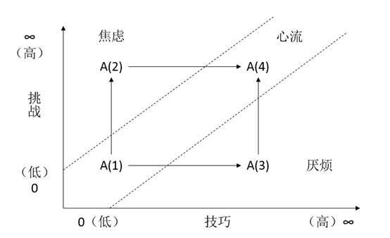

 我曾经在做PL(project leader)时，团队要落一个工具，而工具的框架没人弄，我就花几天时间搭了工具框架，开发公共代码和打通流程。

​     后来一个小伙伴问我，做PL那么忙，怎么做到那么短时间写成这个工具的框架代码的，效率这么高。我才下意识地回顾了下当时的工作状态，那时的状态可以用***\*血脉偾张，废寝忘食，心无旁骛，专心致志\****来描述。搭那个工具框架时，真的是连续几天***\*中午不睡觉，晚上睡不着觉，第二天早上还起的比鸡早\****的那种兴奋状态和成就感。这种状态就叫心流。

​     《心流：最优体验心理学》，原名《Flow: The Psychology of Optimal Experience》，米哈尔.契克森米哈赖发表于1990年。书中有三个关键词：幸福、最优体验（心流）和精神熵。这是一本教大家如何寻找幸福和最优体验（心流）的心理学巨著。

关于幸福，虽然我们比古人活的更久，更发达，轻易获取到奢侈品，但依然很浮躁、焦虑、倦怠。为什么？ 米合尔说，幸福并不是存心找就能找到的。那么如何找到自己的幸福，各位可以一读该巨著。

关于心流，书中描述心流的成因和特征：

第一，  具有挑战性的目标。

第二，  全神贯注，知行合一。因全神贯注，日常恼人的不带被忘却和屏蔽。不剩一丝能量处理任何与挑战无关的资讯。

第三，  即时回馈。参见下文查德威克游海峡的故事。

第四，  达到了忘我的状态。传说中的人剑合一，人球合一。

第五，  掌控自如。比如输一般棋，没什么好担心的。

第六，  时间感异常。时间过的快，或者生物钟准。

第七，  目标不假外求。目标达成，就是最大的激励，目标没达成，就是就大的惩罚。

第八，  从被迫的体验中顿悟。被父母逼着学乐器，很反感，突然有一天顿悟明白，就喜欢上了。

第九，  没有绝对的好。如同“爱”。心流是能量的一种形式，而凡是能量，都既可以造福人，也可以用于破坏。

如，户外运动、医生，还有我上面举的例子。米哈尔发现，真正的心流是在工作中，不是吃喝嫖赌抽。

 

所以，真正牛逼的管理，不是胡萝卜加大棒，而是心流。貌似驱动力3.0就是这个事情。

所以，最高效的组织是凭着心流和愿景自发成立的组织。参照《11罗汉》电影。

所以，真正让自己在软件道路上勇往直前的，是心流。是发自内心的追求和成就感。

值得强调的是，《心流》中每次提到最优体验，都以作曲、攀岩、舞蹈、航海、下棋等活动为例。这些活动传导心流的效果特别好，因为它们的设计本来就是以实现心流为目标。它们的规则原本就要求学习新技巧，有一定的目标，提供回馈，使控制成为可能；它们尽量跟日常生活中所谓的“不可逾越的现实”划清界限，使参与者更容易集中注意力。例如，在体育活动中，运动员都穿上色彩鲜明的服饰，分别隶属于不同的队伍，跟普通人暂时有所区别。在比赛过程中，选手与观众都放弃常规的世界，全心关注竞赛创造的另一种现实。包括戏剧、艺术、游行、宗教仪式、体育在内的心流活动，主要功能在于提供乐趣。它们的构造特殊，有助于参加者与观众进入极为愉悦的心理状态。

米哈尔在研究中发现，所有心流活动，都有一个共同点：***\*它带来一种新发现、一种创造感，把当事人带入新的现实。它促使一个人有更好的表现，使意识到达过去连做梦也想不到的境界。简单地说，它把自我变得更复杂，自我因而成长，这就是心流活动的关键。\****

 

 

​                                                图1 心流体验图

 

​     心流活动可以用图2来表达。举个例子来理解这个心流体验图。我刚接触编程语言时，觉得特有意思，写个代码，运行一下，就出来了页面，我还想怎么改就怎么改，尤其上学时跟导师做了几个项目，都是自己操刀，特别爽。就是图2中的A(1)，只是把代码写出来，功能实现，自己很嗨。后来毕业后，做商业软件，那完全不一样了。各种质量要求、新技术，才发现原来自己做的东西欠缺太多。这个时候就处于A(2)。有新的挑战，自己很焦虑。于是埋头苦学，以适应工作内容和挑战。几个月后，跟同事一起在山西电信成功交付项目。很有成就感，达到了A(4)状态，又回到了心流体验。

​     交付完成后，我一个人带着代码交付另外的项目。但是两个项目的客户需求和使用流程存在较大的差异，导致我多次变更主业务流程。很厌烦，处于A(3)状态。后来几经努力和沟通，最终一年后成功上线，又到了A(4)状态。

 

​     我的总结，***\*心流就是通过不断的学习新技巧、做挑战的事，不断成长而获取成就感的一个过程。\****

 

​     当然，如果说不愿意挑战和学习，那么，A就将从图2中消失了。

 

​     举个反面的例子：2015年初，部门分配了个新员工到我们组。当时正值版本过点冲刺。这位新员工没有JAVA经验，需要一段时间熟悉开发环境、语言。 而当时三方件认证需要尽快拿到报告。但是部门在开源扫描时，有几十个JAR包匹配不上，需要确认。

​     事情不复杂，思路啥的都讲了，不过小伙进展比较缓慢，而且稍微有些情绪。我就跟他沟通了一下。 其实我自己对这个事情是不排斥的，通过这个事情，可以知道产品都用了哪些三方软件，这些三方软件都是干啥的，实际上对自己提升还是蛮有意义的。

​      “三方件认证这个事情看着是脏活累活，但是通过这个事情，可以知道产品都用了哪些三方软件，这些三方软件都是干啥的，实际上对自己提升是非常有意义的，是一种很有效的了解产品技术栈的途径。”

​      大家都说一般人只会记住“但是”后面的内容，可这小伙偏偏记住的是但是前面的内容，认为我给他派的是边角的脏活。

​      这是看似是没技巧、没挑战的事情，但实际上我说的是真的，这个事情侧面可以了解产品的技术栈，还能写些工具统一三方包管理等，也是有挑战和技巧的事情，只是他识别不了，也不愿意识别。

​      大家总有不顺不爽的时候，那么就静下心来看下，是因为事情太挑战了搞不定，还是事情太厌烦了没技术含量。根据图2，识别自己应该做的事情，降低挑战，或者学习新技术，识别技术含量等方法，重新回到心流。

​      最后再强调下心流的那种极致体验：“***\*血脉偾张，废寝忘食，心无旁骛，专心致志。\****”