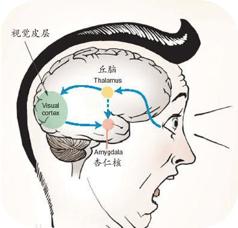

情商（EQ）又称情绪智力，是近几年来心理学家们提出的与智力和智商相对应的概念。它主要是指人在情绪、情感、意志、耐受挫折等方面的品质。
总的来讲，人与人之间的情商并无明显的先天差别，更多与后天的培养息息相关。

  -- 百度百科

有时我觉得自己情商蛮高的，在面对挫折和挑战时，表现的耐力和毅力还不错。但有时又觉得自己好像易怒，易冲动。去年因为任职答辩结果与其他评委意见不一致，拍案而起，被主管教育了一次。 后来又一次答辩，又意见不一致，不拍案了，挂电话不讨论了，还是被批了一次。

也一直思考，问题出现在了哪里？

在龙哥推荐下阅读了《情商》，略有所感。情商有五层境界，更多是后天可培养，下来看如何达到这五层境界。

#### 第一层： 认识自己情绪

首先认知下人的身体结构：

控制情绪的是杏仁核！ 为什么常有专家建议遇事冲动时，数三下再做决策呢？

答案如上图。

人的感官接收到视、听、嗅、味觉后，先传到丘脑，丘脑传到新皮层（大脑计算中心）进行计算，得到最终结果后传到杏仁核，这条路是可信的，客观的，成熟靠谱的反应。但是在丘脑和杏仁核之间，有条小道，会有少量信息通过小道传到杏仁核，这条路是没有经过详细分析的，缺少信息的，主观的，不成熟的，不靠谱的反应。所以，受到某个信息后，第一反应来自于这条小道的信息反应不靠谱，需要等一会，大脑成熟计算后的结果过来后再决策。

这就是为什么专家建议数三下再决策的原因，是有人的身体结构研究理论支撑的。所以，遇到某种刺激容易冲动，是人体正常的生理反应。不用过度担忧。

#### 第二层： 控制自己情绪

通过前面的经验，我觉得最靠谱的做法，就是暂时什么都别做！ 什么都别做！！ 都别做！！！

接下来冷静了，仔细琢磨下自己的目标是啥？ 是要说服他人达成某个目标，还是就鄙视下其他人？

再接下来准备炮弹，一击命中，达成目标。

#### 第三层： 认识他人情绪

如何认识他人情绪，这个好像跟人的经历、品格有关系。举个例子，大家一直比较DISS的鲁豫，竟然追问留守儿童为什么不吃肉。。。

再举个例子，“妈妈再爱我一次”那个电影，哭晕了多少人。 现在有了小孩，就更见不得母子分离类的镜头，甚至动物的。经历过，同理心更强。

之前见一寻子的人自述，曾经被人打劫，后来其中一个劫匪发现了他车子上的标语，是寻子的，就把财物退还了。这时另外一个劫匪不太愿意，他教育道：“这种人也劫，还算人么？”

#### 第四层： 影响他人情绪

情绪能够传染：

一位温柔的母亲能够安慰哭泣的孩子，一个慷慨激昂的领导者能够让低迷的团队振作起来，一个善解人意的老师能给悲伤的学生带来安慰和温暖。

我喜欢足球，有时球场上偏弱的一队被某事激励或某人带动一下后，斗志昂扬，最后赢得了比赛。上学时，有次联赛，我们队跟对手实力相当，结果左前卫一个抬脚过高，被红牌，而偏偏又被领先了一个球。这种被动情况下，队长不停的喊加油，抢第一点，进一个之类的话提士气。果然，我们斗志完全被激发，很快扳平，最后一球绝杀。

之前一个朋友单位，他说他们团队有个人，每次做个东西，只会说这咋可能实现么？这咋弄么？ 弄的朋友也挺丧气的。

后来才反应过来，这种人，应该果断从团队去掉。

做个积极向上、阳光有激情的人， 保持好情绪，不要被坏情绪传染。 

比如最近心声上有好多负面情绪，还是多想想自己的职业目标是什么，向自己的目标进发。

#### 第五层： 达到心流境界

情商的最高境界是心流。

什么是心流，如何达到心流体验，《心流 -- 最优体验心理学》 一书有详细介绍。

举个例子：上学时包夜打游戏，网吧窗户窗帘紧闭，服务员过来问订餐，才发现已到第二天中午。 这种全身心投入，时间感异常的状态就是心流体验。

再举个例子，网上调侃要用打麻将的状态工作。怎么样的状态呢？永远不迟到，决战到天亮。。。 。。。

如何达到心流状态？

参照上图。

#### 其实心流，就人在不断做有技术和挑战的事情中，不断成长，获取成就感的过程。

（1）心流是一种心理体验，是动态变化，持续增长的。

（2）心流体验要综合技巧和挑战，如果事情太有挑战，没技巧，容易焦虑，比如一周时间完成成千上万个编码规范、静态检查整改； 没有挑战，太有技巧，容易厌烦，比如美食品鉴。 没技巧没挑战的，那就歇了吧。

（3）心流体验需要持续专注，这也是推荐静默编码的原因。如果天天搞拉通之流，不断中断和周边交互，很难进入心流体验。