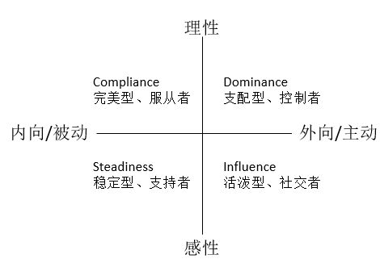

《职场救赎－送给迷茫中的草根族》我看完非常有感觉，然而推荐给几个其他朋友看，却似乎不以为然，没有什么反应。也许可能是经历问题。确实因为自己之前经历迷茫与困惑，所以才会顿觉犹如指路明灯。
 各位如遇不解职业问题，可求解于此书。

​            

##          目标

​         很多人在抱怨职业问题或者咨询选择时，很多答复都是反问你想要什么。确实，我想要得到什么？金钱？权力？地位？成就？困惑、迷惘、找不到方向其实就是失去了目标。去年，主管给我们留了作业：谁是我？ 我是谁？ 我是我！目的也是让我们找准目标定好计划前进。

​        “很多人之所以失败，是因为他们第一步就错了。或者，他们根本就不知道如何迈出第一步！”

​       “目标的丧失，是你走向失败的根源”

​                            – 杨毅 

#### 如何判断自己是否需要进行职业规划：

| 序号     | 描述                                                         | 是   | 否   |
| -------- | ------------------------------------------------------------ | ---- | ---- |
| 1        | 对现有的工作/学习感到乏味，不开心，没有积极性，提不起精神    |      |      |
| 2        | 工作/学习缺乏动力，有一定程度的倦怠倾向                      |      |      |
| 3        | 感到上班/学习是一种痛苦，为了重在，不得不硬着头皮去应付      |      |      |
| 4        | 现在的职业道路行不通，看不到前途，不想继续下去               |      |      |
| 5        | 不知道适合自己的未来在哪里，感到困惑，没有“奔头”             |      |      |
| 6        | 不知道自己，适合干什么， 不知道自己的长处和优势在哪里        |      |      |
| 7        | 感觉不太适合这份工作， 不知道是该换公司，换行业，还是换岗位  |      |      |
| 8        | 经常跳槽，但始终找不到令自己满意的工作                       |      |      |
| 9        | 想跳槽/换专业，却不知道适合自己的发展方向在哪里              |      |      |
| 10       | 感觉某项工作为错，有跳槽机会，但又犹豫不决，不知道是否真的适合自己 |      |      |
| 11       | 想通过改变自己性格的方式适应现在的工作/专业，结果非常痛苦    |      |      |
| 12       | 重复劳动，没有提升和成长，整天忙忙碌碌，却不知道在忙些什么   |      |      |
| 13       | 在目前工作多年，但事业发展一直徘徊不前，不知道问题出在哪里   |      |      |
| 14       | 能够胜任目前的工作，想继续发展下去，但遇到瓶颈，不知道怎么突破 |      |      |
| 15       | 与上司、同事 /同学关系处理不好，经常为此感到烦恼             |      |      |
| 统计结果 |                                                              |      |      |

表1 职业发展评估表

 

​     可根据表1对自己的职业规划发展作一个评估。“是”3个以下，职业顺利；3-6个，有轻度问题；6-9个，中等严重问题；9个以上，到了危险的边缘，需要赶紧行动，找准定位。 16年时，我按照此表做了下评估，得了114分。路子也就这了。

####          那么如何确定职业目标进行职业规划呢？借用杨老师的五个步骤：

######          Step1:职业远景探测：我最想干什么？

​         可以用以下问题引导自己：假如重新给你一次选择的机会你最想干什么？你最想读的专业是什么？你心中的偶像是谁？你渴望成为什么样的人？你认为什么样的事情最有价值？哪些事情一想起来，就令你感觉“浑身是劲儿”？假如一切条件都具备你最想干的事情是什么？

​         Step2：性格分析：我的性格适合干什么？

######          可用DISC性格测试分析。

######         Step3：优劣势分析

​                1 性格特质方面，有什么优势和劣势？

​                2 专业技能方面，有什么优势和劣势？

​                3 工作经历方面，有什么优势和劣势？

​                4 社会关系方面，有什么优势和劣势？

​                5 是否具备一些特殊技能

######         Step4：确定职业目标

​                杨毅老师的书中有方法论，准则1，做你喜欢的事；准则2，做你适合的事；准则3，做你擅长的事。

​     不同的性格，适合做不同的事。可根据DISC理论分析自己的性格类型，确定自己适合做的事情。

​     

​                                                图1 DISC理论

​     Dominance – 支配型、控制者。天生的领导，占3%。典型代表：孙悟空，项羽，张飞。

​     Infuence – 活泼型，社交者。团队活动组织者。占12%。典型人物：猪八戒，王熙凤。

​     Steadiness – 稳定型，支持者。平和，知足常乐，不愿意主动前进。占69%典型人物：沙和尚，宋江，刘备。

​     Compliance – 完美型、服从者。追求完美的专业型人才。占16%。如唐僧，诸葛亮。

​    

谬论：木桶理论；干一行，爱一行；只要功夫深，铁杵磨成针；先就业，后择业。

######         Step5：制定行动计划

​                

​        其实我儿时的兴趣是硬件，一直对信号、电路这些最感兴趣，现在看看还是算了，只能从事软件这个第二兴趣行业了。

 

##          执行

​         所谓学而不做等于没学，知而不做等于无知。目标计划定的再高大上，如果不执行，一样白废。

​         如何提升执行力呢？推荐下杨毅的理论步骤：

​         1把后果想清楚

​         2制定行动计划和评估表

​         3高效时间管理

​         4拒绝外界干扰

​         5适当奖励自己

#####          即时回馈和榜样很重要

​       第一个故事。1952年7月4日清晨，加利福尼亚海岸下起了浓雾。费罗伦丝.查德威克准备从加州海岸以西 21 英里的卡塔林纳岛上游向加州海岸。15小时之后，她又累，又冻得发麻。她知道自己不能再游了，就叫人拉她上船。她的母亲和教练在另一条船上。他们都告诉她海岸很近了，叫她不要放弃。但她朝加州海岸望去，除了浓雾什么也看不到。人们拉她上船的地点，离加州海岸只有半英里！后来她说，令她半途而废的不是疲劳，也不是寒冷，***\*而是因为她在浓雾中看不到目标。\****（查德威克小姐一生中就只有这一次没有坚持到底，两个月后她成功了。）

​       第二个故事。我平时比较喜欢户外，偶尔骑行下分水岭。对于西安的骑友来说，分水岭是个圣地，没上过分水岭就不算入门。我总结分水岭之所以备受推崇，是因为越到后面坡越陡，尤其鸡窝子到分水岭界碑，只剩下几公里，但却一般需要一个小时以上（约30公里山路，整体上差不多是前面2/3的路程用1/3的时间，后面的1/3路程用2/3的时间）。体能消耗殆尽，坡却越来越陡，挑战起来真的够劲（我第一次上分水岭，骑到一半时，很想发个微信，标题是：分水岭不过如此。等我真的骑到顶时，心想，幸好没发，分水岭确实名不虚传）。尤其最后几公里，因为给养不足，体能耗尽，步履维艰。基本上是走几步，看下导航，还有多远。最终登顶，用时7个小时。

我骑分水岭和查德威克游海峡，本质的差异是她看不到离目标还有多远，我能随时打开导航看离目的地还有多远。看得到和看不到目标，效果真的不一样。目标和回馈真的太重要了。

 

​       在第二次骑分水岭时，我在四面佛（刚进山2公里左右）附近被一位骑21速小破车的大爷给超了。我就一直奋力尾随这位大爷。这位大爷（后来了解到大爷享受退休生活，平均3天骑一次分水岭）太猛了，速度不快，但是耐力超人，喝水都不带停车，直接边骑边喝。我跟的累了，想歇下，见大爷还继续骑着，就咬牙继续坚持。直到两个小时后，大爷终于停下来补充能量了。大爷下来，向我挥挥手：“小伙子，你年轻，继续吧，我歇会。”

​       “大爷你太牛了，不是跟着你，我早就歇了。”我下车时，腿抖了将近10分钟。

​       两个小时骑了2/3的路程。后面的路程，我就完全进入状态，4.5小时登顶，比大爷先到半小时。

​       所以，有个榜样太重要了。要不然，我也不能那么快。

#####        当天事情当天了

​       这是初一上学第一天班主任老师讲的第一句话，受益颇多。每天计划好的事情，全部闭环，那种成就感，无以言喻。时至今日，却发现每日事务梳理不清，繁事缠身，还是需要找回当年的那种感觉一下。

 

##          品牌及影响力

​         树立品牌：职场不败的唯一砝码。

​          -- 杨毅

​     为什么中国的制造业这么发达，而利润却相对较低？因为没有附加值。为什么同样的工作内容，你的薪水要比别人少一大截？因为你没有附加值。要想摆脱低附加值，应该怎么做？答案只有一个，那就是：打造自己的品牌。

 

​     杨毅老师对树立个人品牌简单总结为三个字：点，线，面。

​     点，即品牌代表的核心价值点。比如现在一般人提到华为，就是手机。那么，我们的简历呈现给别人时，希望让对方怎么认知我们？希望留下什么样的印象？技术很牛？

​     线，一条代表时间的竖线。随着时间的推移，知识和能力越积越厚，越积越深。要走好三大步：专业化，成为顶尖高手；行业化，精通行业特征、发民趋势等；企业化，如李嘉诚秘书洪小莲，从秘书成长为董事，心得是：“和公司共成长，共分享苦乐。”

​     面，指的是除了核心价值外，还必须补充的一些东西，包括人际关系、沟通能力、学习能力、管理能力、执行能力等“软实力”。

 

​     我在个人品牌和影响力方面还不足，也没太多经验，虽然平时也会写些博客，但是影响力还是不太够，这也是个人后续要继续改进的地方。

 

##          持续学习

​         书到用时方恨少，现在看来是一点没错啊。多想回到学校，好好再从头学一遍专业课。工作十余载，才体会到专业的一点点门道，才知道应该系统性的梳理一下知识。确实惭愧。好饭不怕晚，从现在开始，好好学习，天天向上。

#####          时间问题

​		这个问题是职业人绕不过的坎，尤其作为996一族，尤其尤其作为上有老，下有小的中年人，根本没有专门的学习时间。所以只能是忙里偷闲来学习。学习这个事情从来不是给时间，给资源就能搞定的，更多还是个人意愿。搞了无数的培训，实质效果真的一般。所以，关键是内因，这个谁也帮不了你。

​		外因方面，有些技巧，比如极客时间这种的，一个系列的内容分解成很多小章节，一个章节就5－10分钟左右，可以在工作的间歇时间碎片里查看学习。手机APP，电子书等资源很多，也很方便。我个人倒是喜欢看纸质的书，不太喜欢电子书。

#####          知识体系

​         知识体系就是结构化的思维组织专业领域知识，其实这方面张冬一直做的很棒，《大话存储》，《大话计算机》，10年磨一剑，打破砂锅问到底，从电到软件彻底弄清楚计算机体系。

​         我个人倒也想做类似的事情，一方面为自己梳理知识，另一方面想着将来教育小孩。等小孩长大问我电脑是怎么显示出来图像时，能够讲出他听的懂的话，使他快速明白。

