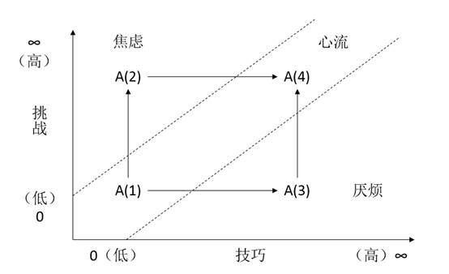

## 1 为人处世

​		《易经》、《道德经》、《菜根谭》、《围炉夜话》、《小窗幽记》为总结天地规律、处世学问，道、德、仁、义、礼框架，乃至治国治世之道。此类著述均提一个道理：“不见可欲，使民心不乱”，“绝奢禁欲，所以除累”，“欲路勿染，理路勿退”等等，说的有道理，人之所以累，就是欲望太多，而且不满足现状，不断的追求更大的房子，更好的车子，所以疲于奔命。

​		关于道德经相关理论可以参照：《<https://gitee.com/Kenneth-Lee-2012/daodejing_translation> 》

​		但是，这里好像有个悖论，根据老子的美之为美斯恶矣对立统一理论，他提出了“不见可欲”，那就存在其对立面：当世物欲横流。存在即合理，“欲”这个名不是凭空出现的，而是合道而生的，是世界发展的必然产物。人如果有没有欲望，整天安于现状，不求上进，那与行尸走肉何异？哪个帝王不是胸有大欲才成就的一代霸业？阳明先生不也是立志成为圣贤才得以龙场悟道？说白了，上面的著述没有回答人应该追求什么样的欲，应该做什么样的事情，为什么要做那个事情。记得前段时间，有人采访一个翼装飞行玩家，问他翼装飞行风险大，出事概率高，怕不怕。他回答说，他宁愿摔了，也不能不飞。大家觉得非常危险的事情，而他却觉得是人生意义所在。所以，绝奢禁欲不是禁所有的欲，而是追求合道的欲。那么，问题来了，我应该追求什么欲呢？为什么有的人天天996，却觉得很充实，甚至不用催他，都天天晚上睡的比狗晚，中午不睡觉，第二天还起的比鸡早？

## 2 所求何欲

​		这就是阳明先生的“心学”要解决的问题了，参照：https://www.zhihu.com/question/20810860/answer/44211799。

​		心学很好的解决了上面的问题，解答了心中关于欲望的追求。我理解“欲”就是“良知”。

​		“无善无恶心之体，有善有恶意之动。知善知恶是良知，为善去恶是格物。”良知是不断的知行合一过程中，逐渐去恶存善，做自己喜爱的事情，止于至善。

​		有个很有意思的事情，之前给大学的亲戚、刚入职场的同学推送职业规划的书，但他们看完基本没什么共鸣。为何？因为这不是他们的良知。他们看完这个理论书籍，却觉得与自己不太相关，然后就没有然后了，更没有知行合一了。“绝奢禁欲”这个事情很多中年人看了有感觉，正是因为他已“知行合一”过了，寻找到了一些良知了，但是对于很多小年青，往往是不以为然。有的人跳个伞就觉得非常刺激了，而有的人则翼装飞行下才爽，更有的人非得翼装钻下山洞。为什么每个人的良知不尽相同？在面对不确定性事物时，究竟是不是良知，应该如何抉择？比如练习钢琴，天天枯燥无味的练习，重复无味，很明显不是良知，应该放弃么？但是如果他坚持下来，达到了大师级水平，君临天下的程度时，很可能又是良知了。

​		意的善恶，体现的就是人的爱憎喜怒，所以，身之主宰便是心，心之所发便是意，意之本体便是知，意之所载便是物，意之所表是情绪，情绪定性叫情商。根据《情商》的五层次理论，情绪是可以控制，情商是可以提升的，所以良知是可以控制的，有规律可循的。

​		我总结良知分两类，一类是不内疚，一类是心里爽。不内疚是保健因素，心里爽才是激励因素。给老妈过年发了红包，买了衣服，那也只是不用担心被老姐熊，分分钟忘到脑后。只有做成一件牛X的事情，才会久久倍爽。这也是情商的最高层次：心流体验。

## 3 激励的最高境界

​		什么是心流？举个例子，打麻将时，专心致志，聚精会神，连厕所都不去，一不小心就打了通宵，有人还总结了麻将精神：1：随叫随到，从不拖拖拉拉。2：不在乎工作环境，专心致志。3：不抱怨，经常反省自己，唉又错了！4：永不言败，推倒再来。5：牌好牌坏都努力往更好的方向整。6：最主要是从不嫌弃工作时间太长。7 ：最最主要的是始终抱着赢的心态。这就是心流。

​		我的总结，心流体验就四个成语概括：“***\*血脉偾张，废寝忘食，心无旁骛，专心致志\****。” 

​		关于心流体验，书中描述心流的成因和特征是这样的：

第一，  具有挑战性的目标。

第二，  全神贯注，知行合一。因全神贯注，日常恼人的不带被忘却和屏蔽。不剩一丝能量处理任何与挑战无关的资讯。

第三，  即时回馈。参见下文查德威克游海峡的故事。

第四，  达到了忘我的状态。传说中的人剑合一，人球合一。

第五，  掌控自如。比如输一般棋，没什么好担心的。

第六，  时间感异常。时间过的快，或者生物钟准。

第七，  目标不假外求。目标达成，就是最大的激励，目标没达成，就是就大的惩罚。

第八，  从被迫的体验中顿悟。被父母逼着学乐器，很反感，突然有一天顿悟明白，就喜欢上了。

第九，  没有绝对的好。如同“爱”。心流是能量的一种形式，而凡是能量，都既可以造福人，也可以用于破坏。

如，户外运动、医生，还有我上面举的例子。米哈尔发现，真正的心流是在工作中，不是吃喝嫖赌抽。

​	

​		所以，真正牛逼的管理，不是胡萝卜加大棒，而是心流。貌似驱动力3.0就是这个事情。

​		所以，最高效的组织是凭着心流和愿景自发成立的组织。参照《11罗汉》电影。

​		所以，真正让自己在软件道路上勇往直前的，是心流。是发自内心的追求和成就感。

​		那么如何达到心流体验呢？

​		米哈尔在研究中发现，所有心流活动，都有一个共同点：***\*它带来一种新发现、一种创造感，把当事人带入新的现实。它促使一个人有更好的表现，使意识到达过去连做梦也想不到的境界。简单地说，它把自我变得更复杂，自我因而成长，这就是心流活动的关键。\****

 

 

​                                                图1 心流体验图

心流活动可以用图2来表达。举个例子来理解这个心流体验图。我刚接触编程语言时，觉得特有意思，写个代码，运行一下，就出来了页面，我还想怎么改就怎么改，尤其上学时跟导师做了几个项目，都是自己操刀，特别爽。就是图2中的A(1)，只是把代码写出来，功能实现，自己很嗨。后来毕业后，做商业软件，那完全不一样了。各种质量要求、新技术，才发现原来自己做的东西欠缺太多。这个时候就处于A(2)。有新的挑战，自己很焦虑。于是埋头苦学，以适应工作内容和挑战。几个月后，跟同事一起成功交付项目。很有成就感，达到了A(4)状态，又回到了心流体验。
交付完成后，我一个人带着代码交付另外的项目。但是两个项目的客户需求和使用流程存在较大的差异，导致我多次变更主业务流程。很厌烦，处于A(3)状态。后来几经努力和沟通，最终一年后成功上线，又到了A(4)状态。

​		我的总结，***\*心流就是通过不断的学习新技巧、做挑战的事，不断成长而获取成就感的一个过程。\****
​                当然，如果说不愿意挑战和学习，那么，A就将从图2中消失了。这就是因为不能一下看到未来，致良知的过程可能是痛苦的，只能坚持到最后那一刻，才可能突破挑战和技巧，达到心流境界。
## 4 快乐因素		

​		然而为什么做挑战的事情人就是爽呢？现如今科学又进一步给出了科学的解释，这一切归结于一种叫多巴胺的的快乐激素。

​		科学家发现，人脑中会分泌多种能让人感到快乐、安全和成就感的物质，这些物质统称为“快乐激素”，其中较有代表性的有四种：产生快感的“多巴胺”，带来激情的“去甲肾上腺素”，负责取乐和镇痛的“内啡肽”，还有协助我们战胜困难的“催产素”。  多巴胺是由大脑分泌的神经递质，可影响一个人的情绪，当我们积极做某事时，脑中会非常活络的分泌出大量多巴胺物质，多巴胺带来的“激情”，可以让人感觉良好。享受美味的食物，性爱等愉快的活动时，大脑会分泌大量的多巴胺。而当多巴胺分泌不足时，你会变得迟钝，消沉，感觉生活无趣。所以掌握一些方法来提高多巴胺的分泌还是大有裨益的。 

​		那么如何能够多分泌快乐激素呢？

​		方法1：通过饮食增加多巴胺分泌：

​		（1） 吃富含酪氨酸的食物

​		（2）增加抗氧化成分的摄入量

​		方法2：促进分泌多巴胺的生活方式：

​		（1）经常运动锻炼，

​		（2）保证充足的睡眠

​		（3）达到新的目标

## 5 总结

​	人生哲学逻辑链就是：在道德仁义礼框架下，通过知行合一，不断做有挑战和技巧的事情，寻找到人生的良知，并在心流体验区间里持续上升成长。