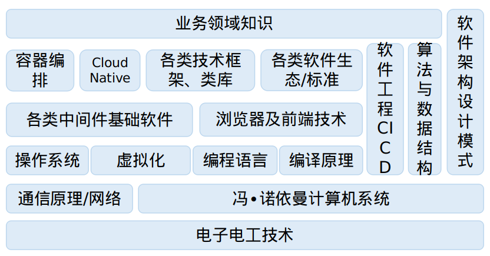

.. _coregiu_summary_index:

================
个人工作技能学习总结
================

本人从事计算机软件行业数年，一直想从底层硬件搞明白计算机到底是怎么工作的，所以我从电工电子技术着手，基本的电路、运放、逻辑门、触发器、时序逻辑电路
到单片机、通用计算机系统、操作系统、网络到程序语言、数据结构与算法、人工智能全栈的技术做一下学习总结。

总结技术栈如下图：

这是一个极其庞大的体系，每个单点领域都蕴含着极深极复杂的知识。我尝试弄明白其中的逻辑，能够讲清楚其中的关键关系：

* 电->晶体管->放大电路->差分放大电路/集成运放->数字逻辑电路/门电路->触发器->时序逻辑电路->图灵机
* 现代计算机体系统->网络及通信->操作系统
* 计算机指令->汇编语言->高级程序语言及编译->业界流行的中间件、技术
* 软件工程、数据结构与算法、软件架构设计贯穿整个软件栈
* 个人判断软件的未来一定是软硬结合，走向智能时代，比如机器人

电子技术与单片机
================================

-------------------------------------------------
`1 电子电工技术 <01-electronic-technology>`_
-------------------------------------------------

----------------------------
`2 51单片机 <02-mcu51>`_
----------------------------

----------------------------
`3 STM32单片机 <03-stm32>`_
----------------------------

通用计算机技术
==============================

--------------------------------------------------------
`1 计算机体系结构及网络 <05-computer-system>`_
--------------------------------------------------------

--------------------------------------------------------
`2 操作系统 <06-operation-system>`_
--------------------------------------------------------

软件开发
========================

--------------------------------------------------------
`1 程序语言 <08-programming-language>`_
--------------------------------------------------------

--------------------------------------------------------
`2 数据结构和算法 <09-data-structure-algorithm>`_
--------------------------------------------------------

--------------------------------------------------------
`3 软件架构设计 <10-software-architecture>`_
--------------------------------------------------------

--------------------------------------------------------
`4 编译原理 <11-compiler>`_
--------------------------------------------------------

--------------------------------------------------------
`5 软件工程及经典软件解析 <12-software-analysis>`_
--------------------------------------------------------

人工智能与机器人
================================

--------------------------------------------------------
`1 机器学习与视频图像处理 <13-machine-learning>`_
--------------------------------------------------------

------------------------------------------
`2 机器人&机械臂 <14-roboot>`_
------------------------------------------

哲学/心理学
===========================
--------------------------------------------------------
`1 古典哲学学习总结 <15-philosophy>`_
--------------------------------------------------------

目录
----
.. toctree::
    :maxdepth: 3
    :numbered:
    :glob:

    01-electronic-technology
    02-mcu51
    03-stm32
    04-computer-network
    05-operation-system
    06-programming-language
    07-data-structure-algorithm
    08-software-architecture
    09-compiler
    10-software-analysis
    11-machine-learning
    12-roboot
    13-philosophy

=====================================================
索引
=====================================================
* :ref:`genindex`
* :ref:`modindex`
* :ref:`search`